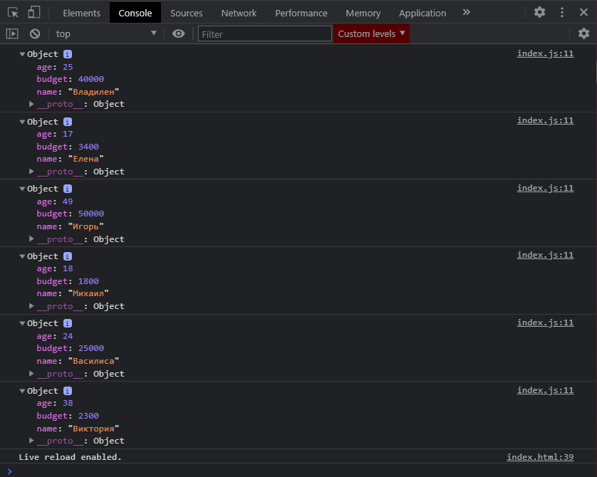

# Методы массивов

## Метод for

Для начало рассмомтрим простую очень задачу.

```js
const people = [
  { name: 'Владилен', age: 25, budget: 40000 },
  { name: 'Елена', age: 17, budget: 3400 },
  { name: 'Игорь', age: 49, budget: 50000 },
  { name: 'Михаил', age: 18, budget: 1800 },
  { name: 'Василиса', age: 24, budget: 25000 },
  { name: 'Виктория', age: 38, budget: 2300 },
];

// ForEach

// Map

// Filter

// Reduce

// Find

// FindIndex
```

У нас есть массив **people**. Массив в котором каждый элемент является объектом. И нам нужно как то его проитерировать. Как мы делаем это в привычной форме?

У нас есть как минимум два цикла которые позволяют это сделать это цикл **for**. Где на каждой итерации мы создаем какой-то индекс **let i =0;** Далее мы делаем итерацию до тех пор пока **i < people.length;** И далее мы делаем инкремент для нашего индекса **i++**. И теперь в консоль мы можем выводить какой-то элемент по его индексу.

```js
const people = [
  { name: 'Владилен', age: 25, budget: 40000 },
  { name: 'Елена', age: 17, budget: 3400 },
  { name: 'Игорь', age: 49, budget: 50000 },
  { name: 'Михаил', age: 18, budget: 1800 },
  { name: 'Василиса', age: 24, budget: 25000 },
  { name: 'Виктория', age: 38, budget: 2300 },
];

for (let i = 0; i < people.length; i++) {
  console.log(people[i]);
}

// ForEach

// Map

// Filter

// Reduce

// Find

// FindIndex
```



На каждой итерации в консоль выводится отдельный объект.
