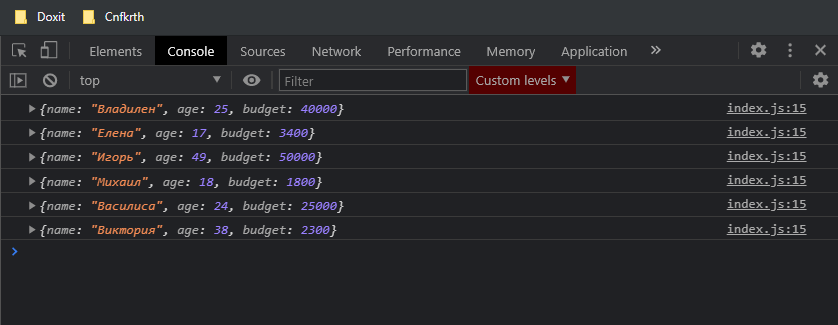

# Метод for of

Мы так же можем обратиться к ключевому слову **for**. На каждой итерации создать переменную **let person**, и дальше использовать ключевое слово **of** что бы указать по какому массиву мы делаем итерацию, в нашем случае это массив **people**. В теле цикла вывожу в консоль переменную **person**.

```js
const people = [
  { name: 'Владилен', age: 25, budget: 40000 },
  { name: 'Елена', age: 17, budget: 3400 },
  { name: 'Игорь', age: 49, budget: 50000 },
  { name: 'Михаил', age: 18, budget: 1800 },
  { name: 'Василиса', age: 24, budget: 25000 },
  { name: 'Виктория', age: 38, budget: 2300 },
];

// for (let i = 0; i < people.length; i++) {
//   console.log(people[i]);
// }

for (let person of people) {
  console.log(person);
}

// ForEach

// Map

// Filter

// Reduce

// Find

// FindIndex
```

Если я обновлю страницу то я получу тот же самый результат как и с циклом **for**.



**for of** синтаксис относится уже к **ES6** синтаксису.
