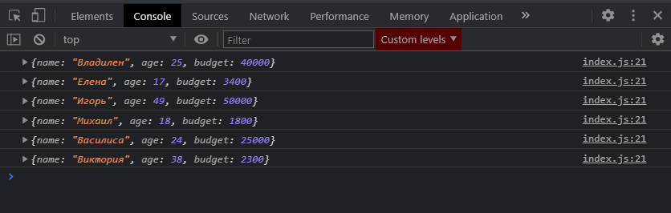
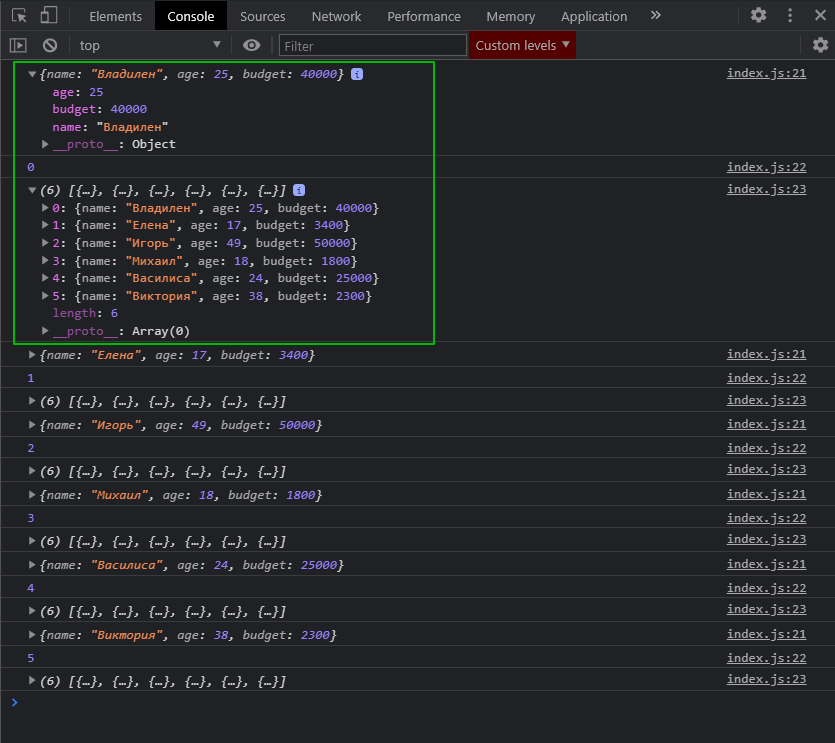
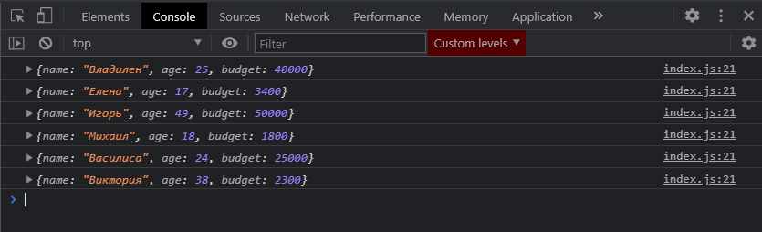

# forEach

По мимо стандартных циклов **for** в **JS** у каждого массива присутствует так называемы **Higher-order function** [https://en.wikipedia.org/wiki/Higher-order_function](https://en.wikipedia.org/wiki/Higher-order_function). или конкретно по **JS** [https://habr.com/ru/company/ruvds/blog/428570/](https://habr.com/ru/company/ruvds/blog/428570/).

я обращаюсь к самому массиву **people**. и вызываю у него метод **forEach()**, он так дословно и переводится что мы делаем какую-то итерацию для каждого элемента. По сути данный цикл принимает в себя параметр функцию, запишу в **ES5** синтаксисе.

```js
const people = [
  { name: 'Владилен', age: 25, budget: 40000 },
  { name: 'Елена', age: 17, budget: 3400 },
  { name: 'Игорь', age: 49, budget: 50000 },
  { name: 'Михаил', age: 18, budget: 1800 },
  { name: 'Василиса', age: 24, budget: 25000 },
  { name: 'Виктория', age: 38, budget: 2300 },
];

// for (let i = 0; i < people.length; i++) {
//   console.log(people[i]);
// }

// for (let person of people) {
//   console.log(person);
// }

// ForEach

people.forEach(function () {});

// Map

// Filter

// Reduce

// Find

// FindIndex
```

Данная функция принимает в себя три параметра.

1. параметр это объект **person** т.е. каждый объект данного массива
2. Второй параметр это некоторый **index**
3. И соответственно третьим параметром указываю сам массив **people** допустим нозову его **pArr**.

```js
const people = [
  { name: 'Владилен', age: 25, budget: 40000 },
  { name: 'Елена', age: 17, budget: 3400 },
  { name: 'Игорь', age: 49, budget: 50000 },
  { name: 'Михаил', age: 18, budget: 1800 },
  { name: 'Василиса', age: 24, budget: 25000 },
  { name: 'Виктория', age: 38, budget: 2300 },
];

// for (let i = 0; i < people.length; i++) {
//   console.log(people[i]);
// }

// for (let person of people) {
//   console.log(person);
// }

// ForEach

people.forEach(function (person, index, pArr) {});

// Map

// Filter

// Reduce

// Find

// FindIndex
```

Теперь для того что бы проитерировать каждый элемент и вообще посмотреть на каждый элемент мы можем обратиться к первому параметру который принимает данный **callback**.

```jsx
const people = [
  { name: 'Владилен', age: 25, budget: 40000 },
  { name: 'Елена', age: 17, budget: 3400 },
  { name: 'Игорь', age: 49, budget: 50000 },
  { name: 'Михаил', age: 18, budget: 1800 },
  { name: 'Василиса', age: 24, budget: 25000 },
  { name: 'Виктория', age: 38, budget: 2300 },
];

// for (let i = 0; i < people.length; i++) {
//   console.log(people[i]);
// }

// for (let person of people) {
//   console.log(person);
// }

// ForEach

people.forEach(function (person, index, pArr) {
  console.log(person);
});

// Map

// Filter

// Reduce

// Find

// FindIndex
```



Безусловно сейчас есть дополнительные параметры **index** и **pArr**. Но данную запись мы можем сократить. Но пока что все аргументы выведу в консоль.

```js
const people = [
  { name: 'Владилен', age: 25, budget: 40000 },
  { name: 'Елена', age: 17, budget: 3400 },
  { name: 'Игорь', age: 49, budget: 50000 },
  { name: 'Михаил', age: 18, budget: 1800 },
  { name: 'Василиса', age: 24, budget: 25000 },
  { name: 'Виктория', age: 38, budget: 2300 },
];

// for (let i = 0; i < people.length; i++) {
//   console.log(people[i]);
// }

// for (let person of people) {
//   console.log(person);
// }

// ForEach

people.forEach(function (person, index, pArr) {
  console.log(person);
  console.log(index);
  console.log(pArr);
});

// Map

// Filter

// Reduce

// Find

// FindIndex
```



Все аргументы отрабатывают.

Первый параметр это текущий объект, дальше идет индек начинающийся с ноля, и потом идет непосредственно сам массив.

Но обычно последни аргумент вообще редко используется. **index** так же используется достаточно редко. По этому мы видим в основном подобную запись.

```js
const people = [
  { name: 'Владилен', age: 25, budget: 40000 },
  { name: 'Елена', age: 17, budget: 3400 },
  { name: 'Игорь', age: 49, budget: 50000 },
  { name: 'Михаил', age: 18, budget: 1800 },
  { name: 'Василиса', age: 24, budget: 25000 },
  { name: 'Виктория', age: 38, budget: 2300 },
];

// for (let i = 0; i < people.length; i++) {
//   console.log(people[i]);
// }

// for (let person of people) {
//   console.log(person);
// }

// ForEach

people.forEach(function (person) {
  console.log(person);
});

// Map

// Filter

// Reduce

// Find

// FindIndex
```



Но с использованием **ES6** синтаксиса, а конкретно с использованием стрелочных функций, мы можем существенно сократить данную запись. Т.е. вообще записать все в одну строчку.

```js
const people = [
  { name: 'Владилен', age: 25, budget: 40000 },
  { name: 'Елена', age: 17, budget: 3400 },
  { name: 'Игорь', age: 49, budget: 50000 },
  { name: 'Михаил', age: 18, budget: 1800 },
  { name: 'Василиса', age: 24, budget: 25000 },
  { name: 'Виктория', age: 38, budget: 2300 },
];

// for (let i = 0; i < people.length; i++) {
//   console.log(people[i]);
// }

// for (let person of people) {
//   console.log(person);
// }

// ForEach

// people.forEach(function (person) {
//   console.log(person);
// });

people.forEach((person) => console.log(person));

// Map

// Filter

// Reduce

// Find

// FindIndex
```


