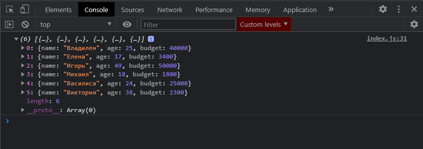
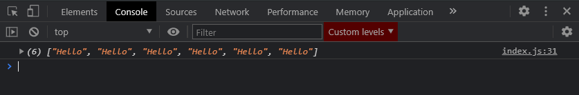
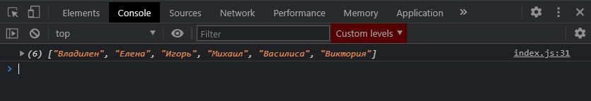
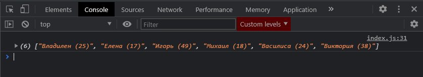
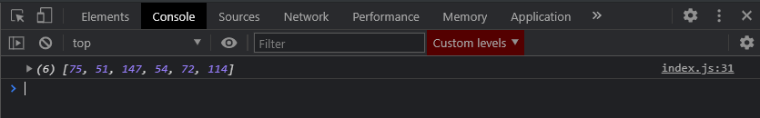

# map

Метод **map** по сути работаем схожим образом с матодом **forEach** т.е. он принимает те же самые параметры

1. сам элемент массива
2. **index**
3. И сам массив по которому мы делаем итерацию

Но он работает немного по другому. С помощью метода map мы можем создавать новые массивы, и соответственно как результат мы их заносив в новую переменную.

Допустим я создаю переменную **const newPeople =** далее обращаюсь к массиву **people** и вызываю у него метод **map()**. Здесь я так же могу передавать ключевое слово **function**, но здесь мы будем использовать уже **ES6** синтаксис, по этому на каждой итерации я буду получать объект **person =>{}**. И здесь, в теле функции мне нужно кое что вернуть, т.е. к примеру верну объект **person**.

```jsx
const people = [
  { name: 'Владилен', age: 25, budget: 40000 },
  { name: 'Елена', age: 17, budget: 3400 },
  { name: 'Игорь', age: 49, budget: 50000 },
  { name: 'Михаил', age: 18, budget: 1800 },
  { name: 'Василиса', age: 24, budget: 25000 },
  { name: 'Виктория', age: 38, budget: 2300 },
];

// for (let i = 0; i < people.length; i++) {
//   console.log(people[i]);
// }

// for (let person of people) {
//   console.log(person);
// }

// ForEach

// people.forEach(function (person) {
//   console.log(person);
// });

// people.forEach((person) => console.log(person));

// Map

const newPeople = people.map((person) => {
  return person;
});
console.log(newPeople);

// Filter

// Reduce

// Find

// FindIndex
```



И вот мы видим тот же самый массив с которым мы начинали работать, только он новый. Посути мы итерируем по массиву и возвращаем сам объект.

Но метод map хорош тем что мы можем как угодно трансформировать эти данные и заносить их в новый результирующий массив.

Как самый базовый пример. В возвращаемом результате мы можем не привязываться в объекту **person** а просто к примеру вернуть строку **Hello**. Результатом вывода будет вывод шести строк.

```js
const people = [
  { name: 'Владилен', age: 25, budget: 40000 },
  { name: 'Елена', age: 17, budget: 3400 },
  { name: 'Игорь', age: 49, budget: 50000 },
  { name: 'Михаил', age: 18, budget: 1800 },
  { name: 'Василиса', age: 24, budget: 25000 },
  { name: 'Виктория', age: 38, budget: 2300 },
];

// for (let i = 0; i < people.length; i++) {
//   console.log(people[i]);
// }

// for (let person of people) {
//   console.log(person);
// }

// ForEach

// people.forEach(function (person) {
//   console.log(person);
// });

// people.forEach((person) => console.log(person));

// Map

const newPeople = people.map((person) => {
  return 'Hello';
});
console.log(newPeople);

// Filter

// Reduce

// Find

// FindIndex
```



Т.е. таким образом мы каждый объект массива **people** преобразуем в строку **Hello**.

Выглядит это конечно прикольно, но не практично.

Что действительно прикольно так это то что мы можем действительно оперировать с объектом **person**. Например мы можем получать какие либо данные из него, или как то их трансформировать.

Скажем мы можем получить имена людей которые есть в массиве. Для этого в возвращаемом результате обращаюсь к объекту **person** и к его полю **name**.

```js
const people = [
  { name: 'Владилен', age: 25, budget: 40000 },
  { name: 'Елена', age: 17, budget: 3400 },
  { name: 'Игорь', age: 49, budget: 50000 },
  { name: 'Михаил', age: 18, budget: 1800 },
  { name: 'Василиса', age: 24, budget: 25000 },
  { name: 'Виктория', age: 38, budget: 2300 },
];

// for (let i = 0; i < people.length; i++) {
//   console.log(people[i]);
// }

// for (let person of people) {
//   console.log(person);
// }

// ForEach

// people.forEach(function (person) {
//   console.log(person);
// });

// people.forEach((person) => console.log(person));

// Map

const newPeople = people.map((person) => {
  return person.name;
});
console.log(newPeople);

// Filter

// Reduce

// Find

// FindIndex
```



Аналогичным способом мы можем получать любые данные из этих объектов. К примеру мы можем вернуть шаблонную строку

```js
const people = [
  { name: 'Владилен', age: 25, budget: 40000 },
  { name: 'Елена', age: 17, budget: 3400 },
  { name: 'Игорь', age: 49, budget: 50000 },
  { name: 'Михаил', age: 18, budget: 1800 },
  { name: 'Василиса', age: 24, budget: 25000 },
  { name: 'Виктория', age: 38, budget: 2300 },
];

// for (let i = 0; i < people.length; i++) {
//   console.log(people[i]);
// }

// for (let person of people) {
//   console.log(person);
// }

// ForEach

// people.forEach(function (person) {
//   console.log(person);
// });

// people.forEach((person) => console.log(person));

// Map

const newPeople = people.map((person) => {
  return `${person.name} (${person.age})`;
});
console.log(newPeople);

// Filter

// Reduce

// Find

// FindIndex
```



Мы получаем новый массив где каждый элемент представлен ввиде строчки и строка состоит из имени и возраста.

Так же например мы можем оперировать с числами.

```jsx
const people = [
  { name: 'Владилен', age: 25, budget: 40000 },
  { name: 'Елена', age: 17, budget: 3400 },
  { name: 'Игорь', age: 49, budget: 50000 },
  { name: 'Михаил', age: 18, budget: 1800 },
  { name: 'Василиса', age: 24, budget: 25000 },
  { name: 'Виктория', age: 38, budget: 2300 },
];

// for (let i = 0; i < people.length; i++) {
//   console.log(people[i]);
// }

// for (let person of people) {
//   console.log(person);
// }

// ForEach

// people.forEach(function (person) {
//   console.log(person);
// });

// people.forEach((person) => console.log(person));

// Map

const newPeople = people.map((person) => {
  return person.age * 3;
});
console.log(newPeople);

// Filter

// Reduce

// Find

// FindIndex
```



Таким образом работает метод map и он служит для преобразования старого массива в новый массив.
