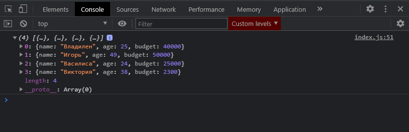

# filter

Метод **filter** служит нам для того что бы мы соответственно фильтровали по какому либо условию исходный массив.

Допустим мы хотим отфильтровать тех людей которые могут покупать себе алкоголь. Нужно получить массив людей которые старше **18**-ти лет.

Как мы бы это сделали с использованием базового цикла **for**?

```jsx
const people = [
  { name: 'Владилен', age: 25, budget: 40000 },
  { name: 'Елена', age: 17, budget: 3400 },
  { name: 'Игорь', age: 49, budget: 50000 },
  { name: 'Михаил', age: 15, budget: 1800 },
  { name: 'Василиса', age: 24, budget: 25000 },
  { name: 'Виктория', age: 38, budget: 2300 },
];

// for (let i = 0; i < people.length; i++) {
//   console.log(people[i]);
// }

// for (let person of people) {
//   console.log(person);
// }

// ForEach

// people.forEach(function (person) {
//   console.log(person);
// });

// people.forEach((person) => console.log(person));

// Map

// const newPeople = people.map((person) => {
//   return person.age * 3;
// });
// console.log(newPeople);

// Filter

const adults = [];

for (let i = 0; i < people.length; i++) {
  if (people[i].age >= 18) {
    adults.push(people[i]);
  }
}

console.log(adults);

// Reduce

// Find

// FindIndex
```


Но подобная запись достаточно долгая.

Рассмотрим как нам может помочь метод **filter** для того что бы реализовать подобный функционал.

Я так же создаю массив **const adults =** обращаюсь к массиву **people** и вызываю у него метод **filter**. Метод **filter** так же принимает в себя три параметра

1. Сам элемент по которому мы делаем итерацию
2. index
3. сам итерируемый массив

Пишу что на каждой итерации я получаю объект **person**, и по сути здесь мне необходимо вернуть либо **true** или **false** в том случае если я хочу оставить этот элемент в массиве **audults**. Т.е. я могу так же написать условие **if** и спросить **person.age >= 18** то тогда я возвращаю **true**.

```js
const people = [
  { name: 'Владилен', age: 25, budget: 40000 },
  { name: 'Елена', age: 17, budget: 3400 },
  { name: 'Игорь', age: 49, budget: 50000 },
  { name: 'Михаил', age: 15, budget: 1800 },
  { name: 'Василиса', age: 24, budget: 25000 },
  { name: 'Виктория', age: 38, budget: 2300 },
];

// for (let i = 0; i < people.length; i++) {
//   console.log(people[i]);
// }

// for (let person of people) {
//   console.log(person);
// }

// ForEach

// people.forEach(function (person) {
//   console.log(person);
// });

// people.forEach((person) => console.log(person));

// Map

// const newPeople = people.map((person) => {
//   return person.age * 3;
// });
// console.log(newPeople);

// Filter

// const adults = [];

// for (let i = 0; i < people.length; i++) {
//   if (people[i].age >= 18) {
//     audults.push(people[i]);
//   }
// }

// console.log(adults);

const adults = people.filter((person) => {
  if (person.age >= 18) {
    return true;
  }
});

console.log(adults);

// Reduce

// Find

// FindIndex
```



Сейчас вы можете видеть разницу в записи старого формата и нового.

Однако я могу вернуть это все и ввиде стрелочной функии.

```js
const people = [
  { name: 'Владилен', age: 25, budget: 40000 },
  { name: 'Елена', age: 17, budget: 3400 },
  { name: 'Игорь', age: 49, budget: 50000 },
  { name: 'Михаил', age: 15, budget: 1800 },
  { name: 'Василиса', age: 24, budget: 25000 },
  { name: 'Виктория', age: 38, budget: 2300 },
];

// for (let i = 0; i < people.length; i++) {
//   console.log(people[i]);
// }

// for (let person of people) {
//   console.log(person);
// }

// ForEach

// people.forEach(function (person) {
//   console.log(person);
// });

// people.forEach((person) => console.log(person));

// Map

// const newPeople = people.map((person) => {
//   return person.age * 3;
// });
// console.log(newPeople);

// Filter

// const adults = [];

// for (let i = 0; i < people.length; i++) {
//   if (people[i].age >= 18) {
//     audults.push(people[i]);
//   }
// }

// console.log(adults);

const adults = people.filter((person) => person.age >= 18);

console.log(adults);

// Reduce

// Find

// FindIndex
```


Причем на собеседованиях или на работе чем чаще вы используете подобные методы присущие для текущего контекста, чем лаконичнее вы их записываете тем больше это говорит про вашу компетенцию и ваше умение работать с кодом. По этому имейте ввиду что эти методы очень полезны на практике.
