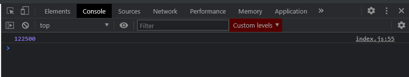
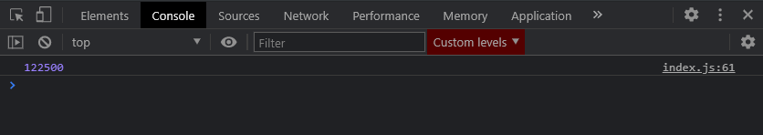
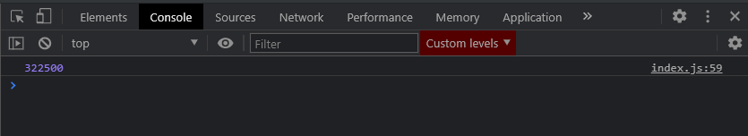

# Reduce

Он немного выбивается из линейки предыдущих методов которые мы рассматривали. И по сути он служит для того что бы мы получили какое-то финальное значение совершив итерацию по какому-нибудь массиву.

Рассмотрим базовый пример. У каждого из людей данного массива присутствует поле **budget:** Предположим у нас есть задача посчитать сколько всего бютжета есть у этих людей. Грубо говоря проссуммировать каждый из этих полей. Я думаю что сделать с помощью цикла **for** это будет сделать достаточно просто.

Мы так же делаем итерацию по массиву **people**

```js
const people = [
  { name: 'Владилен', age: 25, budget: 40000 },
  { name: 'Елена', age: 17, budget: 3400 },
  { name: 'Игорь', age: 49, budget: 50000 },
  { name: 'Михаил', age: 15, budget: 1800 },
  { name: 'Василиса', age: 24, budget: 25000 },
  { name: 'Виктория', age: 38, budget: 2300 },
];

// for (let i = 0; i < people.length; i++) {
//   console.log(people[i]);
// }

// for (let person of people) {
//   console.log(person);
// }

// ForEach

// people.forEach(function (person) {
//   console.log(person);
// });

// people.forEach((person) => console.log(person));

// Map

// const newPeople = people.map((person) => {
//   return person.age * 3;
// });
// console.log(newPeople);

// Filter

// const adults = [];

// for (let i = 0; i < people.length; i++) {
//   if (people[i].age >= 18) {
//     audults.push(people[i]);
//   }
// }

// console.log(adults);

// const adults = people.filter((person) => person.age >= 18);

// console.log(adults);

// Reduce

let amount = 0;
for (let i = 0; i < people.length; i++) {
  amount += people[i].budget;
}
console.log(amount);

// Find

// FindIndex
```



С методом **reduce** мы можем повторить подобный функционал и сделать это более комфортно.

Мы создаем переменную **const amount =** пробегаемся по массиву **people.reduce()**. Данный метод принимает в себя два параметра. Первый параметр это **callback**, который принимает в себя так же два параметра. Первый параметр это **total**, и второй параметр это итерируемый элемент у массива т.е. **person**

```jsx
const people = [
  { name: 'Владилен', age: 25, budget: 40000 },
  { name: 'Елена', age: 17, budget: 3400 },
  { name: 'Игорь', age: 49, budget: 50000 },
  { name: 'Михаил', age: 15, budget: 1800 },
  { name: 'Василиса', age: 24, budget: 25000 },
  { name: 'Виктория', age: 38, budget: 2300 },
];

// for (let i = 0; i < people.length; i++) {
//   console.log(people[i]);
// }

// for (let person of people) {
//   console.log(person);
// }

// ForEach

// people.forEach(function (person) {
//   console.log(person);
// });

// people.forEach((person) => console.log(person));

// Map

// const newPeople = people.map((person) => {
//   return person.age * 3;
// });
// console.log(newPeople);

// Filter

// const adults = [];

// for (let i = 0; i < people.length; i++) {
//   if (people[i].age >= 18) {
//     audults.push(people[i]);
//   }
// }

// console.log(adults);

// const adults = people.filter((person) => person.age >= 18);

// console.log(adults);

// Reduce

// let amount = 0;
// for (let i = 0; i < people.length; i++) {
//   amount += people[i].budget;
// }
// console.log(amount);

const amount = people.reduce((total, person) => {});

// Find

// FindIndex
```

Вторым параметром **reduce** принимает некоторое начальное значение которое будет присвоено первому агументу в **callback**, в нашем случае данное значение будет присвоено переменной **total**. Т.к. мы хотим посчитать суммарный бютжет людей, по этому мы начинаем с ноля.

```js
const people = [
  { name: 'Владилен', age: 25, budget: 40000 },
  { name: 'Елена', age: 17, budget: 3400 },
  { name: 'Игорь', age: 49, budget: 50000 },
  { name: 'Михаил', age: 15, budget: 1800 },
  { name: 'Василиса', age: 24, budget: 25000 },
  { name: 'Виктория', age: 38, budget: 2300 },
];

// for (let i = 0; i < people.length; i++) {
//   console.log(people[i]);
// }

// for (let person of people) {
//   console.log(person);
// }

// ForEach

// people.forEach(function (person) {
//   console.log(person);
// });

// people.forEach((person) => console.log(person));

// Map

// const newPeople = people.map((person) => {
//   return person.age * 3;
// });
// console.log(newPeople);

// Filter

// const adults = [];

// for (let i = 0; i < people.length; i++) {
//   if (people[i].age >= 18) {
//     audults.push(people[i]);
//   }
// }

// console.log(adults);

// const adults = people.filter((person) => person.age >= 18);

// console.log(adults);

// Reduce

// let amount = 0;
// for (let i = 0; i < people.length; i++) {
//   amount += people[i].budget;
// }
// console.log(amount);

const amount = people.reduce((total, person) => {}, 0);

// Find

// FindIndex
```

В теле **callback** мы должны вернуть какое-то измененное значение т.е. изначальному значению т.е. переменной **total** мы должны присвоить **person.butget**.

```jsx
const people = [
  { name: 'Владилен', age: 25, budget: 40000 },
  { name: 'Елена', age: 17, budget: 3400 },
  { name: 'Игорь', age: 49, budget: 50000 },
  { name: 'Михаил', age: 15, budget: 1800 },
  { name: 'Василиса', age: 24, budget: 25000 },
  { name: 'Виктория', age: 38, budget: 2300 },
];

// for (let i = 0; i < people.length; i++) {
//   console.log(people[i]);
// }

// for (let person of people) {
//   console.log(person);
// }

// ForEach

// people.forEach(function (person) {
//   console.log(person);
// });

// people.forEach((person) => console.log(person));

// Map

// const newPeople = people.map((person) => {
//   return person.age * 3;
// });
// console.log(newPeople);

// Filter

// const adults = [];

// for (let i = 0; i < people.length; i++) {
//   if (people[i].age >= 18) {
//     audults.push(people[i]);
//   }
// }

// console.log(adults);

// const adults = people.filter((person) => person.age >= 18);

// console.log(adults);

// Reduce

// let amount = 0;
// for (let i = 0; i < people.length; i++) {
//   amount += people[i].budget;
// }
// console.log(amount);

const amount = people.reduce((total, person) => {
  return total + person.budget;
}, 0);

console.log(amount);

// Find

// FindIndex
```



Более того мы так же данный метод можем записать в одну строчку

```jsx
const people = [
  { name: 'Владилен', age: 25, budget: 40000 },
  { name: 'Елена', age: 17, budget: 3400 },
  { name: 'Игорь', age: 49, budget: 50000 },
  { name: 'Михаил', age: 15, budget: 1800 },
  { name: 'Василиса', age: 24, budget: 25000 },
  { name: 'Виктория', age: 38, budget: 2300 },
];

// for (let i = 0; i < people.length; i++) {
//   console.log(people[i]);
// }

// for (let person of people) {
//   console.log(person);
// }

// ForEach

// people.forEach(function (person) {
//   console.log(person);
// });

// people.forEach((person) => console.log(person));

// Map

// const newPeople = people.map((person) => {
//   return person.age * 3;
// });
// console.log(newPeople);

// Filter

// const adults = [];

// for (let i = 0; i < people.length; i++) {
//   if (people[i].age >= 18) {
//     audults.push(people[i]);
//   }
// }

// console.log(adults);

// const adults = people.filter((person) => person.age >= 18);

// console.log(adults);

// Reduce

// let amount = 0;
// for (let i = 0; i < people.length; i++) {
//   amount += people[i].budget;
// }
// console.log(amount);

const amount = people.reduce((total, person) => total + person.budget, 0);

console.log(amount);

// Find

// FindIndex
```

Т.е. по сути идея метода **reduce** очень простая. На каждой итерации мы изменяем первый параметр **callback**, в нашем случае **total**. На каждой итерации я ссумирую значения из поля **budget** cо значением на предыдущей итерации.

Вторым параметром **reduce** обязательно должно быть значение по умолчанию. Если я выставлю это значение в **200000**, то отсчет будет производиться с данного значения.

```js
const people = [
  { name: 'Владилен', age: 25, budget: 40000 },
  { name: 'Елена', age: 17, budget: 3400 },
  { name: 'Игорь', age: 49, budget: 50000 },
  { name: 'Михаил', age: 15, budget: 1800 },
  { name: 'Василиса', age: 24, budget: 25000 },
  { name: 'Виктория', age: 38, budget: 2300 },
];

// for (let i = 0; i < people.length; i++) {
//   console.log(people[i]);
// }

// for (let person of people) {
//   console.log(person);
// }

// ForEach

// people.forEach(function (person) {
//   console.log(person);
// });

// people.forEach((person) => console.log(person));

// Map

// const newPeople = people.map((person) => {
//   return person.age * 3;
// });
// console.log(newPeople);

// Filter

// const adults = [];

// for (let i = 0; i < people.length; i++) {
//   if (people[i].age >= 18) {
//     audults.push(people[i]);
//   }
// }

// console.log(adults);

// const adults = people.filter((person) => person.age >= 18);

// console.log(adults);

// Reduce

// let amount = 0;
// for (let i = 0; i < people.length; i++) {
//   amount += people[i].budget;
// }
// console.log(amount);

const amount = people.reduce((total, person) => total + person.budget, 200000);

console.log(amount);

// Find

// FindIndex
```


