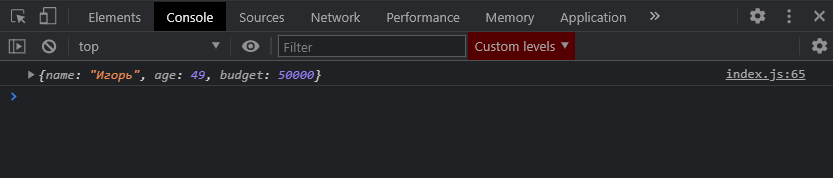

# find

Очень часто используется на практике и который используется для поиска определенных элементов. **Find** служит для того что бы по условию найти нам какой-то нужный элемент.

Допустим я обращаюсь к массиву people и вызываю **find()**. В свою очередь **find** принимает **callback** функцию где мы первым параметром принимаем итерируемый объект, в нашем случае **person**. И допустим мы хотим найти человека у которого имя = Игорь. И я пишу **person.name === 'Игорь'**.

```js
const people = [
  { name: 'Владилен', age: 25, budget: 40000 },
  { name: 'Елена', age: 17, budget: 3400 },
  { name: 'Игорь', age: 49, budget: 50000 },
  { name: 'Михаил', age: 15, budget: 1800 },
  { name: 'Василиса', age: 24, budget: 25000 },
  { name: 'Виктория', age: 38, budget: 2300 },
];

// for (let i = 0; i < people.length; i++) {
//   console.log(people[i]);
// }

// for (let person of people) {
//   console.log(person);
// }

// ForEach

// people.forEach(function (person) {
//   console.log(person);
// });

// people.forEach((person) => console.log(person));

// Map

// const newPeople = people.map((person) => {
//   return person.age * 3;
// });
// console.log(newPeople);

// Filter

// const adults = [];

// for (let i = 0; i < people.length; i++) {
//   if (people[i].age >= 18) {
//     audults.push(people[i]);
//   }
// }

// console.log(adults);

// const adults = people.filter((person) => person.age >= 18);

// console.log(adults);

// Reduce

// let amount = 0;
// for (let i = 0; i < people.length; i++) {
//   amount += people[i].budget;
// }
// console.log(amount);

// const amount = people.reduce((total, person) => total + person.budget, 200000);

// console.log(amount);

// Find

const igor = people.find((person) => person.name === 'Игорь');

console.log(igor);

// FindIndex
```



И мы получаем объект который соответствует условию.
