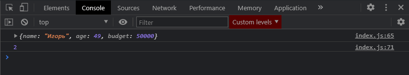

# findIndex

Он работает точно так же как и метод **find** т.е. мы в него передаем определенное условие, но на выходе мы получаем **index**.

```jsx
const people = [
  { name: 'Владилен', age: 25, budget: 40000 },
  { name: 'Елена', age: 17, budget: 3400 },
  { name: 'Игорь', age: 49, budget: 50000 },
  { name: 'Михаил', age: 15, budget: 1800 },
  { name: 'Василиса', age: 24, budget: 25000 },
  { name: 'Виктория', age: 38, budget: 2300 },
];

// for (let i = 0; i < people.length; i++) {
//   console.log(people[i]);
// }

// for (let person of people) {
//   console.log(person);
// }

// ForEach

// people.forEach(function (person) {
//   console.log(person);
// });

// people.forEach((person) => console.log(person));

// Map

// const newPeople = people.map((person) => {
//   return person.age * 3;
// });
// console.log(newPeople);

// Filter

// const adults = [];

// for (let i = 0; i < people.length; i++) {
//   if (people[i].age >= 18) {
//     audults.push(people[i]);
//   }
// }

// console.log(adults);

// const adults = people.filter((person) => person.age >= 18);

// console.log(adults);

// Reduce

// let amount = 0;
// for (let i = 0; i < people.length; i++) {
//   amount += people[i].budget;
// }
// console.log(amount);

// const amount = people.reduce((total, person) => total + person.budget, 200000);

// console.log(amount);

// Find

const igor = people.find((person) => person.name === 'Игорь');

console.log(igor);

// FindIndex

const igorIndex = people.findIndex((person) => person.name === 'Игорь');

console.log(igorIndex);
```



И я получаю index.

Таким образом мы можем искать какие-либо элементы и делать с ними какие нибудь операции, фильтровать, модифицировать, вычислять какое-то общее значение у массивов и т.д.
