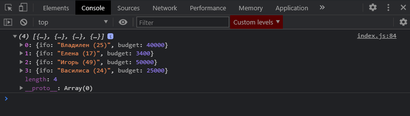
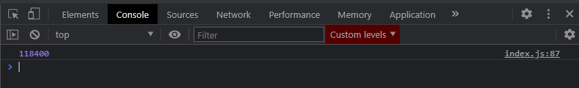
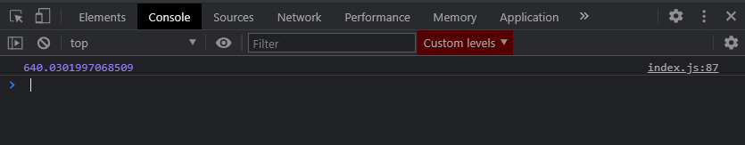

# Совметсное использование.

Вначале мы хотим пробежаться по массиву **people** c помощью метода **filter**. И давайте отфильтруем людей по их **budget**. И допустим нам будут интересны люди бютжет которых больше 3000руб.

Для этого в метод **filter** первым аргументом принимаю объект **person**, называть данный объект можно безусловно как угодно. И прописываю что меня интересуют персоны бютжет которых больше 3000 **person.budget > 3000**.

```js
const people = [
  { name: 'Владилен', age: 25, budget: 40000 },
  { name: 'Елена', age: 17, budget: 3400 },
  { name: 'Игорь', age: 49, budget: 50000 },
  { name: 'Михаил', age: 15, budget: 1800 },
  { name: 'Василиса', age: 24, budget: 25000 },
  { name: 'Виктория', age: 38, budget: 2300 },
];

// for (let i = 0; i < people.length; i++) {
//   console.log(people[i]);
// }

// for (let person of people) {
//   console.log(person);
// }

// ForEach

// people.forEach(function (person) {
//   console.log(person);
// });

// people.forEach((person) => console.log(person));

// Map

// const newPeople = people.map((person) => {
//   return person.age * 3;
// });
// console.log(newPeople);

// Filter

// const adults = [];

// for (let i = 0; i < people.length; i++) {
//   if (people[i].age >= 18) {
//     audults.push(people[i]);
//   }
// }

// console.log(adults);

// const adults = people.filter((person) => person.age >= 18);

// console.log(adults);

// Reduce

// let amount = 0;
// for (let i = 0; i < people.length; i++) {
//   amount += people[i].budget;
// }
// console.log(amount);

// const amount = people.reduce((total, person) => total + person.budget, 200000);

// console.log(amount);

// Find

// const igor = people.find((person) => person.name === 'Игорь');

// console.log(igor);

// FindIndex

// const igorIndex = people.findIndex((person) => person.name === 'Игорь');

// console.log(igorIndex);

//===================================================================================================================

people.filter((person) => person.budget > 3000);
```

Далее метод **filter** нам возвращает новый массив. Далее мы можем вызвать у него метод **.map()**. На каждой итерации я буду получать **person =>{}** и далее буду видоизменять этот объект. Возвращаю новый массив **return{}** состоящий из другого вида объектов. И допустим у него будет поле **info:** куда мы занесем значение **`${person.name} (${person.age})`** и так же здесь нам потребуется поле **budget: person.budget**.

```js
const people = [
  { name: 'Владилен', age: 25, budget: 40000 },
  { name: 'Елена', age: 17, budget: 3400 },
  { name: 'Игорь', age: 49, budget: 50000 },
  { name: 'Михаил', age: 15, budget: 1800 },
  { name: 'Василиса', age: 24, budget: 25000 },
  { name: 'Виктория', age: 38, budget: 2300 },
];

// for (let i = 0; i < people.length; i++) {
//   console.log(people[i]);
// }

// for (let person of people) {
//   console.log(person);
// }

// ForEach

// people.forEach(function (person) {
//   console.log(person);
// });

// people.forEach((person) => console.log(person));

// Map

// const newPeople = people.map((person) => {
//   return person.age * 3;
// });
// console.log(newPeople);

// Filter

// const adults = [];

// for (let i = 0; i < people.length; i++) {
//   if (people[i].age >= 18) {
//     audults.push(people[i]);
//   }
// }

// console.log(adults);

// const adults = people.filter((person) => person.age >= 18);

// console.log(adults);

// Reduce

// let amount = 0;
// for (let i = 0; i < people.length; i++) {
//   amount += people[i].budget;
// }
// console.log(amount);

// const amount = people.reduce((total, person) => total + person.budget, 200000);

// console.log(amount);

// Find

// const igor = people.find((person) => person.name === 'Игорь');

// console.log(igor);

// FindIndex

// const igorIndex = people.findIndex((person) => person.name === 'Игорь');

// console.log(igorIndex);

//===================================================================================================================

const newPeople = people
  .filter((person) => person.budget > 3000)
  .map((person) => {
    return {
      ifo: `${person.name} (${person.age})`,
      budget: person.budget,
    };
  });

console.log(newPeople);
```



Так же у метода **map** мы можем вызвать метод **reduce** для того что бы посчитать сумарный бютжет.

```js
const people = [
  { name: 'Владилен', age: 25, budget: 40000 },
  { name: 'Елена', age: 17, budget: 3400 },
  { name: 'Игорь', age: 49, budget: 50000 },
  { name: 'Михаил', age: 15, budget: 1800 },
  { name: 'Василиса', age: 24, budget: 25000 },
  { name: 'Виктория', age: 38, budget: 2300 },
];

// for (let i = 0; i < people.length; i++) {
//   console.log(people[i]);
// }

// for (let person of people) {
//   console.log(person);
// }

// ForEach

// people.forEach(function (person) {
//   console.log(person);
// });

// people.forEach((person) => console.log(person));

// Map

// const newPeople = people.map((person) => {
//   return person.age * 3;
// });
// console.log(newPeople);

// Filter

// const adults = [];

// for (let i = 0; i < people.length; i++) {
//   if (people[i].age >= 18) {
//     audults.push(people[i]);
//   }
// }

// console.log(adults);

// const adults = people.filter((person) => person.age >= 18);

// console.log(adults);

// Reduce

// let amount = 0;
// for (let i = 0; i < people.length; i++) {
//   amount += people[i].budget;
// }
// console.log(amount);

// const amount = people.reduce((total, person) => total + person.budget, 200000);

// console.log(amount);

// Find

// const igor = people.find((person) => person.name === 'Игорь');

// console.log(igor);

// FindIndex

// const igorIndex = people.findIndex((person) => person.name === 'Игорь');

// console.log(igorIndex);

//===================================================================================================================

const amount = people
  .filter((person) => person.budget > 3000)
  .map((person) => {
    return {
      ifo: `${person.name} (${person.age})`,
      budget: person.budget,
    };
  })
  .reduce((total, person) => {
    return total + person.budget;
  }, 0);

console.log(amount);
```



Если же например я в методе **map** сделаю некоторую манипуляцию, к примеру с глобальным методом **Math**

```js
const people = [
  { name: 'Владилен', age: 25, budget: 40000 },
  { name: 'Елена', age: 17, budget: 3400 },
  { name: 'Игорь', age: 49, budget: 50000 },
  { name: 'Михаил', age: 15, budget: 1800 },
  { name: 'Василиса', age: 24, budget: 25000 },
  { name: 'Виктория', age: 38, budget: 2300 },
];

// for (let i = 0; i < people.length; i++) {
//   console.log(people[i]);
// }

// for (let person of people) {
//   console.log(person);
// }

// ForEach

// people.forEach(function (person) {
//   console.log(person);
// });

// people.forEach((person) => console.log(person));

// Map

// const newPeople = people.map((person) => {
//   return person.age * 3;
// });
// console.log(newPeople);

// Filter

// const adults = [];

// for (let i = 0; i < people.length; i++) {
//   if (people[i].age >= 18) {
//     audults.push(people[i]);
//   }
// }

// console.log(adults);

// const adults = people.filter((person) => person.age >= 18);

// console.log(adults);

// Reduce

// let amount = 0;
// for (let i = 0; i < people.length; i++) {
//   amount += people[i].budget;
// }
// console.log(amount);

// const amount = people.reduce((total, person) => total + person.budget, 200000);

// console.log(amount);

// Find

// const igor = people.find((person) => person.name === 'Игорь');

// console.log(igor);

// FindIndex

// const igorIndex = people.findIndex((person) => person.name === 'Игорь');

// console.log(igorIndex);

//===================================================================================================================

const amount = people
  .filter((person) => person.budget > 3000)
  .map((person) => {
    return {
      ifo: `${person.name} (${person.age})`,
      budget: Math.sqrt(person.budget),
    };
  })
  .reduce((total, person) => {
    return total + person.budget;
  }, 0);

console.log(amount);
```



Т.е. в метода **map** мы преобразуем как то данные. Что интересно эта запись называется **chane** т.е. цепочка. Мы видим что как результат у каждой функции мы получаем массив, и соответственно мы можем дальше обращаться к методам массива.
