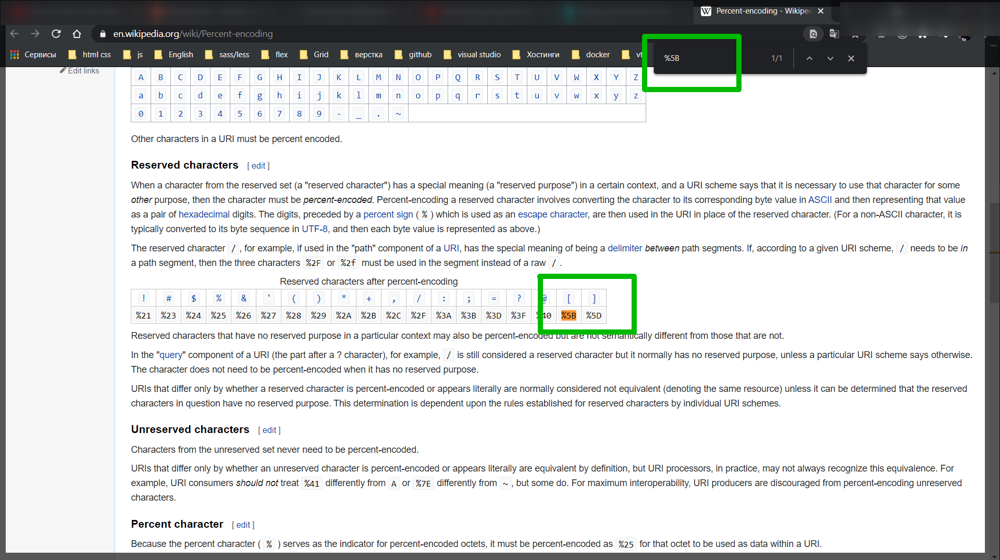
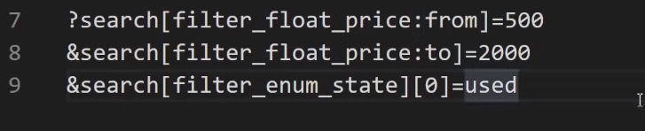
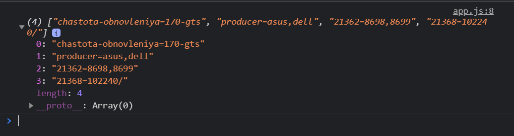
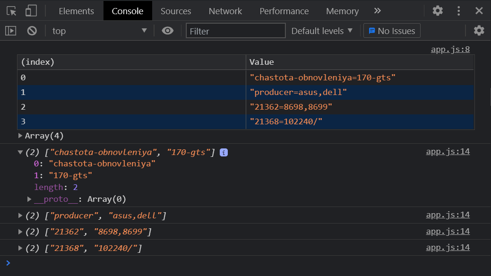
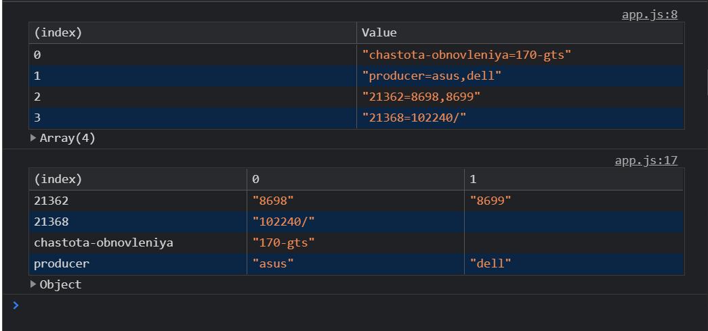

# Фильтр url

Смотри видео тут:<https://www.youtube.com/watch?v=pcPiI2-wmHE&t=184s>

И так обратите внимание есть некий url

```js
//https://www.olx.ua/elektronika/kompyutery-i-komplektuyuschie/
```

Пока ни каких фильтров здесь не заложено.

На данной странице выбираю состояние Б/У.

И появляется первый фильтр

```js
// https://www.olx.ua/elektronika/kompyutery-i-komplektuyuschie/

// https://www.olx.ua/elektronika/kompyutery-i-komplektuyuschie/?search%5Bfilter_enum_state%5D%5B0%5D=used
```

Вот это вот <https://www.olx.ua/elektronika/kompyutery-i-komplektuyuschie/> идет ядрес. Дальше **?** показывает что начинаются get параметры. И далее идут сами параметры. Параметры выглядят следующим образом это слово **search**, **%5B**, ну и соответсвенно **%5D%5B0%5D=used**.

Давайте сразу разберемся что это такое? Когда вы в url адресе встречаете вот такие обозначения **%5B** вы должны понимать что это не просто так.

В url есть разрешенные и символы которые не рекомендуют печатать в url.

Есть такое понятие как [Percent-encoding](https://en.wikipedia.org/wiki/Percent-encoding). Оно позволяет закодировать внутри url адреса разные символы, которые являются не допустимыми по стандарту.

Давайте пройдемся и посмотрим что это такое.



Как мы видим это значок квадратной скобки.

Если все заменить то получится

```js
// search[filter_enum_state][0]=used
```

У нас есть массив **search** и у него есть есть массив **filter_enum_state** внутри которого выступает нулевым параметром значение used. Мы получили двумерный массив. Некоторые называют матрицей. Это массив с которым можно работать.

Посмотрим остальные параметры которые мы можем выставить. Осталось немного параметров. Это цена От и До.

```js
// https://www.olx.ua/elektronika/kompyutery-i-komplektuyuschie/?search%5Bfilter_float_price%3Afrom%5D=500&search%5Bfilter_float_price%3Ato%5D=2000&search%5Bfilter_enum_state%5D%5B0%5D=used
```

Достаточно большой получился фильтр. Разбиваю по амперсанту. Параметры в браузере объеденяются с помощью амперсанта. Соответственно я разбил на три строки.

```js
// https://www.olx.ua/elektronika/kompyutery-i-komplektuyuschie/

//?search%5Bfilter_float_price%3Afrom%5D=500
//&search%5Bfilter_float_price%3Ato%5D=2000
//&search%5Bfilter_enum_state%5D%5B0%5D=used
```

Вот что получается если заменить зашифрованные значения.



И как мы видим у массива есть ключи. Таким образом мы получаем достаточно читаемый url адрес.

Теперь рассмотрим интернет магазин розетка.

И я возьму раздел мониторы

```js
// https://hard.rozetka.com.ua/monitors/c80089/
```

Специально взял мониторы. У мониторов очень много параметров которые интересны.

сейчас адресная строка выглядит вот таким образом

```js
// https://hard.rozetka.com.ua/monitors/c80089/
```

Для начало я выберу одного производителя. И смотрим как изменился url

```js
//https://hard.rozetka.com.ua/monitors/c80089/producer=asus/
```

Здесь у нас кодирование идет конкретно в url адресе. Сейчас у меня выбран один адрес поэтому формат ключ = значение.

Если я выберу несколько производителей то строка станет вот такой.

```js
// https://hard.rozetka.com.ua/monitors/c80089/producer=asus,dell/
```

Как видите параметры перечисляются через запятую.

Цену пока трогать не буду. Выберу диагональ.

```js
https://hard.rozetka.com.ua/monitors/c80089/producer=asus,dell;21362=8698/
```

Обратите внимание диагональ закодировалась не названием а просто числовым значением. Если я выберу несколько диагоналей они будут перечислены через запятую.

```js
https://hard.rozetka.com.ua/monitors/c80089/producer=asus,dell;21362=8698,8699/
```

Ключ как мы видим 21362 а значение 8698,8699. Что собственно неплохо поскольку писать диагональ или дюймы тоже такое себе.

Если мы виберем частоту обновления то как не странно она написана полность.

```js
// https://hard.rozetka.com.ua/monitors/c80089/chastota-obnovleniya=170-gts;producer=asus,dell;21362=8698,8699/
```

Если выставлю разрешение то оно тоже кодируется числом.

```js
// https://hard.rozetka.com.ua/monitors/c80089/chastota-obnovleniya=170-gts;producer=asus,dell;21362=8698,8699;21368=102240/
```

Как мы можем поработать с фильтами. Попробуем разобрать строку.

Из url беру фильтры и засовываю в переменную.

```js
// app.js

const url =
  'chastota-obnovleniya=170-gts;producer=asus,dell;21362=8698,8699;21368=102240/';
```

Эта строка разбира с помощью точек с запятой.

Разбиваю данную строку по точке с запятой

```js
// app.js

const url =
  'chastota-obnovleniya=170-gts;producer=asus,dell;21362=8698,8699;21368=102240/';

let arr = url.split(';');

console.log(arr);
```



Проблема в том что у нас есть ключ и значение. Значений может быть несколько. И все это залетело в обычный массив индексируемый. Это не удобно. Нам жедатьльно разобрать данный массив и получить красивый объект.

```js
// app.js

const url =
  'chastota-obnovleniya=170-gts;producer=asus,dell;21362=8698,8699;21368=102240/';

let arr = url.split(';');

console.table(arr);

let res = {}; // принимает результирующий объект

arr.forEach((item) => {
  let temp = item.split('=');
  console.log(temp);
});
```



И вот разбили ключ и значение. 0 индекс ключ, 1 индекс значение коих может быть несколько. Поэтому они через запятую. Следовательно я напишу.

```js
// app.js

const url =
  'chastota-obnovleniya=170-gts;producer=asus,dell;21362=8698,8699;21368=102240/';

let arr = url.split(';');

console.table(arr);

let res = {}; // принимает результирующий объект

arr.forEach((item) => {
  let temp = item.split('=');
  res[temp[0]] = temp[1].split(',');
});

console.table(res);
```



Было и стало. Соответственно мы можем дальше с ними работать.
