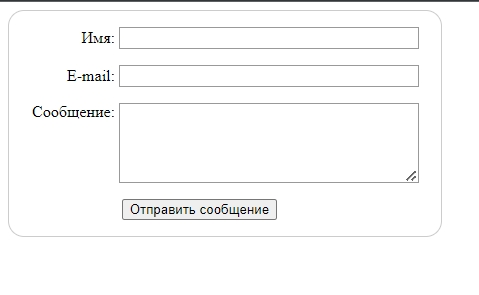

# 001_Ваша_первая_html_форма

<https://developer.mozilla.org/ru/docs/Learn/Forms>

```html
<!DOCTYPE html>
<html lang="en">
  <head>
    <meta charset="UTF-8" />
    <meta
      name="viewport"
      content="width=device-width, user-scalable=no, initial-scale=1.0, maximum-scale=1.0, minimum-scale=1.0"
    />
    <meta http-equiv="X-UA-Compatible" content="ie=edge" />
    <link rel="stylesheet" href="./index.css" />
    <title>Document</title>
  </head>
  <body>
    <form action="/my-handling-form-page" method="post">
      <div>
        <label for="name">Имя:</label>
        <input type="text" id="name" name="user_name" />
      </div>

      <div>
        <label for="mail">E-mail:</label>
        <input type="email" id="mail" name="user_email" />
      </div>

      <div>
        <label for="msg">Сообщение:</label>
        <textarea id="msg" name="user_message"></textarea>
      </div>

      <div class="button">
        <button type="submit">Отправить сообщение</button>
      </div>
    </form>

    <script src="./index.js"></script>
  </body>
</html>

```

```css
form {
  /*Центрирую форму*/
  margin: 0;
  width: 400px;
  /*  Что бы увидить пределы формы*/
  padding: 1em;
  border: 1px solid #ccc;
  border-radius: 1em;
}

div + div {
  margin-top: 1em;
}

label {
  /*  Убеждаюсь что все label выровнены и имеют одинаковый размер*/
  display: inline-block;
  width: 90px;
  text-align: right;
}

input,
textarea {
  font: 1em sans-serif;
  /*  Задаю одинаковый размер*/
  width: 300px;
  -moz-box-sizing: border-box;
  box-sizing: border-box;
  /*  Внешний вид границы текстового поля*/
  border: 1px solid #999;
}

input:focus,
textarea:focus {
  /*  Выделя. активные элементы*/
  border-color: #000;
}

textarea {
  /*  Правильно выравниваю текстовое поле с label*/
  vertical-align: top;
  /*  Задаю высоту для достаточного места для ввода текста*/
  height: 5em;
  /*  Разрешаю пользователям менять размер текстовой области*/
  resize: vertical;
}

.button {
  padding-left: 90px;
}
button {
  margin-left: 0.5em;
}

```



