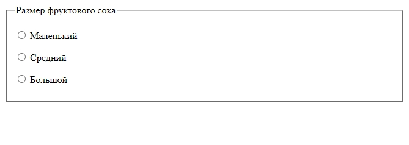
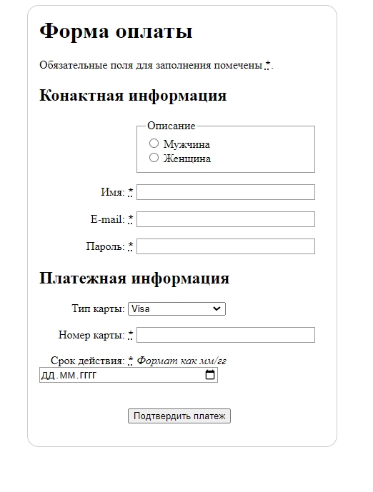

# Как структурировать html формы

<https://developer.mozilla.org/ru/docs/Learn/Forms/How_to_structure_a_web_form>

```html
<!DOCTYPE html>
<html lang="en">
  <head>
    <meta charset="UTF-8" />
    <meta
      name="viewport"
      content="width=device-width, user-scalable=no, initial-scale=1.0, maximum-scale=1.0, minimum-scale=1.0"
    />
    <meta http-equiv="X-UA-Compatible" content="ie=edge" />
    <link rel="stylesheet" href="./index.css" />
    <title>Document</title>
  </head>
  <body>
    <form>
      <fieldset>
        <legend>Размер фруктового сока</legend>
        <p>
          <input type="radio" name="size" id="size_1" value="small" />
          <label for="size_1">Маленький</label>
        </p>
        <p>
          <input type="radio" name="size" id="size_2" value="medium" />
          <label for="size_2">Средний</label>
        </p>
        <p>
          <input type="radio" name="size" id="size_3" value="large" />
          <label for="size_3">Большой</label>
        </p>
      </fieldset>
    </form>

    <script src="./index.js"></script>
  </body>
</html>

```



И более сложная форма оплаты.

```html
<!DOCTYPE html>
<html lang="en">
  <head>
    <meta charset="UTF-8" />
    <meta
      name="viewport"
      content="width=device-width, user-scalable=no, initial-scale=1.0, maximum-scale=1.0, minimum-scale=1.0"
    />
    <meta http-equiv="X-UA-Compatible" content="ie=edge" />
    <link rel="stylesheet" href="./index.css" />
    <title>Document</title>
  </head>
  <body>
    <form>
      <h1>Форма оплаты</h1>
      <p>
        Обязательные поля для заполнения помечены
        <strong><abbr title="required">*</abbr></strong
        >.
      </p>
      <section>
        <h2>Конактная информация</h2>
        <fieldset>
          <legend>Описание</legend>
          <ul>
            <li>
              <label for="title_1">
                <input type="radio" id="title_1" name="title" value="M." />
                Мужчина
              </label>
            </li>
            <li>
              <label for="title_2">
                <input type="radio" id="title_2" name="title" value="Ms." />
                Женщина
              </label>
            </li>
          </ul>
        </fieldset>
        <p>
          <label for="name">
            <span>Имя: </span>
            <strong><abbr title="required">*</abbr></strong>
          </label>
          <input type="text" id="name" name="username" />
        </p>
        <p>
          <label for="mail">
            <span>E-mail: </span>
            <strong>
              <abbr title="required">*</abbr>
            </strong>
          </label>
          <input type="email" id="mail" name="usermail" />
        </p>
        <p>
          <label for="pwd">
            <span>Пароль: </span>
            <strong><abbr title="required">*</abbr></strong>
          </label>
          <input type="password" id="pwd" name="password" />
        </p>
      </section>
      <section>
        <h2>Платежная информация</h2>
        <p>
          <label for="card">
            <span>Тип карты:</span>
          </label>
          <select id="card" name="usercard">
            <option value="visa">Visa</option>
            <option value="mc">Mastercard</option>
            <option value="amex">American Express</option>
          </select>
        </p>
        <p>
          <label for="number">
            <span>Номер карты:</span>
            <strong><abbr title="required">*</abbr></strong>
          </label>
          <input type="number" id="number" name="cardnumber" />
        </p>
        <p>
          <label for="date">
            <span>Срок действия:</span>
            <strong><abbr title="required">*</abbr></strong>
            <em>Формат как мм/гг</em>
          </label>
          <input type="date" id="date" name="expiration" />
        </p>
      </section>
      <p><button type="submit">Подтвердить платеж</button></p>
    </form>
    <script src="./index.js"></script>
  </body>
</html>

```

```css
h1 {
  margin-top: 0;
}

ul {
  margin: 0;
  padding: 0;
  list-style: none;
}

form {
  margin: 0 auto;
  width: 400px;
  padding: 1em;
  border: 1px solid #ccc;
  border-radius: 1em;
}

div + div {
  margin-top: 1em;
}

label span {
  display: inline-block;
  width: 120px;
  text-align: right;
}

input,
textarea {
  font: 1em sans-serif;
  width: 250px;
  box-sizing: border-box;
  border: 1px solid #999;
}

input[type="checkbox"],
input[type="radio"] {
  width: auto;
  border: none;
}

input:focus,
textarea:focus {
  border-color: #000;
}

textarea {
  vertical-align: top;
  height: 5em;
  resize: vertical;
}

fieldset {
  width: 250px;
  box-sizing: border-box;
  margin-left: 136px;
  border: 1px solid #999;
}

button {
  margin: 20px 0 0 124px;
}

label {
  position: relative;
}

```




