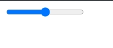

# 003_Стандартные_виджеты_форм

<https://developer.mozilla.org/ru/docs/Learn/Forms/Basic_native_form_controls>

Пример базового одностраничного текстового поля:

```html
 <input type="text" id="comment" name="comment" value="Я текстовое поле" />
```


Однострочное текстовое поле имеет только одно настоящее ограничение: если вы вводите текст с разрывами строки, браузер удаляет эти разрывы строк перед отправкой данных.

<br/>
<br/>
<br/>

Поле E-mail

```html
    <input type="email" id="email" name="email" multiple />

```


можно разрешить пользователю вводить несколько адресов электронной почты в один и тот же ввод (разделенные запятыми), включив multiple атрибут.

<br/>
<br/>
<br/>

Поле пароля

```html
<input type="password" id="pwd" name="pwd">
```


Размещайте все страницы форм изпользуя протокол https для того что бы данные шифровались перед отправкой формы.

<br/>
<br/>
<br/>

Поле поиска

```html
<input type="search" id="search" name="search">
```


<br/>
<br/>
<br/>

Поле телефонного номера

```html
<input type="tel" id="tel" name="tel">
```


<br/>
<br/>
<br/>

Поле для ввода url

```html
<input type="url" id="url" name="url">
```

<br/>
<br/>
<br/>

Многострочные текстовые поля

```html
<textarea cols="30" rows="10"></textarea>
```

Основное различие между текстовым полем и обычным однострочным текстовым полем заключается в том, что пользователям разрешено вводить текст, который включает жесткие разрывы строк (т. е. нажатие клавиши возврата).

<br/>
<br/>
<br/>

Выпадающий контент

Select box

```html
<select id="simple" name="simple">
  <option>Banana</option>
  <option>Cherry</option>
  <option>Lemon</option>
</select>
```


Для того что бы выбать что что будет помещено по умолчанию, в любой нужный элемент option указываю атрибут selected

```html
 <select id="simple" name="simple">
      <option>Banana</option>
      <option>Cherry</option>
      <option selected>Lemon</option>
    </select>
```


Элементы option также могут быть вложены внутрь элементов optgroup для создания визуально связанных групп значений:

```html
<select id="groups" name="groups">
  <optgroup label="fruits">
    <option>Banana</option>
    <option selected>Cherry</option>
    <option>Lemon</option>
  </optgroup>
  <optgroup label="vegetables">
    <option>Carrot</option>
    <option>Eggplant</option>
    <option>Potato</option>
  </optgroup>
</select>
```


Если для элемента option задан атрибут value, значение этого атрибута отправляется при отправке формы. Если атрибут value опущен, содержимое элемента option используется в качестве значения поля выбора.

Множественный выбор

```html
<select multiple id="multi" name="multi">
  <option>Banana</option>
  <option>Cherry</option>
  <option>Lemon</option>
</select>
```

Зажимаю Ctrl


<br/>
<br/>
<br/>

Поле Автозаполнения

```html
<label for="myFruit">Какой твой любимый фрукт?</label>
<input type="text" name="myFruit" id="myFruit" list="mySuggestion">
<datalist id="mySuggestion">
  <option>Apple</option>
  <option>Banana</option>
  <option>Blackberry</option>
  <option>Blueberry</option>
  <option>Lemon</option>
  <option>Lychee</option>
  <option>Peach</option>
  <option>Pear</option>
</datalist>
```


Рекомендуется использовать только с текстовыми полями.

<br/>
<br/>
<br/>

Проверяемые элементы

<https://developer.mozilla.org/ru/docs/Learn/Forms/Basic_native_form_controls#checkable_items>

Check box

```html
<input type="checkbox" checked id="carrots" name="carrots" value="carrots">
```


Включение атрибута checked делает флажок автоматически установленным при загрузке страницы

<br/>
<br/>
<br/>

Radio button

Несколько радиокнопок можно связать вместе. Если они имеют одинаковое значение атрибута имени, они будут считаться принадлежащими к одной группе кнопок. Одновременно может быть проверена только одна кнопка в данной группе; это означает, что когда один из них отмечен, все остальные автоматически снимаются. При отправке формы отправляется только значение отмеченного переключателя. Если ни один из них не отмечен, считается, что весь пул переключателей находится в неизвестном состоянии, и с формой не отправляется никакое значение.

```html
<form>
    <fieldset>
        <legend>Какое ваше любимое блюдо?</legend>
        <ul>
            <li>
                <label for="soup">Soup</label>
                <input type="radio" checked id="soup" name="meal" value="soup">
            </li>
            <li>
                <label for="curry">Curry</label>
                <input type="radio" id="curry" name="meal" value="curry">
            </li>
            <li>
                <label for="pizza">Pizza</label>
                <input type="radio" id="pizza" name="meal" value="pizza">
            </li>
        </ul>
    </fieldset>
</form>
```


<br/>
<br/>
<br/>

В html формах есть три типа кнопок

* Submit - Отправляет данные формы на сервер
* Reset - Сбрасывает все виджеты формы к их значениям по умолчанию
* Anonymous - Кнопки, которые не действуют автоматически, но могут быть настроены с помощью кода JavaScript. Если вы опустите атрибут type, это значение по умолчанию

```html
<form>
      <button type="submit">This a <br /><strong>submit button</strong></button>

      <input type="submit" value="This is a submit button" />
    </form>
```


reset

```html
<form>
      <button type="reset">This a <br /><strong>reset button</strong></button>

      <input type="reset" value="This is a reset button" />
    </form>
```


anonymous

```html
<form>
    <button type="button">
        This an <br /><strong>anonymous button</strong>
    </button>

    <input type="button" value="This is an anonymous button" />
</form>
```


С технической точки зрения почти нет разницы между кнопкой, определенной с помощью элемента button, или элемента ввода. Единственная заметная разница — это метка самой кнопки. В элементе ввода метка может быть только символьной, тогда как в элементе кнопки метка может быть HTML, поэтому ее можно оформить соответствующим образом.

<br/>
<br/>
<br/>

Numbers

```html
<input type="number" name="age" id="age" min="1" max="10" step="2">
```

<br/>
<br/>
<br/>

Sliders

Другой способ выбрать номер — использовать ползунок. С визуальной точки зрения ползунки менее точны, чем текстовые поля, поэтому они используются для выбора числа, точное значение которого не обязательно важно.

Ползунок создается с использованием ввода с атрибутом типа, установленным в диапазоне значений. Важно правильно настроить слайдер; с этой целью настоятельно рекомендуется установить атрибуты min, max и step.

```html
    <input type="range" name="beans" id="beans" min="0" max="500" step="10" />

```



В этом примере создается ползунок, значение которого может находиться в диапазоне от 0 до 500, а кнопки увеличения/уменьшения изменяют значение на +10 и -10.

Одна из проблем с ползунками заключается в том, что они не предлагают никакой визуальной обратной связи относительно текущего значения. Вам нужно добавить это самостоятельно с помощью JavaScript, но это относительно легко сделать. В этом примере мы добавляем пустой элемент span, в который будем записывать текущее значение ползунка, обновляя его по мере изменения.

```html
<form>
      <label for="beans">How many beans can you eat?</label>
      <input type="range" name="beans" id="beans" min="0" max="500" step="10" />
      <span class="beancount"></span>
    </form>
```


```js
var beans = document.querySelector('#beans');
var count = document.querySelector('.beancount');

count.textContent = beans.value;

beans.oninput = function() {
  count.textContent = beans.value;
}
```


Здесь мы сохраняем ссылки на входной диапазон и диапазон в двух переменных, затем мы сразу же устанавливаем textContent диапазона в текущее значение ввода. Наконец, мы настроили обработчик события oninput, чтобы при каждом перемещении ползунка диапазона textContent диапазона обновлялся до нового входного значения.

<br/>
<br/>
<br/>

Date and time picker(Выбор даты и времени)

Сбор значений даты и времени традиционно был кошмаром для веб-разработчиков. HTML5 вносит некоторые улучшения, предоставляя специальный элемент управления для обработки данных определенного типа.

Элемент управления датой и временем создается с использованием элемента ввода и соответствующего значения атрибута типа, в зависимости от того, хотите ли вы собирать даты, время или и то, и другое.

datetime-local
Это создает виджет для отображения и выбора даты со временем, но без какой-либо конкретной информации о часовом поясе.

```html
    <input type="datetime-local" name="datetime" id="datetime" />

```


<br/>
<br/>
<br/>

month

```html
<input type="month" name="month" id="month">
```


<br/>
<br/>

time

```html
<input type="time" name="time" id="time">
```


<br/>
<br/>

week

```html
<input type="week" name="week" id="week">
```


Все элементы управления датой и временем могут быть ограничены с помощью атрибутов min и max.

```html
 <label for="myDate">Когда вы свободны этим летом?</label>
    <input
      type="date"
      name="myDate"
      min="2022-06-01"
      max="2022-08-31"
      id="myDate"
    />
```


<br/>
<br/>
<br/>

Выбор цвета

```html
<input type="color" name="color" id="color">
```


<br/>
<br/>
<br/>

File picker(Средство выбора файлов)

```html
<input type="file" name="file" id="file" accept="image/*" multiple>
```


<br/>
<br/>
<br/>

Скрытый контент
Иногда по техническим причинам удобно иметь фрагменты данных, которые отправляются с формой, но не отображаются пользователю. Для этого вы можете добавить в форму невидимый элемент. Используйте вход со скрытым значением атрибута типа.

Если вы создаете такой элемент, необходимо установить его атрибуты name и value:

```html
<input type="hidden" id="timestamp" name="timestamp" value="1286705410">
```

К примеру отправлять token с какими-то данными.

<br/>
<br/>
<br/>

Image button

```html
<input
        type="image"
        alt="Click me!"
        src="./button-arrow.png"
        width="80"
        height="30"
/>
```


Если кнопка изображения используется для отправки формы, этот виджет не отправляет свое значение; вместо этого отправляются координаты X и Y щелчка по изображению (координаты относятся к изображению, что означает, что верхний левый угол изображения представляет собой координату 0, 0). Координаты отправляются в виде двух пар ключ/значение:

Ключ значения X — это значение атрибута имени, за которым следует строка «.x».
Ключ значения Y — это значение атрибута имени, за которым следует строка «.y».
Так, например, когда вы нажимаете на изображение этого виджета, вы перенаправляетесь на URL-адрес, подобный следующему:


```
http://foo.com?pos.x=123&pos.y=456
```


Это очень удобный способ построения «горячей карты». Как эти значения отправляются и извлекаются, подробно описано в статье Отправка и получение данных формы.

<br/>
<br/>
<br/>

Счетчики и индикаторы выполнения

Progress

Индикатор выполнения представляет собой значение, которое со временем изменяется до максимального значения, заданного атрибутом max. Такой бар создается с помощью элемента progress.

```html
<progress max="100" value="75">75/100</progress>
```
Это необходимо для реализации чего-либо, требующего отчета о ходе выполнения, например, процента от общего числа загруженных файлов или количества вопросов, заполненных в анкете.

Содержимое внутри элемента progress является запасным вариантом для браузеров, которые не поддерживают этот элемент, и для вспомогательных технологий, которые озвучивают его.

<br/>
<br/>
<br/>

Meter

Полоса индикатора представляет собой фиксированное значение в диапазоне, ограниченном минимальным и максимальным значением. Это значение визуально отображается в виде полосы, и чтобы узнать, как выглядит эта полоса, мы сравниваем это значение с некоторыми другими заданными значениями:

Низкие и высокие значения делят диапазон на три части:
Нижняя часть диапазона находится между минимальным и низким значениями (включая эти значения).
Средняя часть диапазона находится между низкими и высокими значениями (исключая эти значения).
Верхняя часть диапазона находится между максимальным и максимальным значениями (включая эти значения).
Оптимальное значение определяет оптимальное значение для измерительного элемента. В сочетании с низким и высоким значением он определяет, какая часть диапазона предпочтительнее:
Если оптимальное значение находится в нижней части диапазона, нижний диапазон считается предпочтительным, средний диапазон считается средним, а верхний диапазон считается наихудшей частью.
Если оптимальное значение находится в средней части диапазона, нижний диапазон считается средней частью, средний диапазон считается предпочтительной частью, а верхний диапазон также считается средним.
Если оптимальное значение находится в верхней части диапазона, нижний диапазон считается наихудшей частью, средний диапазон считается средней частью, а более высокий диапазон считается предпочтительной частью.

Все браузеры, которые реализуют элемент счетчика, используют эти значения для изменения цвета полосы индикатора:

Если текущее значение находится в предпочтительной части диапазона, полоса становится зеленой.
Если текущее значение находится в средней части диапазона, полоса имеет желтый цвет.
Если текущее значение находится в худшей части диапазона, полоса становится красной.
Такая полоса создается с помощью элемента счетчика. Это для реализации любого типа счетчика, например, полосы, показывающей общее пространство, используемое на диске, которая становится красной, когда начинает заполняться.

```html
<meter min="0" max="100" value="25" low="33" high="66" optimum="75">
      25
    </meter>
```


```html
 <meter min="0" max="100" value="50" low="33" high="66" optimum="75">
      50
    </meter>
```


```html
 <meter min="0" max="100" value="100" low="33" high="66" optimum="75">
      100
    </meter>
```


