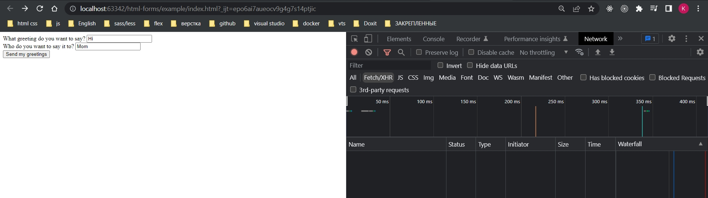
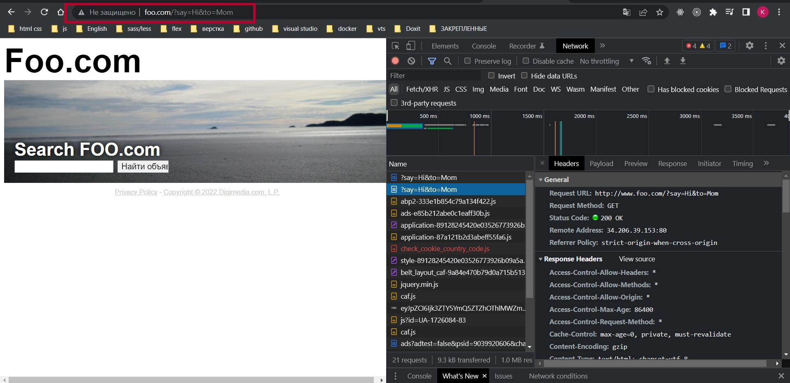
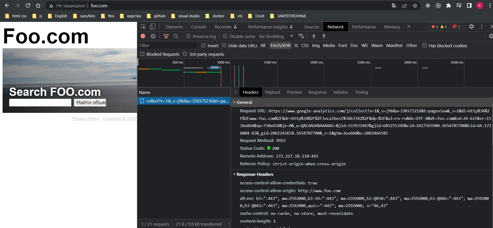
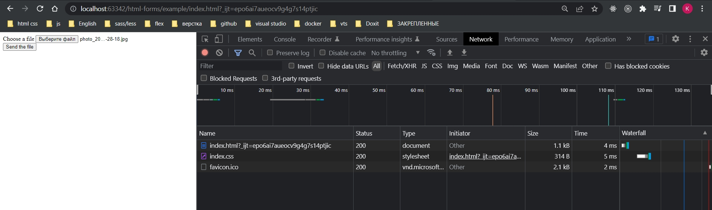
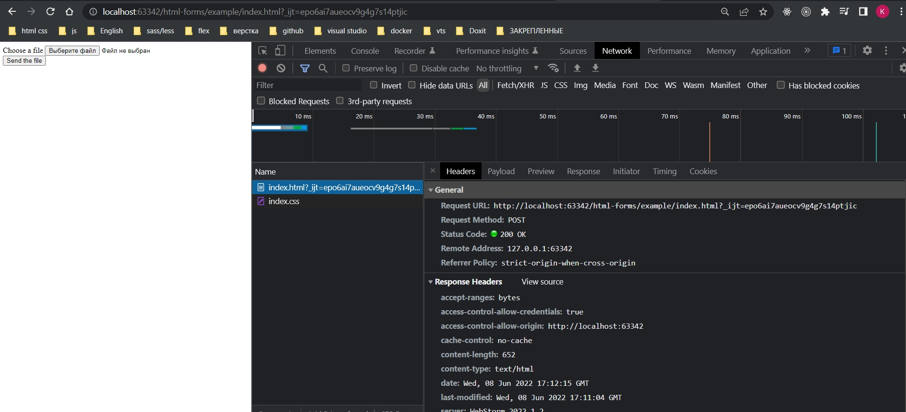

# 004_Отправка_данных

<https://developer.mozilla.org/ru/docs/Learn/Forms/Sending_and_retrieving_form_data>

Метод GET

Метод GET - это метод, используемый браузером, который говорит серверу, что нужно отправить назад данный ресурс: «Эй, сервер, я хочу получить этот ресурс». В этом случае браузер отправляет пустое тело. Поскольку тело пустое, если форма отправляется с использованием данного метода, данные, отправляемые на сервер, добавляются к URL-адресу.

Рассмотрим следующую форму:

```html
<form action="http://foo.com" method="get">
  <div>
    <label for="say">What greeting do you want to say?</label>
    <input name="say" id="say" value="Hi">
  </div>
  <div>
    <label for="to">Who do you want to say it to?</label>
    <input name="to" id="to" value="Mom">
  </div>
  <div>
    <button>Send my greetings</button>
  </div>
</form>
```

Поскольку используется метод GET, вы увидите URL www.foo.com/?say=Hi&to=Mom, который появится в адресной строке браузера при отправке формы.





Данные добавляются в URL как последовательность пар имя / значение. После того, как URL веб-адрес закончился, мы добавляем знак вопроса (?), за которым следуют пары имя / значение, каждая из которых разделена амперсандом (&). В этом случае мы передаём две части данных на сервер:

say, со значением Hi
to, со значением Mom

Метод POST

Метод POST немного отличается. Браузер использует этот метод для связи с сервером при запросе ответа с учётом данных, представленные в теле HTTP-запроса: «Эй, сервер, взгляни на эти данные и отправь мне соответствующий результат». Если форма отправляется с использованием этого метода, данные добавляются в тело HTTP-запроса.

Давайте рассмотрим пример — это та же самая форма, которую мы рассматривали в разделе GET выше, но с атрибутом method, установленным в post.

```html
<form action="http://foo.com" method="post">
  <div>
    <label for="say">What greeting do you want to say?</label>
    <input name="say" id="say" value="Hi">
  </div>
  <div>
    <label for="to">Who do you want to say it to?</label>
    <input name="to" id="to" value="Mom">
  </div>
  <div>
    <button>Send my greetings</button>
  </div>
</form>
```



Когда форма отправляется с использованием метода POST, данные добавляются не к URL-адресу, а включаются в тело запроса. HTTP-запрос имеет следующий вид:

```
POST / HTTP/2.0
Host: foo.com
Content-Type: application/x-www-form-urlencoded
Content-Length: 13

say=Hi&to=Mom

```

Заголовок Content-Length указывает размер тела, а заголовок Content-Type указывает тип данных, отправляемых на сервер.

Особый случай: отправка файлов
Отправка файлов с помощью форм HTML —  это особый случай. Файлы — это бинарные данные или рассматриваются как таковые, в то время как все остальные — это текстовые данные. Поскольку HTTP — это текстовый протокол, есть особые требования для работы с бинарными данными.

Атрибут enctype
Этот атрибут позволяет конкретизировать значение в Content-Type HTTP заголовок, включённый в запрос, при генерировании отправки формы. Этот заголовок очень важен, потому что указывает серверу, какой тип данных отправляется. По умолчанию это: application/x-www-form-urlencoded. На человеческом это значит: "Это форма с данными, которые были закодированы в URL параметры."

Если хотите отправить файл, нужно сделать следующие три шага:

Указать method атрибут POST, поскольку содержимое файла, как и сам файл, не могут быть отображены в URL параметрах.
Установить в enctype значение multipart/form-data, потому что данные будут разбиты на несколько частей: одна часть на файл (две части на два файла), и одна часть на текстовые данные (при условии, если форма содержит поле для получения тестовых данных).
Подключите один или более File picker виджетов, чтобы позволить своим пользователям выбрать, какие и сколько файлов будут загружены.
Пример:

```html
<form method="post" enctype="multipart/form-data">
  <div>
    <label for="file">Choose a file</label>
    <input type="file" id="file" name="myFile">
  </div>
  <div>
    <button>Send the file</button>
  </div>
</form>
```





Проблемы безопасности
Каждый раз, когда вы отправляете данные на сервер, вы должны учитывать безопасность. HTML-формы являются наиболее распространёнными векторами атак на серверы(места, где могут происходить атаки). Проблемы вытекают не из самих форм HTML, а из-за того, как сервер обрабатывает данные из этих форм.

В зависимости от того, что вы делаете, вы можете столкнуться с некоторыми очень известными проблемами безопасности:

XSS "Межсайтовый скриптинг" и CSRF "Подделка межсайтовых запросов"
Межсайтовый скриптинг (XSS "Cross Site Request Forgery") и подделка межсайтовых запросов (CSRF "Cross-Site Scripting") - это распространённые типы атак, которые происходят при отображении данных после ответа сервера или другого пользователя.

Межсайтовый скриптинг (XSS "Cross Site Request Forgery") позволяет злоумышленникам внедрить клиентский скрипт в веб-страницы, просматриваемые другими пользователями. Подделка межсайтовых запросов (CSRF "Cross-Site Scripting") может использоваться злоумышленниками для обхода средств контроля доступа, таких как одна и та же политика происхождения. Последствие от этих атак может варьироваться от мелких неудобств до значительного риска безопасности.

CSRF-атаки аналогичны XSS-атакам в том, что они начинаются одинаково - с внедрения клиентского скрипта в веб-страницы - но их конечные цели разные. Злоумышленники CSRF пытаются назначить права пользователям с более высоким уровнем прав доступа(например, администратору сайта), чтобы выполнить действие, которое они не должны выполнять (например, отправка данных ненадёжному пользователю). Атаки XSS используют доверие пользователя к веб-сайту, в то время как атаки CSRF используют доверие веб-сайта к пользователю.

Чтобы предотвратить эти атаки, вы всегда должны проверять данные, которые пользователь отправляет на ваш сервер, и (если вам нужно отобразить их) стараться не отображать HTML-контент, предоставленный пользователем. Вместо этого вы должны обработать предоставленные пользователем данные, чтобы не отображать их слово в слово. Сегодня почти все платформы на рынке реализуют минимальный "фильтр", который удаляет элементы HTML <script>, <iframe> (en-US) и <object> (en-US) полученных от любого пользователя. Это помогает снизить риск, но не исключает его полностью.

SQL - вброс
SQL -вброс представляет собой тип атак, при которых осуществляется попытка выполнения действия с базой данных, используемой целевым веб-сайтом. В этих случаях обычно осуществляется отправка SQL-запроса в надежде, что сервер выполнит этот запрос (обычно при попытке сервера приложения сохранить данные, отправляемые пользователем). Данный вид атак является одним из самых направленных атак на веб-сайты.

Последствия могут быть ужасающими, начиная от потери данных и заканчивая утратой контроля над всей инфраструктурой веб-сайта за счёт повышения привилегий. Это очень серьёзная угроза, поэтому никогда не сохраняйте данные, отправляемые пользователем, без выполнения фильтрации данных (например, с помощью mysqli_real_escape_string().

Вброс HTTP-заголовка и email
Эти виды атак могут проявляться, когда ваше приложение создаёт заголовки HTTP или электронные почтовые адреса на основании данных, введённых пользователем в форму. Такие атаки напрямую не повреждают сервер или пользователей, однако создают уязвимость для таких угроз, как перехват сессии, или для фишинговых атак.

Такие атаки являются самыми незаметными, но при этом могут превратить ваш сервер в зомби.

Будьте параноиком: никогда не доверяйте вашим пользователям
Как вы боретесь с такими угрозами? Этот вопрос выходит далеко за рамки данной статьи, но есть несколько общих правил, которые следует всегда соблюдать. Самое важное из них - никогда не доверяйте вашим пользователям, в том числе себе; даже проверенный пользователь может быть атакован.

Все данные, поступающие на ваш сервер, необходимо проверять и санитизировать. Все и всегда. Без исключений.

Избегайте потенциально опасных символов. Конкретные символы, с которыми следует соблюдать осторожность, зависят от контекста, в котором используются данные, а также от используемой платформы. Однако, все языки на стороне сервера имеют соответствующие функции для обеспечения такой защиты.
Ограничьте входящий объем данных для поступления только реально необходимых данных.
Помещайте загруженные файлы в песочницу (храните их на другом сервере и предоставляйте доступ к фалам только через отдельный поддомен или даже через совершенно другое доменное имя).
Соблюдая эти три правила, вы сможете избежать многих/большинства проблем. При этом следует помнить, что периодически необходимо проводить анализ защищённости, желательно квалифицированной сторонней организацией. Не считайте, что вы уже сталкивались со всеми возможными угрозами.