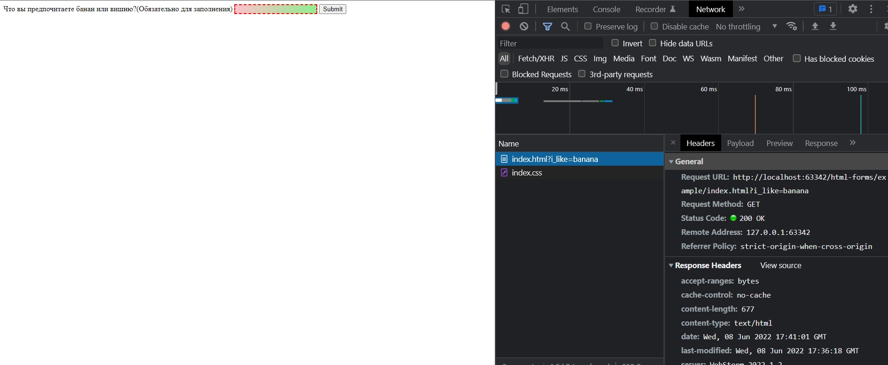

# 005_Валидация_форм_на_стороне_клиента

<https://developer.mozilla.org/ru/docs/Learn/Forms/Form_validation>

Типы валидации на стороне клиента
Существует два типа валидации на стороне клиента, с которыми вы столкнётесь в Интернете:

Встроенная валидация форм использует функционал валидации HTML5, который мы неоднократно обсуждали в этом модуле. HTML5-валидация обычно не требует большого количества JavaScript-кода и демонстрирует лучшую производительность, но не настолько настраиваема, как валидация с помощью JavaScript.
JavaScript-валидация кодируется с помощью JavaScript. Она полностью настраиваема, но требует программирования всей логики (или использования библиотеки).

Использование встроенной валидации формИспользование встроенной валидации форм

* **required**: Определяет, что для отправки формы данное поле предварительно должно быть заполнено.
* **minlength** и **maxlength**: Задаёт минимальную и максимальную длину текстовых данных (строк)
* **min** и **max**: Задаёт минимальное и максимальное значение для поля, расчитанного на числовой тип данных
* **type**: Определяет тип данных, на который рассчитано поле: число, email-адрес или какой-то другой предустановленный тип
* **pattern**: С помощью регулярного выражения, определяет шаблон, которому должны соответствовать вводимые данные.


Когда элемент валиден, справедливы следующие утверждения:

* Элемент соответствует CSS-псевдоклассу :valid, позволяющему стилизовать только валидные элементы.
* Если пользователь пытается отправить данные, браузер отправит форму при условии, что ничто другое (например, JavaScript) не помешает ему это сделать

Когда элемент не валиден, справедливы следующие утверждения:

* Элемент соответствует CSS-псевдоклассу :invalid или, в зависимости от ошибки, другим псевдоклассам (например, :out-of-range), которые позволяют применять определённые стили к элементам, не являющимся валидными.
* Если пользователь пытается отправить данные, браузер заблокирует форму и выведет сообщение об ошибке.

Примечание: Существует ошибки, которые не позволяют отправлять форму, в частности badInput, patternMismatch, rangeOverflow или rangeUnderflow, stepMismatch, tooLong или tooShort, typeMismatch, valueMissing, или customError.

Примеры встроенной валидации форм

```html
<form>
    <label for="choose">Что вы предпочитаете банан или вишню?(Обязательно для заполнения)</label>
    <input id="choose" name="i_like" required />
    <button>Submit</button>
</form>
```

```css
input:invalid {
    border: 2px dashed red;
}

input:invalid:required {
    background-image: linear-gradient(to right, pink, lightgreen);
}

input:valid {
    border: 2px solid black;
}
```




<br/>
<br/>
<br/>

Валидация с помощью регулярного выражения   

```html
<form>
  <label for="choose">Would you prefer a banana or a cherry?</label>
  <input id="choose" name="i_like" required pattern="[Bb]anana|[Cc]herry">
  <button>Submit</button>
</form>
```


<br/>
<br/>
<br/>

Ограничение длины вводимых значений

Можно ограничить максимально допустимое количество символов для текстовых полей input или textarea (en-US) используя атрибуты minlength и maxlength. Поле будет не валидным, если количество символов его содержимого будет меньше minlength или больше maxlength.

<br/>
<br/>
<br/>

Ограничение допустимых значений
В полях, предназначенных для ввода чисел (например, input type="number"), диапазон допустимых значений можно определить с помощью атрибутов min и max. Если поле содержит значение за пределами данного диапазона, оно будет не валидным.

```html
<form>
  <div>
    <label for="choose">Would you prefer a banana or a cherry?</label>
    <input type="text" id="choose" name="i_like" required minlength="6" maxlength="6">
  </div>
  <div>
    <label for="number">How many would you like?</label>
    <input type="number" id="number" name="amount" value="1" min="1" max="10">
  </div>
  <div>
    <button>Submit</button>
  </div>
</form>
```

И еще пример

```html
<form>
  <p>
    <fieldset>
      <legend>Do you have a driver's license?<abbr title="This field is mandatory" aria-label="required">*</abbr></legend>
      <!-- Так как в группе радио-кнопок, имеющих одинаковое имя, выбранной может быть
          только одна, то и атрибут "required" достаточно задать хотя бы одной кнопке,
          чтобы сделать всю группу обязательной для заполнения -->
      <input type="radio" required name="driver" id="r1" value="yes"><label for="r1">Yes</label>
      <input type="radio" required name="driver" id="r2" value="no"><label for="r2">No</label>
    </fieldset>
  </p>
  <p>
    <label for="n1">How old are you?</label>
    <!-- Атрибут "pattern" может выступать фолбэком для браузеров, которые
        не поддерживают поля ввода c числовым типом данных. Те браузеры,
        которые такие поля поддерживают, будут просто игнорировать его.
        Как раз, ниже атрибут "pattern" выполняет роль фолбека.
     -->
    <input type="number" min="12" max="120" step="1" id="n1" name="age"
           pattern="\d+">
  </p>
  <p>
    <label for="t1">What's your favorite fruit?<abbr title="This field is mandatory" aria-label="required">*</abbr></label>
    <input type="text" id="t1" name="fruit" list="l1" required
           pattern="[Bb]anana|[Cc]herry|[Aa]pple|[Ss]trawberry|[Ll]emon|[Oo]range">
    <datalist id="l1">
      <option>Banana</option>
      <option>Cherry</option>
      <option>Apple</option>
      <option>Strawberry</option>
      <option>Lemon</option>
      <option>Orange</option>
    </datalist>
  </p>
  <p>
    <label for="t2">What's your e-mail address?</label>
    <input type="email" id="t2" name="email">
  </p>
  <p>
    <label for="t3">Leave a short message</label>
    <textarea id="t3" name="msg" maxlength="140" rows="5"></textarea>
  </p>
  <p>
    <button>Submit</button>
  </p>
</form>
```

```css
form {
  font: 1em sans-serif;
  max-width: 320px;
}

p > label {
  display: block;
}

input[type="text"],
input[type="email"],
input[type="number"],
textarea,
fieldset {
  width : 100%;
  border: 1px solid #333;
  box-sizing: border-box;
}

input:invalid {
  box-shadow: 0 0 5px 1px red;
}

input:focus:invalid {
  box-shadow: none;
}
```


<br/>
<br/>
<br/>
<br/>

Валидация форм с помощью JavaScript

Если нужно управлять внешним видом встроенных сообщений об ошибке или работать с устаревшими браузерами, которые не поддерживают встроенную валидацию форм HTML, вам следует использовать JavaScript. В данном разделе мы рассмотрим различные способы делать это.

Constraint Validation API
Большинство браузеров поддерживают Constraint Validation API, который состоит из набора свойств и методов, доступных на DOM-интерфейсах следующих элементов форм:

* HTMLButtonElement (представляет элемент button)
* HTMLFieldSetElement (представляет элемент fieldset)
* HTMLInputElement (представляет элемент input)
* HTMLOutputElement (представляет элемент output)
* HTMLSelectElement (представляет элемент select)
* HTMLTextAreaElement (представляет элемент textarea)

Для перечисленных выше элементов Constraint Validation API делает доступными следующие свойства.

* validationMessage: Возвращает локализованное сообщение, описывающее ограничения валидации (если таковые имеются), которым не удовлетворяет определённый элемент. Если элемент не участвует в валидации (willValidate установлено в false) или значение элемента удовлетворяет установленным ограничениям (является валидным), будет возвращена пустая строка.
* validity: Возвращает объект ValidityState, который содержит несколько свойств, описывающих состояние валидности элемента. Подробное описание всех свойств доступности можно найти на странице справочника ValidityState; ниже приведён список наиболее используемых:
* patternMismatch: Возвращает true, если значение не соответствует шаблону, указанному в атрибуте pattern, и false если соответствует. Если true, элемент соответствует CSS-псевдоклассу :invalid.
* tooLong: Возвращает true, если значение длиннее максимальной длины, указанной в атрибуте maxlength, и false если оно короче или равно ей. Если true, элемент соответствует CSS-псевдоклассу :invalid.
* tooShort: Возвращает true, если значение короче минимальной длины, указанной в атрибуте minlength, и false если оно длинее или равно ей. Если true, элемент соответствует CSS-псевдоклассу :invalid.
* rangeOverflow: Возвращает true, если значение больше указанного в атрибуте max максимума, и false если меньше или равно ему. Если true, элемент соответствует CSS-псевдоклассам :invalid и :out-of-range
* rangeUnderflow: Возвращает true, если значение меньше указанного в атрибуте min, и false если больше или равно ему. Если true, элемент соответствует CSS-псевдоклассу :invalid и :out-of-range.
* typeMismatch: Возвращает true, если значение не соответствует требуемому синтаксису (когда для type задано значение email или url), и false если синтаксис корректный. Если true, элемент соответствует CSS-псевдоклассу :invalid.
* valid: Возвращает true, если элемент соответствует всем ограничениям валидации — следовательно, считается валидным, и false если не соответствует какому-то ограничению. Если true, элемент соответствует CSS-псевдоклассу :valid; иначе :invalid.
* valueMissing: Возвращает true, если у элемента есть атрибут required, но не введено значенение, иначе возвращает false. Если true, элемент соответствует CSS-псевдоклассу :invalid.
* willValidate: Возвращает true, если элемент будет участвовать в валидации при отправке формы; иначе возвращает false.

Также для перечисленных выше элементов Constraint Validation API делает доступными следующие методы.

* checkValidity(): Возвращает true, если значение элемента проходит валидацию, иначе возвращает false. Если элемент не валиден, данный метод также запускает на нём событие invalid.
* setCustomValidity(message): Позволяет добавить в элемент кастомное сообщение об ошибке; при этом элемент будет считаться не валидным и отобразится указанная ошибка. Это позволяет использовать JavaScript-код, чтобы представить ошибку валидации иначе, чем это предусмотрено стандартными средствами валидации HTML5. При сообщении об ошибке данное кастомное сообщение показывается пользователю.


```html
<form>
  <label for="mail">Я хотел бы что бы вы предоставили мне адрес электронной почты:</label>
  <input type="email" id="mail" name="mail">
  <button>Submit</button>
</form>
```

```js
const email = document.getElementById("mail");

email.addEventListener("input", function (event) {
  if (email.validity.typeMismatch) {
    email.setCustomValidity("I am expecting an e-mail address!");
  } else {
    email.setCustomValidity("");
  }
});
```

При отправке


Теперь более сложный пример

```html
<form novalidate>
      <p>
        <label for="mail">
          <span>Пожалуйста введите email адрес:</span>
          <input type="email" id="mail" name="mail" required minlength="8" />
          <span class="error" aria-live="polite"></span>
        </label>
      </p>
      <button>Отправить</button>
    </form>
```

novalidate отключает автоматическую валидацию браузером.

~~~
Примечание: Ключевым моментом здесь является то, что добавление к форме атрибута novalidate отключает отображение встроенных сообщений об ошибке и позволяет вместо этого добавлять в DOM кастомные сообщения.
~~~


```css
body {
  font: 1em sans-serif;
  width: 200px;
  padding: 0;
  margin : 0 auto;
}

p * {
  display: block;
}

input[type=email]{
  -webkit-appearance: none;
  appearance: none;

  width: 100%;
  border: 1px solid #333;
  margin: 0;

  font-family: inherit;
  font-size: 90%;

  box-sizing: border-box;
}

/* Это стили для не валидных полей */
input:invalid{
  border-color: #900;
  background-color: #FDD;
}

input:focus:invalid {
  outline: none;
}

/* Это стили для кастомных сообщений об ошибке */
.error {
  width  : 100%;
  padding: 0;

  font-size: 80%;
  color: white;
  background-color: #900;
  border-radius: 0 0 5px 5px;

  box-sizing: border-box;
}

.error.active {
  padding: 0.3em;
}
```

```js
// Существуют разные способы получить DOM-узел; здесь мы определяем саму форму и
// поле ввода email и элемент span, в который поместим сообщение об ошибке
const form = document.getElementsByTagName("form")[0];

const email = document.getElementById("mail");
const emailError = document.querySelector("#mail + span.error");

email.addEventListener("input", function (event) {
  // Каждый раз, когда пользователь что-то вводит,
  // мы проверяем, являются ли поля формы валидными
  if (email.validity.valid) {
    // Если на момент валидации какое-то сообщение об ошибке уже отображается,
    // если поле валидно, удаляем сообщение
    emailError.textContent = ""; // Сбросить содержимое сообщения
    emailError.className = "error"; // Сбросить визуальное состояние сообщения
  } else {
    // Если поле не валидно, показываем правильную ошибку
    showError();
  }
});

form.addEventListener("submit", function (event) {
  // Если поле email валдно, позволяем форме отправляться
  if (!email.validity.valid) {
    // Если поле email не валидно, отображаем соответствующее сообщение об ошибке
    showError();
    // Затем предотвращаем стандартное событие отправки формы
    event.preventDefault();
  }
});

function showError() {
  if (email.validity.valueMissing) {
    // Если поле пустое,
    // отображаем следующее сообщение об ошибке
    emailError.textContent = "Вам необходимо ввести адрес электронной почты.";
  } else if (email.validity.typeMismatch) {
    // Если поле содержит не email-адрес,
    // отображаем следующее сообщение об ошибке
    emailError.textContent =
      "Введенное значение должно быть адресом электронной почты.";
  } else if (email.validity.tooShort) {
    // Если содержимое слишком короткое,
    // отображаем следующее сообщение об ошибке
    emailError.textContent = `Электронная почта должна быть не менее ${email.minLength} символов. Вы ввели ${email.value.length}`;
  } else {
    // Задаём соответствующую стилизацию
    emailError.className = "error active";
  }
}

```


