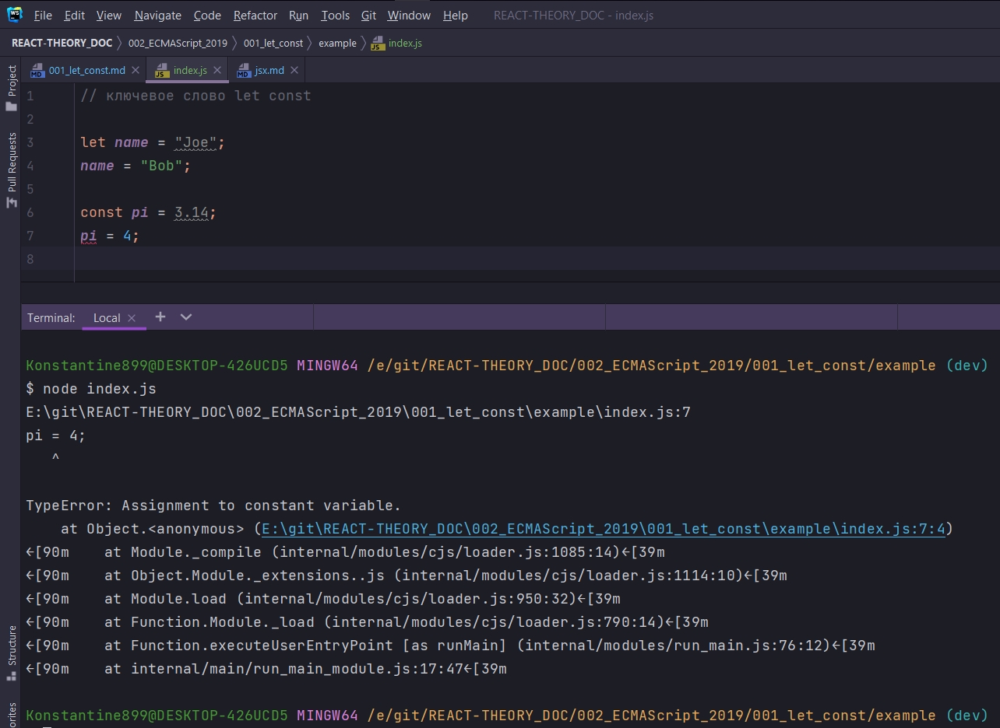
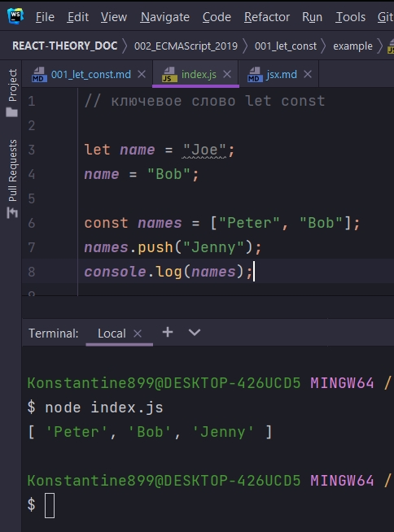
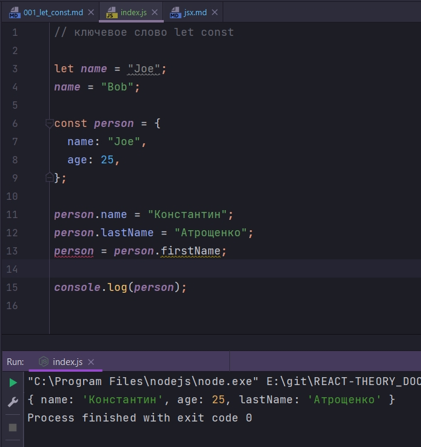
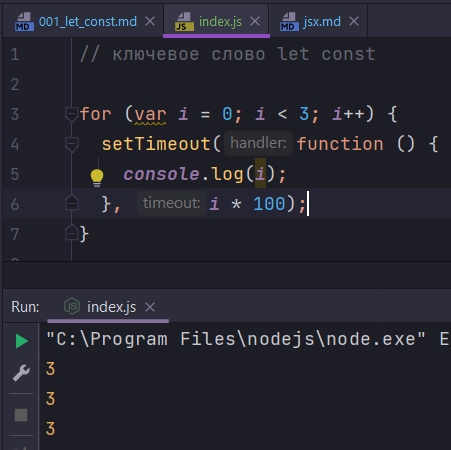
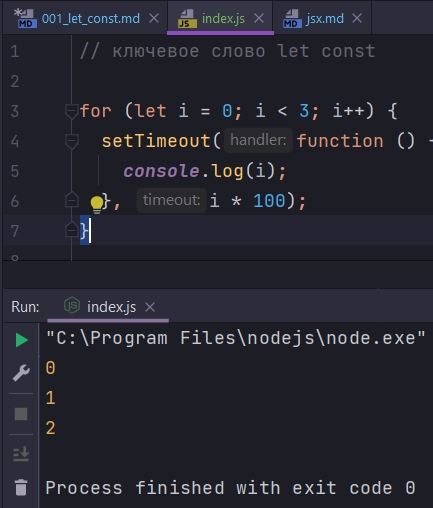

# let const

Они пришли на замену ключевому слову **var**.

Здесь будет мало инфы так для галочки

````js
// ключевое слово let const

let name = "Joe";
name = "Bob";

const pi = 3.14;
pi = 4;

````



Если вы работаете с числами или **boolean** или **string** т.е. с примитивами. **const** означает что что значение примитивов нельзя изменять.

Но если вы работаете с объектами, массивами то тут ситуации интереснее.

```js
// ключевое слово let const

let name = "Joe";
name = "Bob";

const names = ["Peter", "Bob"];

```

Мы не можем присвоить новое значение индентификатору переменной объявленной с помощью **const**. Но мы можем изменять содержимое массива.

```js
// ключевое слово let const

let name = "Joe";
name = "Bob";

const names = ["Peter", "Bob"];
names.push("Jenny");
console.log(names);

```



Тоже самое с объектами

```js
// ключевое слово let const

let name = "Joe";
name = "Bob";

const person = {
  name: "Joe",
  age: 25,
};

person.name = "Константин";
person.lastName = "Атрощенко";
person = person.firstName;

console.log(person);

```



Как видим содержимое объекта я могу изменть, а вот индентификатору переменной объявленной с помощью ключевого слова const присвоить новое значение, т.е. переписать присвоенное ей значение мы не можем.

Проблема **var**.

Проблема индентификаторов переменных объявленных с помощью ключевого слова **var** является вся функция, в то время как **let** и **const** видны только в рамках юлока кода где они объявлены.

Другими словами если у вас есть такой блок

```js
// ключевое слово let const

if (true) {
  let a = 1;
}

// a - не видна

```

То область видимости **let** исключительно тело условия.

Вроде бы мелочь. Однако если посмотреть на это и то как ведет себя **var** в цикле **for** в котором используется асинхронная функция **setTimeout**.

```js
// ключевое слово let const

for (var i = 0; i < 3; i++) {
  setTimeout(function () {
    console.log(i);
  }, i * 100);
}

```



На самом деле все очень просто. На самом деле существует лишь один адрес в памяти где храниться значение переменной **i**. Соответственно через 100 миллисекунд когда будет значение будет выводится в первый раз, значение i уже будет равно 3, потому что к тому моменту цикл уже закончит свою работу. Через 200 миллисек мы запустим функцию setTimeout которая выведет значение из абсолютно того же места в памяти. Ну и точно так же сработает 3-я функция.

```js
// ключевое слово let const

for (let i = 0; i < 3; i++) {
  setTimeout(function () {
    console.log(i);
  }, i * 100);
}

```



Дело в том что область видимости **let** это блок кода, то на каждой итерации цикла создается новая переменная **i** и соответственно новый адрес в памяти который и будет использоваться внутри функции.

> var - не используется
> 
> let - переменные, const - константы
> 
> Область видимости блок кода
> 
> (let - если значение действительно нужно менять)