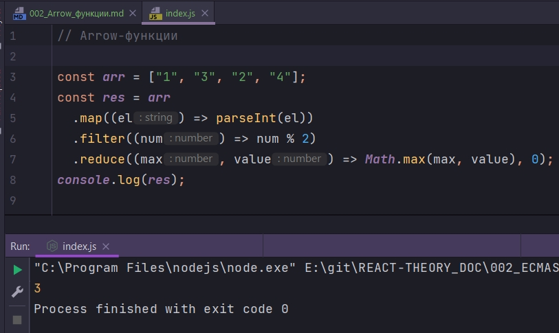
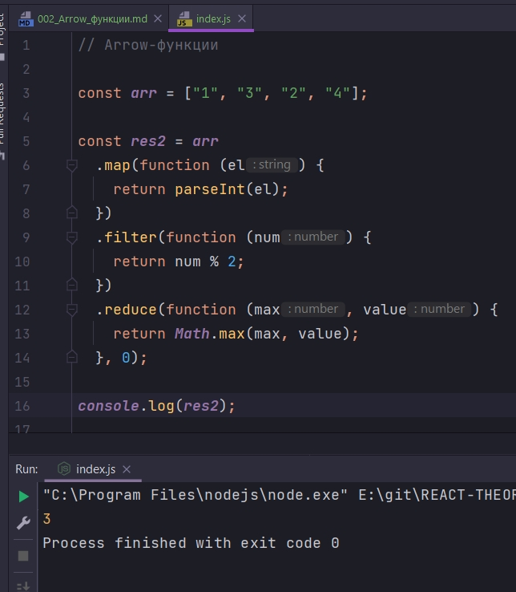
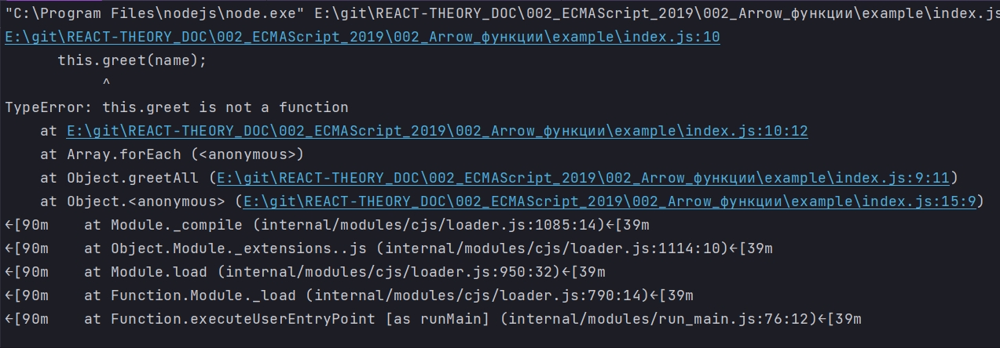
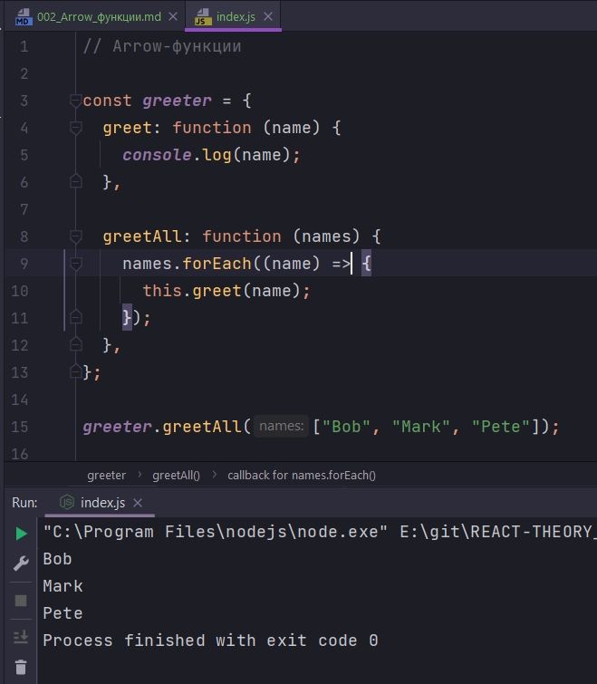
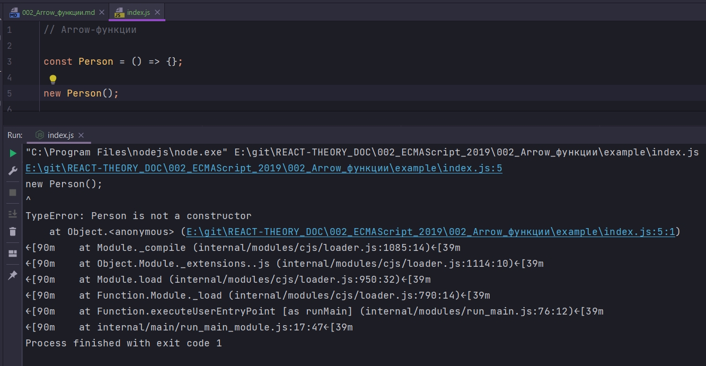

# 002_Arrow_функции

В **JS** функция является объектом. Это очень удобно. Функии можно передавать в качестве аргументов в другии функции, можно их присваивать как значания переменным, можно возвращать как результат с других функции.

Эта особенность **JS** позволяет писать очень элегантный код. Но до **ECMAScript 2015** этот код выглядел несколько не уклюже из-за тоо что для объявления функции нужно было использовать ключевое слово **function** и для того что бы вернуть значение нужно было использовать клчевое слово **return**.

Вот функция которая умножает аргумент сам на себя т.е. возводит его в квадрат.

```js
// Arrow-функции

function square(x) {
  return x * x;
}

```

А вот **arrow** - функция

```js
// Arrow-функции

const sq = (x) => x * x;

```

Немного кода:

```js
// Arrow-функции

const arr = ["1", "3", "2", "4"];
const res = arr
  .map((el) => parseInt(el))
  .filter((num) => num % 2)
  .reduce((max, value) => Math.max(max, value), 0);
console.log(res);

```



С помощью **parseInt** преобразую каждый элемент массива в число. С помощью функции **filter** пробегаемся по элементам массива.

**callback** который принимает функция **filter** т.е. условие которое сработает в данном **callback** вернет **true**, то эти числа останутся.  Если остаток от деления на 2 будет что-нибудь, то это будет **true**, то это не четное  число попадет в массив.

Затем я использую функцию **reduce** для того что бы найти максимальное значение  внутри этого массива. **reduce** пробежится по каждому оставшемуся элементу в массиве и для каждого элемента она выполнит **callback**. Первым аргументом указываю **max** - это наш результат который мы ищем. И вторым аргументом указываю **value** - это элемент массива который к нам придет это 1 или 3. И эта функция должна возвращать новый максимум т.е. если наш новый **value** больше чем прошлый **max** то мы его вернем. Для этого передаю функцию **Math.max()** и в ней мы выбираем между старым max и новым **value**. Соответственно если **value** будет меньше max, то вернется **max**. Если **value** больше max то вернется **value**. И вторым параметром **reduce** принимает стартовое значение 0.

А теперь смотрите на старый вариант этого кода.

```js
// Arrow-функции

const arr = ["1", "3", "2", "4"];

const res2 = arr
  .map(function (el) {
    return parseInt(el);
  })
  .filter(function (num) {
    return num % 2;
  })
  .reduce(function (max, value) {
    return Math.max(max, value);
  }, 0);

console.log(res2);

```



Еще несколько особенностей функции стрелок. Функции стрелки не обязательно должны состоять из одной строки. Если нужно добавить логики, то фигурные скобки становятся обязательными и ключевое слово **return** тоже становится обязательным.

```js
// Arrow-функции

const square = (x) => {
  return x * x;
};

```


Но самая классная особенность **arrow** функций заключается в том что они сохраняют значение ключевого слова **this**.

Рассмотрим такой пример

```js
// Arrow-функции

const greeter = {
  greet: function (name) {
    console.log(name);
  },

  greetAll: function (names) {
    names.forEach(function (name) {
      this.greet(name);
    });
  },
};

greeter.greetAll(["Bob", "Mark", "Pete"]);

```



А все дело в том что в функции **greetAll** еще хранится ссылка на объект **greeter**. А вот в **callback** **forEach** данной ссылки уже нет, она теряется. И соответственно функцию **greet** мы здесь найти не сможем.

А вот arrow **function** захватывает лексическое окружение родителя и сохраняет ссылку **this**.

```js
// Arrow-функции

const greeter = {
  greet: function (name) {
    console.log(name);
  },

  greetAll: function (names) {
    names.forEach((name) => {
      this.greet(name);
    });
  },
};

greeter.greetAll(["Bob", "Mark", "Pete"]);

```



Функции стрелки позволяют избежать многих ошибок. Функция стрелки очень удобна для того что бы передавать их в качестве аргумента другим функциям. Или для того что бы регистрировать их как обработчик событий **eventListener**.

Есть еще несколько отличий между функциями стрелками и обычными функциями о которых нужно помнить.

1. У функции стрелок нет свойства prototype

```js
// Arrow-функции

function Person() {}
Person.prototype.hi = function () {};
```
**prototype** используются для **ООП**. Для того что бы добавлять туда новые функции.

В функциях стрелках они не предназначены, для того что бы из них делать новые объекты. Это легковестная функция, соответственно prototype в них нет.

Если я создам функцию стрелку и на ее основе попробую сделать объект, то это приведет к ошибке.

```js
// Arrow-функции

const Person = () => {};

new Person();

```



Если по какой-то причине вам нужно использовать функцию как конструктор, то вы не можите использовать функцию стрелки, только обычные функции.