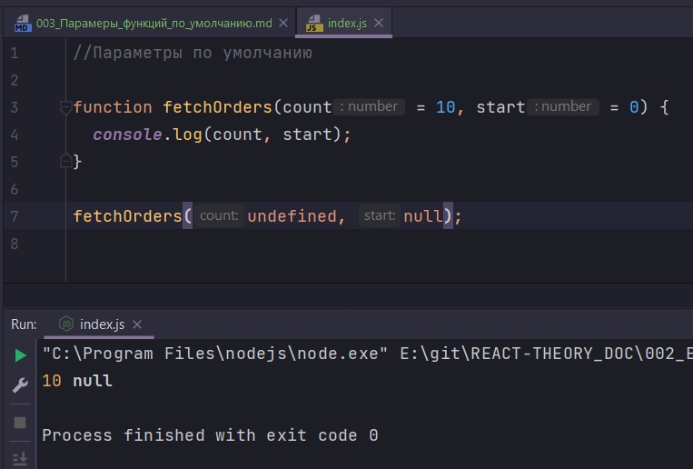
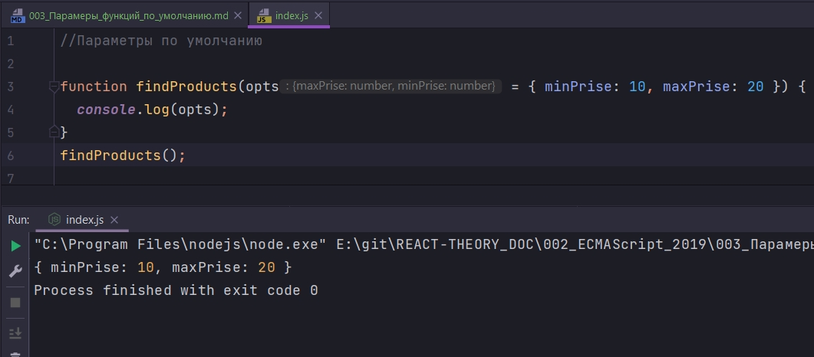
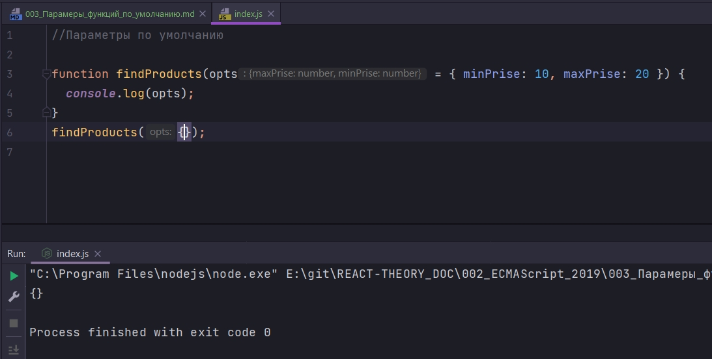

# 003_Парамеры_функций_по_умолчанию

```js
//Параметры по умолчанию

function fetchOrders(count = 10, start = 0) {
  console.log(count, start);
}

fetchOrders();

```

И так по моему из конспекта Andersen count и start это переменные.

Только undefined заменятся параметром по умолчанию.

```js
//Параметры по умолчанию

function fetchOrders(count = 10, start = 0) {
  console.log(count, start);
}

fetchOrders(undefined, null);

```



Мы так же можем в качестве значения по умолчанию передавать объект.

```js
//Параметры по умолчанию

function findProducts(opts = { minPrise: 10, maxPrise: 20 }) {
  console.log(opts);
}
findProducts();

```



Но если я хоть что-то передаю



>Параметры по умолчанию
> 
> function(a = 10, b = 20){}
> 
> Устанавливаются если не передать значение или передать undefined
> 
> Чаще всего идут последние в списке
> 
> Могут иметь любой тип