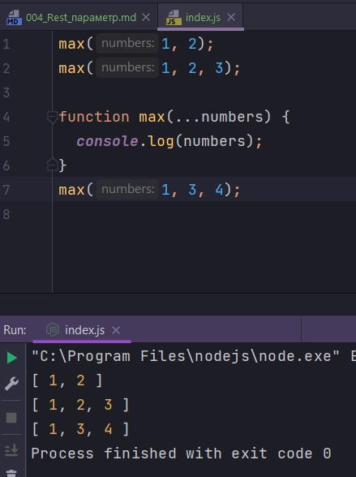
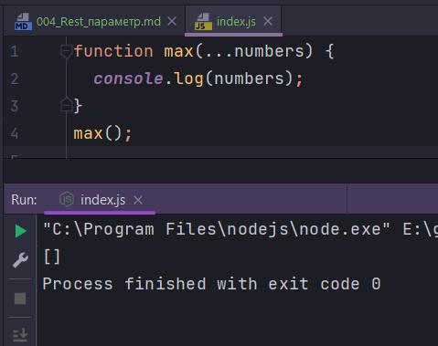
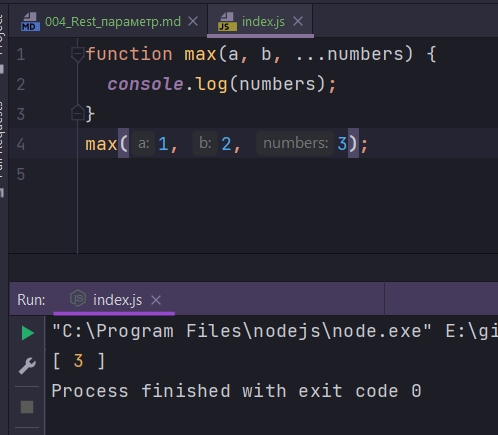

# 004_Rest_параметр

Как вы знаете в функцию JS можно передать любое количество аргументов не зависимо от того сколько параметров вы объявили в этой функции. Это дает возможность писать функции с переменным количеством параметров.

До ECMAScript 2015 необходимо было использовать псвдомассив arguments.

```js
max(1, 2);
max(1, 2, 3);

function max() {
  //pseudo-array
  arguments;
}

```

Для того что бы сконвертировать его в настоящий обычный массив, необходимо было написать вот такую стоку кода.

```js
max(1, 2);
max(1, 2, 3);

function max() {
  //pseudo-array
  var numbers = Array.prototype.slice.call(arguments);
}

```

Соответственно что бы исправить этот недостаток и сделать работу с переменным количеством аргументов немного более удобной в ECMAScript 2015 добавили еще одно нововведение. Оно называется Rest параметр. Это особый параметр функции который группирует в массив все те аргументы которые не были присвоены обычным параметрам.

```js
max(1, 2);
max(1, 2, 3);

function max(...numbers) {
  console.log(numbers);
}
max(1, 3, 4);

```



Самая лучшая особенность Rest параметра это то что если я не передаю ни каких аргументов, он возвращает пустой массив.

```js

function max(...numbers) {
  console.log(numbers);
}
max();

```



Перед Rest параметром могут идти обычные параметры функции

```js
function max(a, b, ...numbers) {
  console.log(numbers);
}
max(1, 2, 3);

```



Есть всего лишь два ограничения при работе с Rest параметрами.

1. Rest параметр обязан идти последним в функции 
2. Нельзя иметь больше одного Rest параметра.