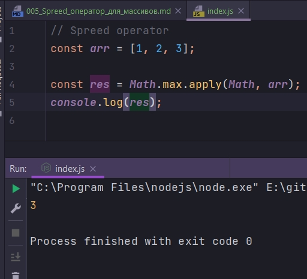
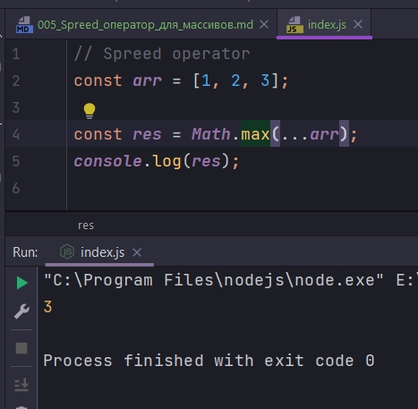
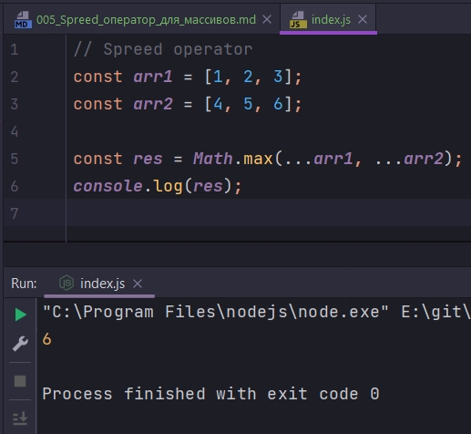
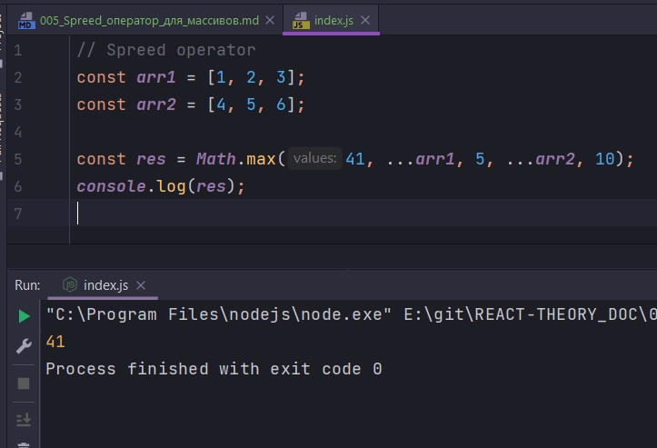
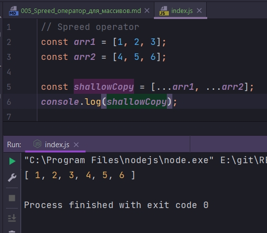

# 005_Spreed_оператор_для_массивов

Spreed оператор похож на Rest параметр функции. Но в то время как Rest параметр собирает несколько независимых аргументов в массив Spreed делает обратное действие. Он расскладывает нассив на список независимых на список независимых элементов которые затем можно передать в функцию или использовать в другом массиве.

Предположим у нас есть массив чисел и мы хотим найти максимальное из них. Мы знаем что во встроенном объекте Math есть метод max который принимает набор арументов и позволяет достать из них максимальное число. Но проблема Math.max() в том что он не умеет работать с массивом. 

Для того что бы решить эту проблему и найти с помощью этого метода максимум из этих чисел в массиве, мы могли использовать метод apply. Мы передали бы объект который был бы контекстом this, т.е. первым параметром, а затем передали бы массив который стал бы списком аргументов для функции Math.max

```js
// Spreed operator
const arr = [1, 2, 3];

const res = Math.max.apply(Math, arr);
console.log(res);

```



Этот код можно написать лучше используя spreed operator

```js
// Spreed operator
const arr = [1, 2, 3];

const res = Math.max(...arr);
console.log(res);

```



Spreed оперратор извлечет значения из массива и передаст как значения в функцию.

Spreed оператор этим не ограничивается.

```js
// Spreed operator
const arr1 = [1, 2, 3];
const arr2 = [4, 5, 6];

const res = Math.max(...arr1, ...arr2);
console.log(res);

```



Spreed оператор можно комбинировать с обычными аргументами.

```js
// Spreed operator
const arr1 = [1, 2, 3];
const arr2 = [4, 5, 6];

const res = Math.max(41, ...arr1, 5, ...arr2, 10);
console.log(res);

```



Но где Spreed оператор действительно не заменим, так это при создании новых массивов. Он делает поверхностное копирование.

```js
// Spreed operator
const arr1 = [1, 2, 3];
const arr2 = [4, 5, 6];

const shallowCopy = [...arr1, ...arr2];
console.log(shallowCopy);

```



Т.е. произошло копирование двух массивов с последующей их конкотенацией. Это используется для того что бы не мутировать исходный массив, а исменять скопирванный массив.

> Spreed оператор разворачивает массив, превращая его в список аргументов