# 006_Деструктуризация_объектов

Деструктуризация позволяет вам лаконично достать значение из какой-нибудь структуры данных, массива или объекта.

```js
// Destructuring - Деструктуризация

const person = {
  firstName: "Peter",
  lastName: "Smith",
  age: 27,
};

```

Предположим нам нужно сохранить **firstName** и **lastName** в отдельные переменные, что бы не писать везде название объекта.

```js
// Destructuring - Деструктуризация

const person = {
    firstName: "Peter",
    lastName: "Smith",
    age: 27,
};

const { firstName, lastName } = person;
console.log("firstName: ", firstName);
console.log("lastName: ", lastName);


```

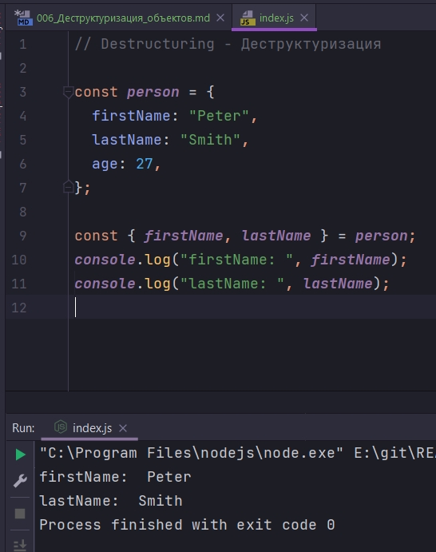

Только что мы создали две константы **firstName** и **lastName** и сохранили в них значение из аналогичных свойств объекта **person**. Важно заметить что когда вы используете такой синтаксис, название ваших констант будут совпадать с названием полей в объекте.

## Деструктуризация из вложенного объекта

Конечно объект может содержать внутреннюю структуру. Объект **person** может содержать объект name в котором будут поля **firstName** и **lastName**.

```js
// Destructuring - Деструктуризация

const person = {
  name: {
    first: "Peter",
    last: "Smith",
  },
  age: 27,
};

const {
  name: { first, last },
} = person;

console.log(first, last);

```
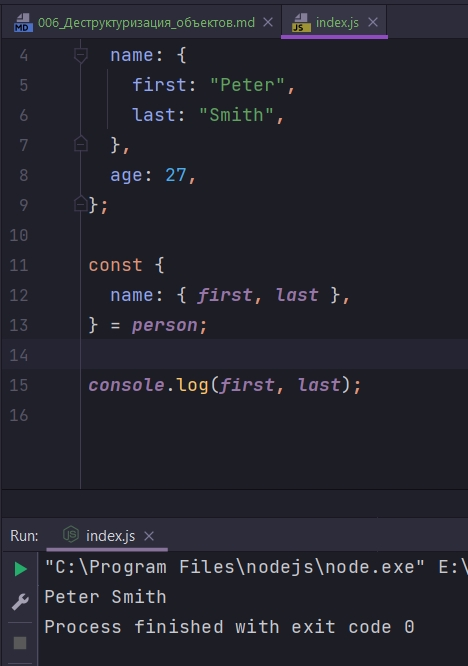

## Переименование констант

Заметьте что давать имена константам такие же как поля в объекте может быть не всегда удобно. К примеру когда мы немножко перестроили нашу структуру объекта и положили **first** и **last** в поле name, мы полностью теряем контекст. Что такое **first**? Что такое **last**? Мы же не знаем что это относилось к имени человека. Может это было последнее место работы.

Используя синтаксис деструктуризации вы можете переименовать те свойства которые вы достаете из объекта. Для того что бы переименовать константу, после имени индентификатора ставлю : и присваиваю новое название индентификатору переменной.

```js
// Destructuring - Деструктуризация

const person = {
  name: {
    first: "Peter",
    last: "Smith",
  },
  age: 27,
};

const {
  name: { first: firstName, last: lastName },
} = person;

console.log(firstName, lastName);

```

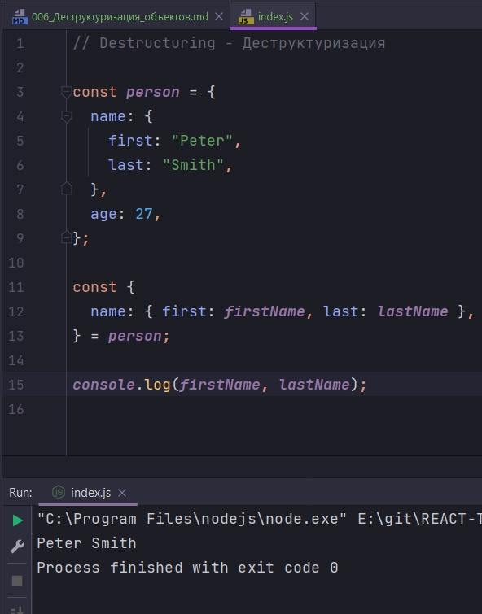


## Значение по умолчанию

Мы можем указать что в объекте есть свойство **role**, а если его нет то вернуть значение по умолчанию.

```js
// Destructuring - Деструктуризация

const person = {
  name: {
    first: "Peter",
    last: "Smith",
  },
  age: 27,
};

const { role = "user" } = person;

console.log("role:", role);

```

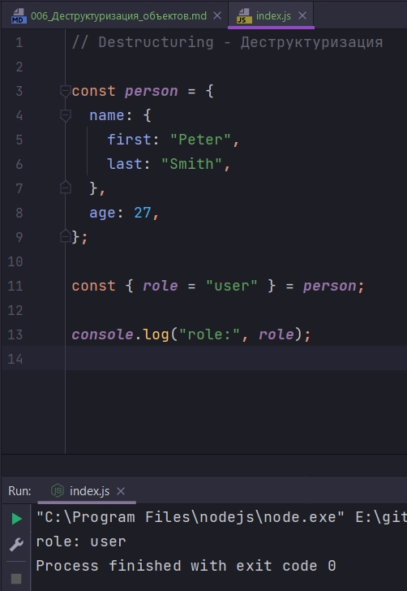

Но если мы добавим свойство **role** в объект

```js
// Destructuring - Деструктуризация

const person = {
  name: {
    first: "Peter",
    last: "Smith",
  },
  age: 27,
  role: "admin",
};

const { role = "user" } = person;

console.log("role:", role);

```

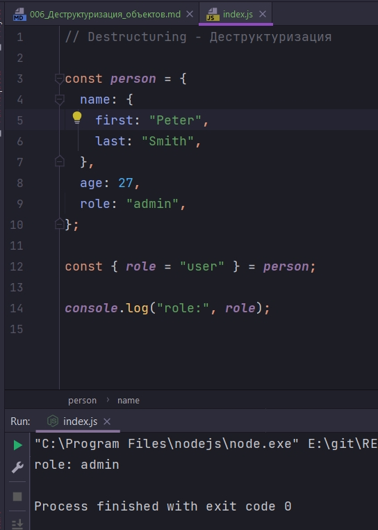

К сожалению такая техника не будет хорошо работать если свойство по умолчанию вложенное. К примеру если мы рассчитываем что у нас будет объект по умолчанию **permissions** и у него я будет свойство **role**, и если нет **role** то оно по умолчанию будет **user**. Вот такой код нам сейчас даст ошибку. Потому что **JS** попробует найти объект **permissions**, а затем внутри его найти объект **role**. Будет ошибка потому что объект **permissions** **undefined**.

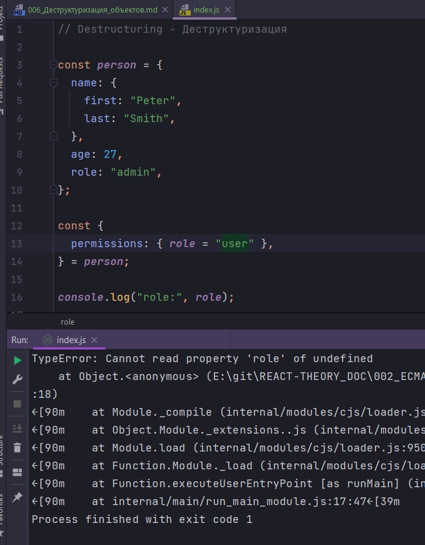

Это ограничение можно обойти если вы дадите **permissions** объект по умолчанию.

```js
// Destructuring - Деструктуризация

const person = {
  name: {
    first: "Peter",
    last: "Smith",
  },
  age: 27,
  role: "admin",
};

const { permissions: { role = "user" } = {} } = person;

console.log("role:", role);

```

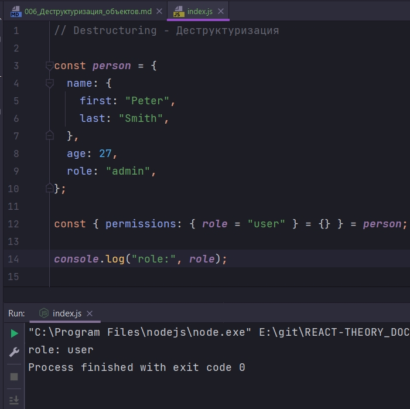

Синиаксис сложноватый.


## Деструктуризация аргументов функции

Предположим у вас есть функция которая должна подключаться к какому-нибудь сетевому сервису. Для подключения нужно передать несколько аругументов **HOST**, **PORT**, **USER_NAME**. И некоторые аргументы могут иметь значения по умолчанию. Некоторые могут быть опциональными. И вместо того что бы заставлять пользователей запоминать порядок этих параметров, мы решаем что удобнее всего будет передать в функцию connect объект **options**.

```js
// Destructuring - Деструктуризация

function connect(options) {}

connect({
  host: "localhost",
  port: 1829,
  user: "peter",
});

```

Если вы писали такой код, то знаете что за ним идет мучительная обработка опций внутри функции. Т.е. вы проверяете каждую отдельную опцию и проверяете undefined она или не **undefined**,рисваиваете ей значение по умолчанию и т.д. Как правило писать этот код довольно не приятно.

Использую синтаксис деструктуризации, опции и их параметры по умолчанию, можно указать прямо в месте с параметром функции. Вместо параметра функции мы ставим фигурные скобки. Таким образом мы говорим что мы будем деструктурировать то что придет в качестве первого агрумента. И затем пишу какие у нас будут опции по умолчанию.

```js
// Destructuring - Деструктуризация

function connect({ host = "localhost", port = 12345, user = "guest" }) {}

connect({
  host: "localhost",
  port: 1829,
  user: "peter",
});

```

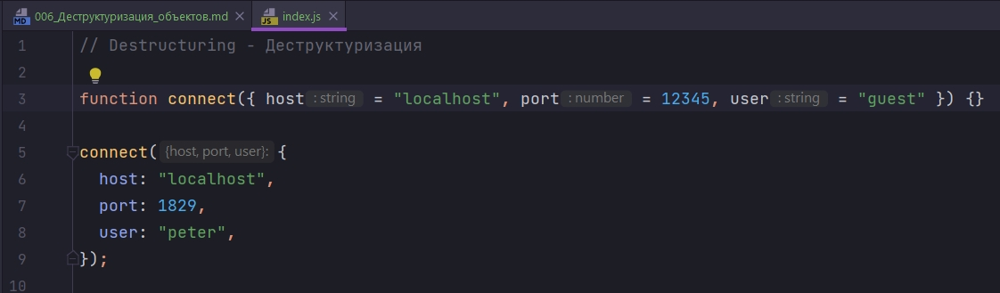

И теперь когда пользователь, который будет использовать эту функцию, он прочитает этот код, прямо не заглядвая в тело функции, он может сказать. Эта функция принимает три параметра в функции и у этих параметров есть какие-то параметры по умолчанию. Фактически параметры такой функции можно не документировать, вся документация находится в параметрах функции.

```js
// Destructuring - Деструктуризация

function connect({ host = "localhost", port = 12345, user = "guest" }) {
  console.log("host:", host, "port:", port, "user:", user);
}

connect({});

```

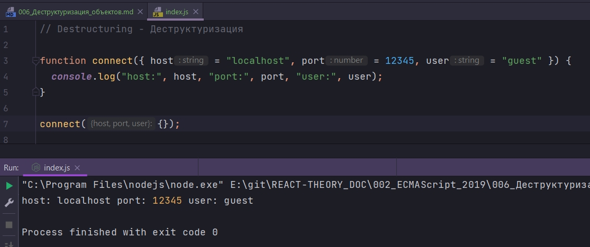

И мы получаем все параметры по умолчанию.

Теперь если мы передадим хоть одно из значений.

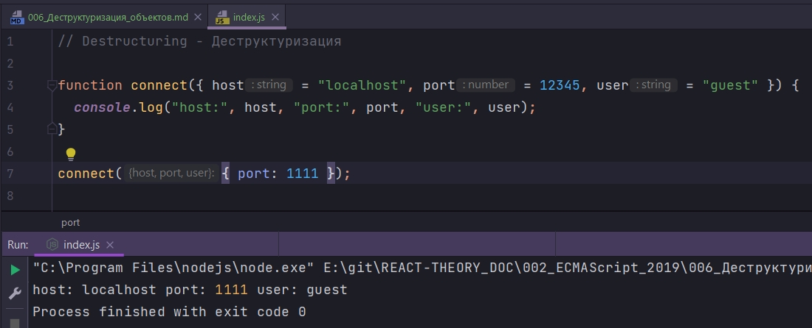

Теперь только **port** получает те параметры которые мы передали. Тем не менее **user** и **host** получают значения по умолчанию.

Но если я вызову данную функцию без параметров вообще, то будет ошибка

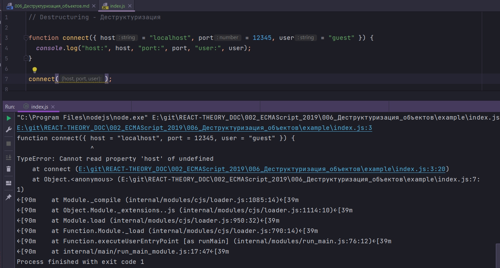

Т.е. не получилось у нас деструктурировать объект, когда объекта небыло вообще.

Но как вы уже помните, передаваемому аргументу мы тоже можем присвоить значение по умолчанию.

```js
// Destructuring - Деструктуризация

function connect({ host = "localhost", port = 12345, user = "guest" } = {}) {
  console.log("host:", host, "port:", port, "user:", user);
}

connect();

```

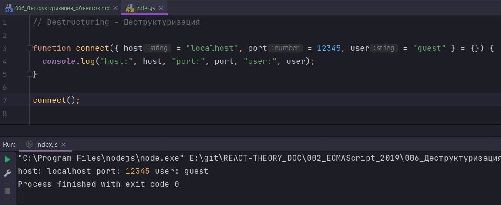

Теперь мы можем вызывать данную функцию вообще без параметров


## Rest element

Он работает точно так же как **rest** аргументы в функциях собирая в отдельный объект все те свойства которые не были присвоены переменным.

```js
// Destructuring - Деструктуризация

const dict = {
  dug: "quack",
  dog: "woff",
  mouse: "squeak",
};

const { dug } = dict;

console.log(dug);

```

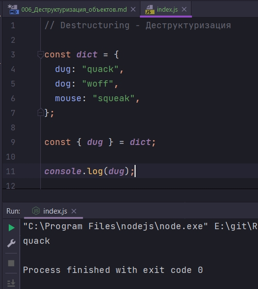

А теперь если после **dug** мы добавим ... а затем название константы, которую мы хотим создать **otherAnimals**, то в этот объект **otherAnimals** попадут все те значения которые небыли деструктурированы. Т.е. **dug** у нас был деструктурирован, а dog и **mouse** попадут в **otherAnimals**

```js
// Destructuring - Деструктуризация

const dict = {
  dug: "quack",
  dog: "woff",
  mouse: "squeak",
};

const { dug, ...otherAnimals } = dict;

console.log("dug:", dug);
console.log("otherAnimals:", otherAnimals);

```

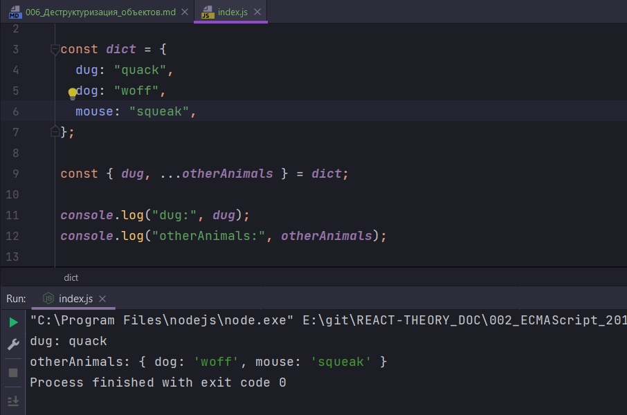

Правила использования для **rest** элементов точно такие же как и для **rest** параметров.

1. **rest element** должен быть последним в списке
2. На одномуровне может быть максимум один **rest** **element**

> Деструктуризация
> 
> const {name, age} = person
> 
> Упрощает получение свойств из объектов
> 
> Поддерживается вложенность и значения по умолчанию
> 
> Работает с параметрами функций
> 
> Поддерживает rest element
