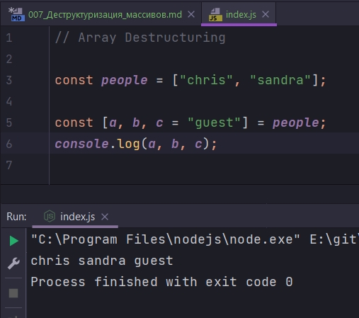

# 007_Деструктуризация_массивов

```js
// Array Destructuring

const fib = [1, 1, 2, 3, 5, 8, 13];

```

Это числа Фибоначчи. Если нам нужно достать первые три числа, то мы можем использовать вот такой синтаксис, который похож на синтаксис деструктуризации для объектов.

```js
// Array Destructuring

const fib = [1, 1, 2, 3, 5, 8, 13];

const [a, b, c] = fib;
console.log(a, b, c);

```


При деструктуризации массивов некоторые значения в массиве можно пропускать. К примеру если вам нужно достать 2-е и 4-е значение.

```js
// Array Destructuring

const fib = [1, 1, 2, 3, 5, 8, 13];

const [, a, , b] = fib;
console.log(a, b);

```


Если у нас есть многомерный массив.

```js
// Array Destructuring

const line = [
  [10, 17],
  [14, 7],
]; // это координады x и y пришедших к нам значений

const [[p1x, p1y], [p2x, p2y]] = line;
console.log(p1x, p1y, p2x, p2y);

```


Если у нас есть массив с двумя именами, то третий параметр мы можем получить если присвоим ему значение по умолчани, точно так же как и с объектами.

```js
// Array Destructuring

const people = ["chris", "sandra"];

const [a, b, c = "guest"] = people;
console.log(a, b, c);

```



Rest **element** работают точно также 

```js
// Array Destructuring

const people = ["chris", "sandra", "Bob"];

const [a, ...others] = people;
console.log("a:", a);
console.log("others:", others);

```


Если функция принимает массив в качестве аргумента, то его можно точно так же деструктурировать прямо в объявлении функции.

Предположим у нас есть такой объект

```js
// Array Destructuring

const dict = {
  dug: "quack",
  dog: "woff",
  mouse: "squeak",
  hamster: "squeak",
};

```

И допустим мы хотим найти всех тех зверей которые говорят squeak. 

Первоначально получаю все ключи при помощи **Object.entries()**. Эта функция принимает объект и возвращает двумерный массив, там будут все ключи и значения, кадое поле объекта - это ключ и значение массива.

```js
// Array Destructuring

const dict = {
  dug: "quack",
  dog: "woff",
  mouse: "squeak",
  hamster: "squeak",
};

const res = Object.entries(dict);
console.log(res);

```


Как разобрать эту структуру данных так что бы найти ключи в которых значение **squeak**. Использую функцию **filter** для того что бы найти второй элемент массива со значением **squeak**

```js
// Array Destructuring

const dict = {
  dug: "quack",
  dog: "woff",
  mouse: "squeak",
  hamster: "squeak",
};

const res = Object.entries(dict).filter((arr) => arr[1] === "squeak");
console.log(res);

```


Но этот код можно написать лучше.

```js
// Array Destructuring

const dict = {
  dug: "quack",
  dog: "woff",
  mouse: "squeak",
  hamster: "squeak",
};

const res = Object.entries(dict).filter(([key, value]) => value === "squeak");
console.log(res);

```


И теперь наша функция понятнее. Мы получаем **key** и **value**  и перебираем только **value** не затрагивая ключи. Значение key мы можем удалить и получать только второй  параметр **value**

```js
// Array Destructuring

const dict = {
  dug: "quack",
  dog: "woff",
  mouse: "squeak",
  hamster: "squeak",
};

const res = Object.entries(dict).filter(([, value]) => value === "squeak");
console.log(res);

```

Теперь я могу с помощью map перебрать только ключи и получить новый массив из животных

```js
// Array Destructuring

const dict = {
  dug: "quack",
  dog: "woff",
  mouse: "squeak",
  hamster: "squeak",
};

const res = Object.entries(dict)
  .filter(([, value]) => value === "squeak")
  .map(([key]) => key);
console.log(res);

```


Рассмотрим более сложный пример.

Синтаксис деструктуризации позволяет вам комбинировать деструктуризацию для массивов и деструктуризацию для объектов.

```js
// Array Destructuring

const shape = {
  type: "segment",
  coordinates: {
    start: [10, 15],
    end: [17, 15],
  },
};

```

Предположим что мы хотим получить коорданаты точек

```js
// Array Destructuring

const shape = {
  type: "segment",
  coordinates: {
    start: [10, 15],
    end: [17, 15],
  },
};

const {
  coordinates: {
    start: [startX, startY],
    end: [endX, endY],
  },
} = shape;

console.log("startX:", startX, "startY:", startY);
console.log("endX:", endX, "endY:", endY);

```


