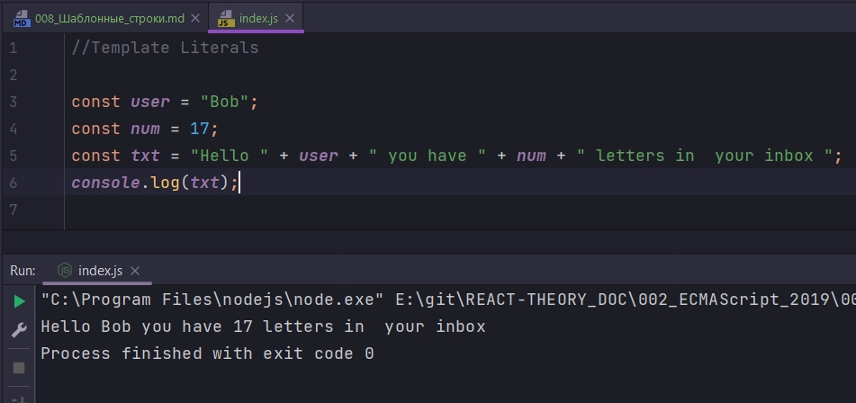
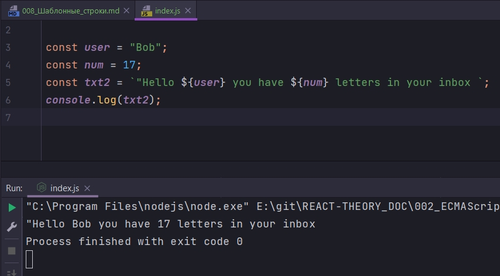
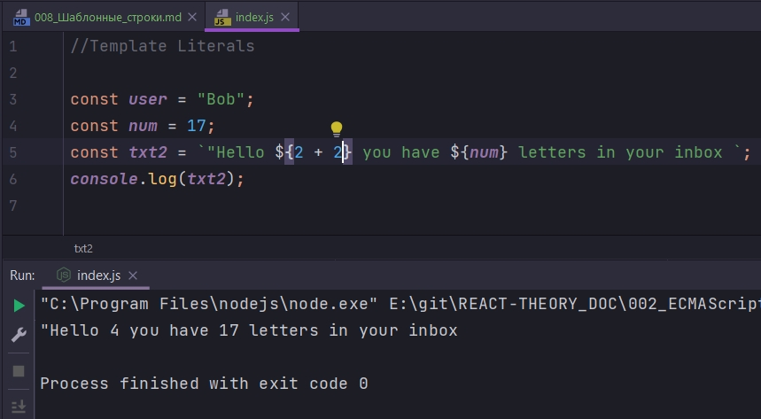
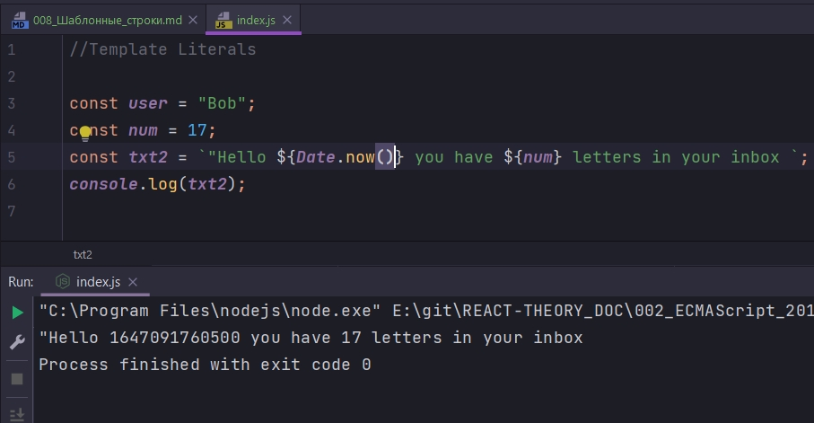
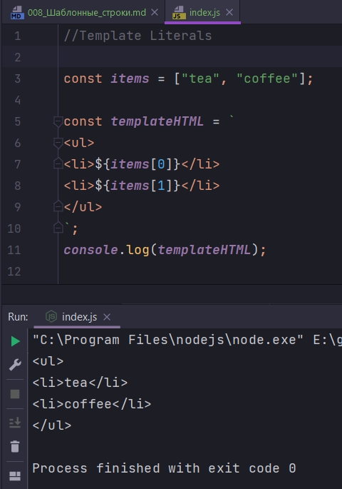

# 008_Шаблонные_строки

```js
//Template Literals

const user = "Bob";
const num = 17;
const txt = "Hello " + user + " you have " + num + " letters in  your inbox ";
console.log(txt);

```

Наверняка вам доводилось писать код который собирает строку из подстрок  и  значений переменных



```js
//Template Literals

const user = "Bob";
const num = 17;
const txt2 = `"Hello ${user} you have ${num} letters in your inbox `;
console.log(txt2);

```



Кроме того что мы можем использовать значения переменных мы можем поставить в placeholder любое выражение js



Так же мы можем вывести результат функции



Можно ставить разрыв строки и строка не будет закончена на этом. 

```js
//Template Literals
const templateHTML = `
<ul>
<li>Item One</li>
<li>Item Two</li>
</ul>
`;
```

Ну и конечно мы можем комбинировать с какими нибудь выражениями с JS.

```js
//Template Literals

const items = ["tea", "coffee"];

const templateHTML = `
<ul>
<li>${items[0]}</li>
<li>${items[1]}</li>
</ul>
`;
console.log(templateHTML);

```



