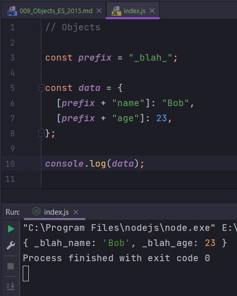
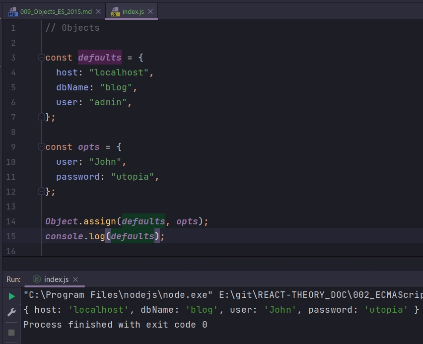
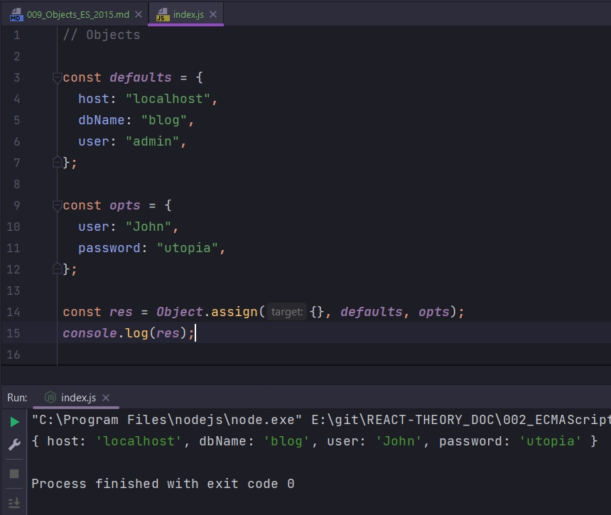
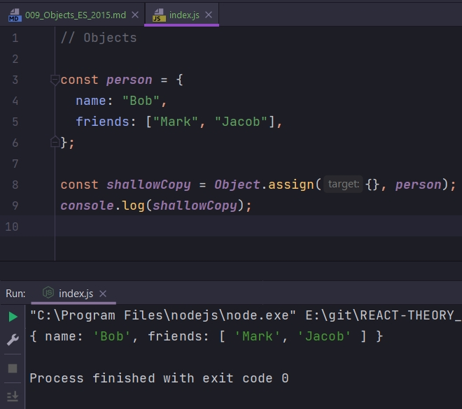

# 009_Objects_ES_2015

В **ES 2015** Объекты получили довольно много внимания от дизайнеров языка.

Новые возможности объектов.

Начнем с упрощенного синтаксиса для создания новых объектов. Предположим в своем приложении вы вычислили коорданаты x и y. И теперь вы хотите создать объект который будет содержать два этих свойства.

В прошлых версиях **ES** мы делали это так.

```js
// Objects
const x = 10;
const y = 30;

const point = {
  x: x,
  y: y,
};

```

В **ES 2015** этот синтаксис можно сократить и написать просто вот так.

```js
// Objects
const x = 10;
const y = 30;

const point = {
  x,
  y,
};

```

Эта сокращенная запись полностью эквивалентна предыдущей. Если ключ и значение переменной совпадают, то мы можем использовать такую упрощенную запись.


Улучшился синтаксис и для создания методов. Методами мы называем функции, которые принадлежат объектам. К примеру в **ES5** что бы создать метод мне нужно было объявить новое свойство и присвоить ему функцию которая выполняла то что что мы хотели сделать.

```js
// Objects
const x = 10;
const y = 30;

const point = {
  x,
  y,
  draw: function () {
    //.....
  },
};

```

В новом синтаксисе мы можем упростить создание функции. Для того что бы создать метод необходимо написать его имя, затем поставить круглые скобки, далее передать параметры которые нужны этой функции...

```js
// Objects
const x = 10;
const y = 30;

const point = {
  x,
  y,
  draw(ctx) {
    //.....
  },
};

```

Этот синтаксис существенно проще, чем тот синтаксис который был раньше. Он позволяет в теле объекта объявлять функцию не добавляя при этом ключевое слово **function**. Заметьте это не **arrow function**, это обычна функция которая написана более лаконичным образом.


При создании объектов можно использовать значение ключей, которые вычисляются динамически.

```js
// Objects

const prefix = "_blah_";

const data = {};

```

Теперь если мы хотим создать новый объект мы можем использовать константу **prefix** для того что бы определять ключи объекта.

```js
// Objects

const prefix = "_blah_";

const data = {
  [prefix + "name"]: "Bob",
  [prefix + "age"]: 23,
};

console.log(data);

```




В **ES 2015** появилась новая функция которая позволяет копировать свойства из одного объекта в другой.

```js
// Objects

const defaults = {
  host: "localhost",
  dbName: "blog",
  user: "admin",
};

const opts = {
  user: "John",
  password: "utopia",
};

```

Предположим у нас есть два объекта. Один из них хранит опции по умолчанию. А второй объект хранит опции которые мы получили от пользователя. Мы хотим создать объект который будет объеденять опции из первого объекта и из второго объекта. 

При этом опции которые передал пользователь имеют более высокий приоритет.

В ES5 приходилось писать код который последвательно будет копировать опции из одного объекта в другой.

В **ES 2015** появилась новая функция которая называется **Object.assign()**. Эта функция принимает несколько объектов. Первый объект это тот объект который получит все необъодимые значения, а после него можно передать объект, или несколько объектов, свойства которых мы будем использовать для того что бы перезаписать свойства первого объекта, объекта первого в списке аргументов.

```js
// Objects

const defaults = {
  host: "localhost",
  dbName: "blog",
  user: "admin",
};

const opts = {
  user: "John",
  password: "utopia",
};

Object.assign(defaults, opts);
console.log(defaults);

```



На самом деле этот код делает не совсем то что мы хотели. Потому что он перезаписывает объект **defaults**. Мы же не хотим изменять свойство **default**.

Что бы не изменять объект **defaults** в нашем коде, мы можем добавить слева еще один аргумент, пустой объект. Теперь в него сначало будут скопированы значения из **defaults**, а затем все значения из **opts**. Т.е. свойства копируются по очереди из объектов слева на право. Таким образом значения из **opts** будут перезаписывать значения которые возможно есть в **defaults** т.е. **opts** будет иметь добее высокий приоритет. И еще **Object.assign** возвращает первый аргумент т.е. тот пустой объект который мы заполняем.

```js
// Objects

const defaults = {
  host: "localhost",
  dbName: "blog",
  user: "admin",
};

const opts = {
  user: "John",
  password: "utopia",
};

const res = Object.assign({}, defaults, opts);
console.log(res);

```



Объект **defaults** остался не тронутым, объект **opts** остался не тронутым. В результате у нас получился новый объект **res** который имеет все свойства из **defaults** и все свойства из opts.

**Object.assign()** очень удобно использовать для того что бы создавать поверхностные копии объектов или **shallow** **copy** в Английской терминологии.

```js
// Objects

const person = {
    name: "Bob",
    friends: ["Mark", "Jacob"],
};

const shallowCopy = Object.assign({}, person);
console.log(shallowCopy);

```




