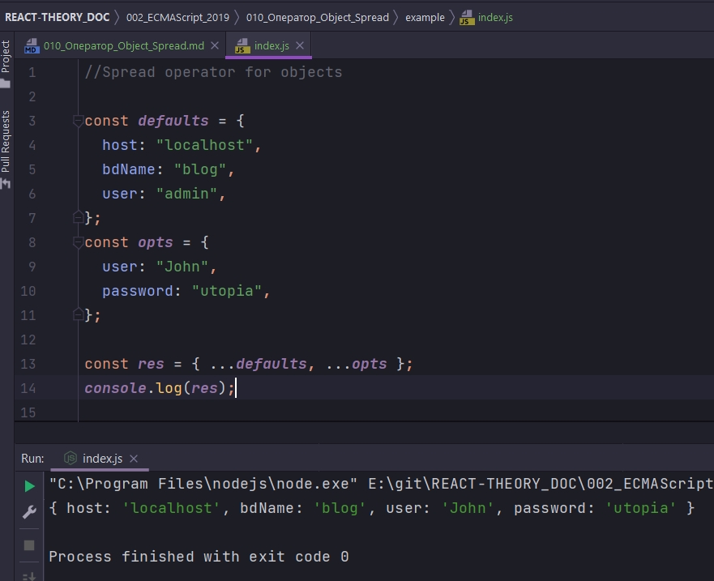

# 010_Оператор_Object_Spread

**Spread** оператор для объектов появился в **ES2018**.

**Object Spread** оператор работает точно так же как **Object.assign()**, но код выглядит намного оаконичнее.

```js
//Spread operator for objects

const defaults = {
  host: "localhost",
  bdName: "blog",
  user: "admin",
};
const opts = {
  user: "John",
  password: "utopia",
};

```

У нас есть два объекта и каждый из них представляет набор опций. Есть набор опций по умолчанию и есть набор опций которые передал пользователь.

Нам нужно создать третий объект который объеденяет объекты **defaults** и **opts**, но объеденяет их таки образом что объект opts имеет более высокий приоритет.

```js
//Spread operator for objects

const defaults = {
  host: "localhost",
  bdName: "blog",
  user: "admin",
};
const opts = {
  user: "John",
  password: "utopia",
};

const res = { ...defaults, ...opts };

```

Очень похоже как работает **spreed** оператор в массивах, но в массивах **spreed** оператор расскрывает массив на список аргументов, в объектах естественно раскрывается не список аргументов а список ключей и значений которые будут присвоены другому объекту.



Но чем **spreed** оператор действительно хорош - это тем что его можно комбинировать с  любым другим синтаксисом который работает при создании объектов.

Предположим у нас есть константа **port** которую мы хотим добавить к нашеу объекту. Мы можем просто добавить ее в объект

```js
//Spread operator for objects

const defaults = {
  host: "localhost",
  bdName: "blog",
  user: "admin",
};
const opts = {
  user: "John",
  password: "utopia",
};

const port = 8080;

const res = { ...defaults, ...opts, port: port };
console.log(res);

```

Не забываем что если ключ и значение совпадают то можно и сократить просто передать **port**.

И точно так же мы можем добавить какой-нибудь метод например **connect**.

```js
//Spread operator for objects

const defaults = {
  host: "localhost",
  bdName: "blog",
  user: "admin",
};
const opts = {
  user: "John",
  password: "utopia",
};

const port = 8080;

const res = { ...defaults, ...opts, port: port, connect() {} };
console.log(res);

```

Как видите **Object Spreed** оператор намного лаконичнее по сравнению с функцией **Object.assign()**.

А с развитием библиотек **React** и **Redux** которые работают с неизменяемыми данными этот синтаксис очень удобно использовать для того что бы создвать **shallow copy** поверхностные копии объектов.

> Spreed оператор для объектов
> 
> Разворачивает объект превращая его в список свойств
> 
> Можно комбинировать с любым другим синтаксисом создания объектов

