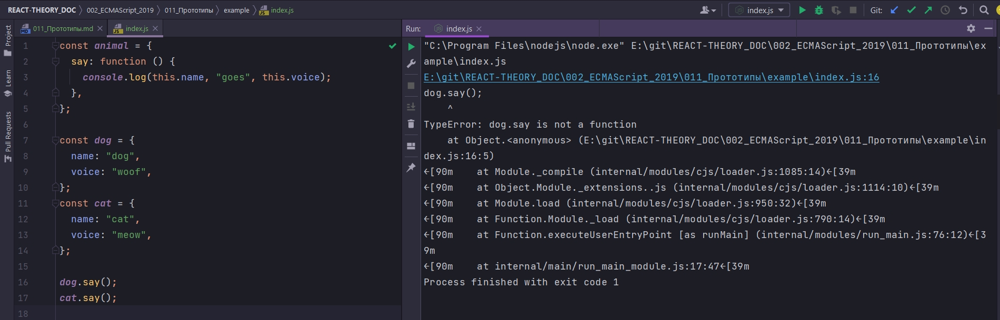
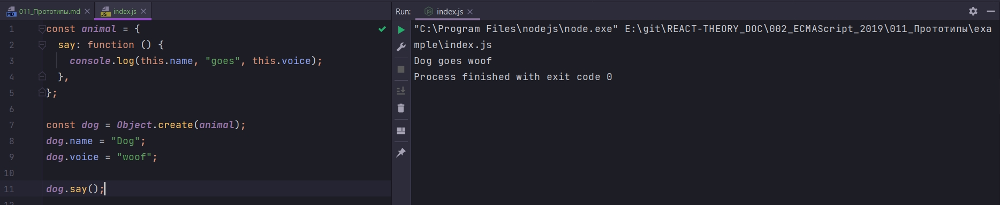

# 011_Прототипы

Прототипы в JS существовали с самой первой его версии. Но все источники объясняют прототипы через чур сложно, а порой откровенно не правильно.

Поскольку прототипы это фундоментальная часть языка. Без понимания прототипов не возможно нормально объяснить синтаксис классов.

Идея прототипов очень проста. Давайте представим что у нас есть много много объектов которые описываю животных. И у каждого животного есть функция say() которая будет использовать name и voice для того что бы вывести какое-нибудь приветственное сообщение. Как видите имена и голос у каждого животного отличаются. Но функция say()  у них абсолютно одинаковая.


Если эти функции одинаковые, нужно ли их хранить на каждом индивидуальном животном? Или их можно вынести как-нибудь в другое место. К примеру в другой объект. И затем сделать так что бы каждый объект животного мог использовать эту самую функцию, а не держать каждый свою собственную копию.


Назовем этот общий объект прототипом каждого из животных т.е. Animal Prototype будет прототипом Собаки, Кота и Птицы.

Теперь скажем мы устанавливаем такое правило. Когда JS движок пытается найти на объекте какое-нибудь свойство, то он в первую очередь будет проверять есть ли это свойство на самом объекте.


Т.е. если это свойство есть. Свойством может быть все что угодно - это может быть обычное поле, строка, число или функция. Если это свойство у объекта есть, то все отлично, поиск на этом закончен. Но если этого свойства нет, то JS не будет сразу останавливаться а будет проверять есть ли  у нашего объекта прототип


И если этот прототип есть, то JS будет переходить на прототип и искать это свойство там.

Мы только что говорили что Прототип это обычный объект и он хранит обчыное свойство. И значение этих свойств может быть функция или строки или числа, все что угодно. 

Суть в том что эти свойства могут переиспользовать другие объекты. Но поскольку сам прототип является обычным объектом, то у него может быть свой собственный прототип.

И тогда если JS не найдет нужного свойства даже на прототипе, то он посмотрит если у прототипа прототип.


И так поиск буде проходить до тех пор пока мы не дойдем до объекта у которого нет прототипа. И тогда движок нам вернет undefined. 

Эта структура называется цепочкой прототипов.

Напишем код и ограничемся двумя объектами.

```js
const dog = {
  name: "dog",
  voice: "woof",
  say: function () {
    console.log(this.name, "goes", this.voice);
  },
};
const cat = {
  name: "cat",
  voice: "meow",
  say: function () {
    console.log(this.name, "goes", this.voice);
  },
};

```

У каждого из этих объектов есть функция say которая использует поля объектов для того, что бы вывести это самое сообщение.

Для начало вынесем нашу функцию say() в отдельный объект

```js
const animal = {
  say: function () {
    console.log(this.name, "goes", this.voice);
  },
};

const dog = {
  name: "dog",
  voice: "woof",
};
const cat = {
  name: "cat",
  voice: "meow",
};

dog.say();
cat.say();

```

Если сейчас мы запустим этот код мы получим ошибку потому что dog и cat ничего не знают про animal



У dog и cat нет ни какой связи с animal. Есть несколько способов как это сделать.

Первый способ. Будем использовать функцию которая тоже появилась в ES2015 которая называется Object.setPrototypeOf()

```js
const animal = {
  say: function () {
    console.log(this.name, "goes", this.voice);
  },
};

const dog = {
  name: "dog",
  voice: "woof",
};
/*Создаю связь между объектом dog и animal,
animal делаю прототипом объекта dog*/
Object.setPrototypeOf(dog, animal);

const cat = {
  name: "cat",
  voice: "meow",
};
/*Создаю связь между объектом cat и animal,
animal делаю прототипом объекта cat*/
Object.setPrototypeOf(cat, animal);

dog.say();
cat.say();

```


Теперь dog и cat имеют объект animal в качестве своего прототипа. dog и cat делегируют вызов функции say объекту animal.

<https://developer.mozilla.org/en-US/docs/Web/JavaScript/Reference/Global_Objects/Object/setPrototypeOf>

Object.setPrototypeOf - это метод который очень плохо сказывается на производительности вашего приложения. На официальной странице MDN говорится что плохо изменять прототипы объектов потому что это поломает оптимизацию движка и сделает. По этому этот метод лучше не использовать вообще.


Есть более хорошие способы создать эту прототипную связь.

И этот метод это Object.create() который создает пустой объект с заданным прототипом.

И так создаю константу dog - это объект который мы создаем при помощи Object.create(). Object.create() принимает на вход объект который будет прототипом того объекта который мы создаем.

Единственный нюанс dog это пустой объект и нам нужно вернуть его свойства

```js
const animal = {
  say: function () {
    console.log(this.name, "goes", this.voice);
  },
};

const dog = Object.create(animal);
dog.name = "Dog";
dog.voice = "woof";

dog.say();

```



dog это объект прототипом которого является animal.

А теперь сделаю этот код еще немного лучше. Вынесу логику создания животного в отделтную функцию. И установку прототипной связи Object.create(), в отдельную функцию.

```js
const animal = {
  say: function () {
    console.log(this.name, "goes", this.voice);
  },
};

function createAnimal(name, voice) {
  const res = Object.create(animal);
  res.name = name;
  res.voice = voice;
  return res;
}

const dog = createAnimal("Dog", "woof");
const cat = createAnimal("Cat", "meow");

dog.say();
cat.say();

```


То что мы с вами сделали, мы создали функцию конструктор фактически. Мы используем ее для того что бы создавать новые объекты с заданным прототипом. А в JS создание новых объектов одно из самых часто используемых и необходимых действий. 

По этому еще с самых первых версий языка есть ключевое слово new которое помогает упростить жтот код еще немного.


В первую очередь переменуем createAnimal в просто Animal. Это обычный код convention в мире JS. Если у вас есть функция которая создает новые объекты, функция constructor, то ее принто называть с большой буквы.


В тот момент когда я вызываю функцию как constructor, с помощью ключевого слова new, JS оптимизирует для нас несколько моментов:

Во-первых нам не нужно создавать новы пустой объект const res = Object.create(animal); JS сделает это за нас. И этот объект внутри функции constructor будет называться this

Во-вторых нам болше не нужно возвращать его, потому что объект возвращается из конструктора когда мы вызываем его с ключевым словом new автоматически.

```js
const animal = {
  say: function () {
    console.log(this.name, "goes", this.voice);
  },
};

function Animal(name, voice) {
  this.name = name;
  this.voice = voice;
}

const dog = new Animal("Dog", "woof");
const cat = new Animal("Cat", "meow");

dog.say();
cat.say();

```

Если я сейчас его вызову будет ошибка.

Единственный оставшийся вопрос. А каким же образом JS будет знать что прототипом объектов, которые мы создаем, будет именно объект animal?

И тут тоже все просто. В JS у каждой обычной функции, arrow функции не считаются, есть свойство prototype. prototype - это просто пустой объект, который будет использоваться как прототип для новых объектов которые мы создаем с функцией Animal.

Animal.prototype - это изначально пустой объект. И я саписываю функцию say в прототип функции Animal.

```js
function Animal(name, voice) {
  this.name = name;
  this.voice = voice;
}

// Записываю функцию say в прототип функции Animal
Animal.prototype.say = function () {
  console.log(this.name, "goes", this.voice);
};

const dog = new Animal("Dog", "woof");
const cat = new Animal("Cat", "meow");

dog.say();
cat.say();

```


В таком формате код работал с самых первых версий ES.


Но и у этого прототипа есть прототип.


У подавляющего большинства объектов в JS Object.prototype будет вверху цепочки прототипов.

Но некоторые объекты могут не иметь прототипа вообще.

Как создать объект без прототипа?

Мы можем использовать Object.create(null) в качестве прототипа передать null

```js
const obj = Object.create(null);
console.log(obj.toString());

```


> Прототипы
> 
> Хранят общие методы объектов
> 
> 3 способа создать связь "объект-прототип"
> 
1. Object.setPrototypeOf(obj, proto)
2. const obj = Object.create(proto)
3. const obj = nuw Something()
> Объект Something.prototype станет прототипом obj