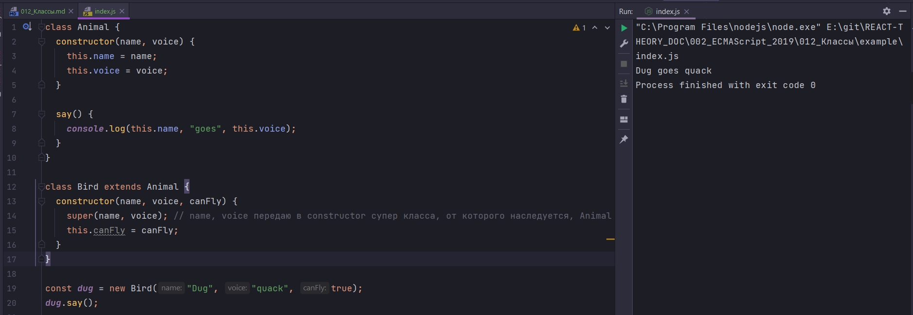

# 012_Классы

Классы - это синтаксический сахар. Нововведение которое добавили в ES 2015.

Класс это некий чкртеж по которому создаются объекты. Класс это одно из смых базовых понятив в ООП программировании. И хоть JS построен не на классах, а на прототипах, тысячи программистов пришли к такому паттерну для ООП кода и назвали его классом. Мы уже рассмотрели этот паттерн и то как он работает в видео про ПРОТОТИПЫ.

Этот паттерн не очень хорош по двум причинам.

1. Этот код показывает нам детали того, как мы формируем связи между объектами, вместо того что бы показывать смысл.

```js
function Animal(name, voice) {
  this.name = name;
  this.voice = voice;
}

Animal.prototype.say = function () {
  console.log(this.name, "goes", this.voice);
};

const dog = new Animal("Dog", "woof");
dog.say();

```

А смысл тут очень простой. У всех объектов типа Animal должно быть name и voice. Кроме того у всех объектов должна быть функция say которая использует значения name и voice.

2. Причина это наследование и управление цепочками прототипов. Работая с прототипами напрямую, код для высова выше, по цепочке прототипов, выглядел слишком сложно и слишком громоздко.

Классы делают работу с прототипами более интуитивной.

Код выше можно переписать так.

```js
class Animal {
  constructor(name, voice) {
    this.name = name;
    this.voice = voice;
  }

  say() {
    console.log(this.name, "goes", this.voice);
  }
}

```

Первое что мы делаем в теле класса, мы создаем функцию конструктор. constructor - это функция которая аналогично функции конструктору которую мы писали раньше.

```js
// Функция конструктор которую мы писали раньше
function Animal(name, voice) {
    this.name = name;
    this.voice = voice;
}
```

Функция constructor будет принимать, и присваивать полям name и voice.

Затем нам нужно добавить функция say. Мы просто пишем название функции, как позволяет синтаксис создания объектов, и точно так же можно написать в классе.

```js
class Animal {
  constructor(name, voice) {
    this.name = name;
    this.voice = voice;
  }

  say() {
    console.log(this.name, "goes", this.voice);
  }
}

```

Давайте теперь представим что нам теперь нужно создать класс для птиц. В моем коде Bird это животное которе еще может быть может летать.

```js
class Animal {
    constructor(name, voice) {
        this.name = name;
        this.voice = voice;
    }

    say() {
        console.log(this.name, "goes", this.voice);
    }
}

// dug -> Bird.prototype -> Animal.prototype -> Object.prototype -> null
class Bird extends Animal {}

const dug = new Bird("Dug", "quack");

```

Ключевое слово extends говорит о том что классы Bird и Animal будут стоять в цепочке прототипов. Т.е. у нас есть объект dug, его прототипом будет Bird.prototype, а его прототипом в свою очередь будет Animal.prototype, Object.prototype -> null.

Смотрите я создал новый инстанс dug и сразу передал ему значения name, voice. Все дело в том что в JS если вы не указываете явно constructor, то ваш класс наследует constructor super класса, а super класс в нашем случае это Animal.

```js
class Animal {
  constructor(name, voice) {
    this.name = name;
    this.voice = voice;
  }

  say() {
    console.log(this.name, "goes", this.voice);
  }
}

class Bird extends Animal {}

const dug = new Bird("Dug", "quack");
dug.say();

```


Но что если мы хотим добавить дополнительные возможности в constructor класса Bird. Мы можем создать constructor. Если класс наследуется extends от другого класса, мы в его кострукторе обязательно должны вызвать ключевое слово super

```js
class Animal {
  constructor(name, voice) {
    this.name = name;
    this.voice = voice;
  }

  say() {
    console.log(this.name, "goes", this.voice);
  }
}

class Bird extends Animal {
  constructor(name, voice, canFly) {
    super(name, voice); // name, voice передаю в constructor супер класса, от которого наследуется, Animal
    this.canFly = canFly;
  }
}

const dug = new Bird("Dug", "quack", true);
dug.say();

```



Есть одно правило. Если мы наследуем класс extends AAnimal, нам обязательно нужно вызвать super конструктор, до того как мы в первый раз используем ключевое слово this.


Ключевое слово очень удобное. Оно дает доступ не только достум к super конструктору, конструктору того класса от которого мы наследуемся, но и к любому методу который объявлен в super классе. К примеру используя метод super мы можем обратиться к методу say.

```js
class Animal {
  constructor(name, voice) {
    this.name = name;
    this.voice = voice;
  }

  say() {
    console.log(this.name, "goes", this.voice);
  }
}

class Bird extends Animal {
  constructor(name, voice, canFly) {
    super(name, voice);
    super.say();
    this.canFly = canFly;
  }
}

const dug = new Bird("Dug", "quack", true);
dug.say();

```


Если необходимо мы можем полностью переопределить функцию say для класса Bird. Для этого мы создаем в теле класса функцию которая называется точно также как и супер классе.

```js
class Animal {
  constructor(name, voice) {
    this.name = name;
    this.voice = voice;
  }

  say() {
    console.log(this.name, "goes", this.voice);
  }
}

class Bird extends Animal {
  constructor(name, voice, canFly) {
    super(name, voice);
    super.say();
    this.canFly = canFly;
  }
  say() {
    console.log(`Birds don\`t like to talk`);
  }
}

const dug = new Bird("Dug", "quack", true);
dug.say();

```


В конструкторе мы вызываем метод super.say(), мы вызываем реализацию функции которая принадлежит супер классу Animal.

После того как мы проинициализировали объект с помощью класса Bird и вызвали функцию say, то мы соответственно вызываем функцию say из класса Bird, ту функцию которая была переопределена.

Кстати в кострукторе класса Bird, если мы хотим обратиться к переопределенной функции, мы можем просто super заменить на this.

```js
class Animal {
  constructor(name, voice) {
    this.name = name;
    this.voice = voice;
  }

  say() {
    console.log(this.name, "goes", this.voice);
  }
}

class Bird extends Animal {
  constructor(name, voice, canFly) {
    super(name, voice);
    this.say();
    this.canFly = canFly;
  }
  say() {
    console.log(`Birds don\`t like to talk`);
  }
}

const dug = new Bird("Dug", "quack", true);
dug.say();

```


Класс - это паттерн использования функций конструкторов и прототипного наследования, который упрощает работу с объектно ориентированным кодом.

> Классы 
> 
> Является синтаксическим сахаром
> 
> Методы добавляются в прототип
> 
> constructor() функция конструктор
> 
> super() вызов супер конструктора
> 
> super.foo() - вызов метода супер класса