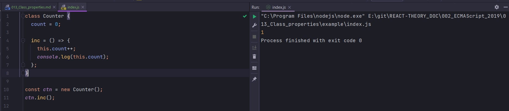

# 013_Class_properties

Тот функционал который мы рассмотрим не явяется частью стандарта. Говорит что это должно войти в стандарт в 2019. У меня на дворе 2022 и я переписываю этот КУРС, код который в **Webstorm** работает замечательно.

Инициализация свойсва прямо в теле класса. Не создавая конструктора мы можем написать 

```js
class Counter {
    count = 0;
}
```

Этот синтаксис удобно использовать когда ваши свойства не зависят от внешних параметров. Тогда вам можно не создавать конструктор и сразу проинициализировать значения.

Вторая особенность это функции, которые автоматически bound привязаны к объекту который создается. И синтаксис будет выглядеть вот так.

```js
class Counter {
    count = 0;

    inc = () => {
        this.count++;
        console.log(this.count);
    };

}

const cnt = new Counter();
cnt.inc();

```



```js
class Counter {
    count = 0;

    inc = () => {
        this.count++;
        console.log(this.count);
    };
}

const cnt = new Counter();
console.log(cnt.count);
cnt.inc();
setTimeout(cnt.inc, 1000);

```

И даже такой синтаксис будет работать потому что функция **inc** всегда привязана к объекту **ctn**. Нам не нужно оборачивать этот код в отдельную функцию или вызывать bind, потому что благодаря этому синтаксису **inc** будет всегда привязан к тому объекту в котором он создан. 

Последние два нововведения касаются ключевого слова **static**. В ООП языках статические свойства - это свойства которые принадлежат классу, а не конкретным объектам. Обычно они используются что бы логически группировать функции.

```js
class Counter {
  count = 0;

  inc = () => {
    this.count += Counter.incStep;
    console.log(this.count);
  };
  static incStep = 2;

  static incrementAll = function (arr) {
    arr.forEach((c) => c.inc());
  };
}

Counter.incrementAll([]);

const cnt = new Counter();
console.log(cnt.count);
cnt.inc();
setTimeout(cnt.inc, 1000);

```

Вот код стандарта.

```js
class Counter {
  constructor() {
    this.count = 0;
    this.inc = () => {
      this.count += Counter.incStep;
      console.log(this.count);
    };
  }
}

Counter.incStep = 2;

Counter.incrementAll = function (arr) {
  arr.forEach((c) => c.inc());
};


```

> Свойства классов
> 
> Инициализация полей в теле класса
> 
> Функции в теле класса привязаны к объекту
> 
> Статические поля
> 
> Статические методы