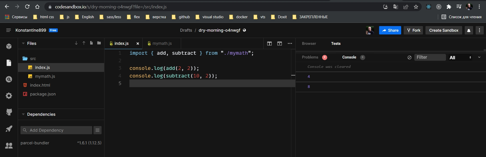
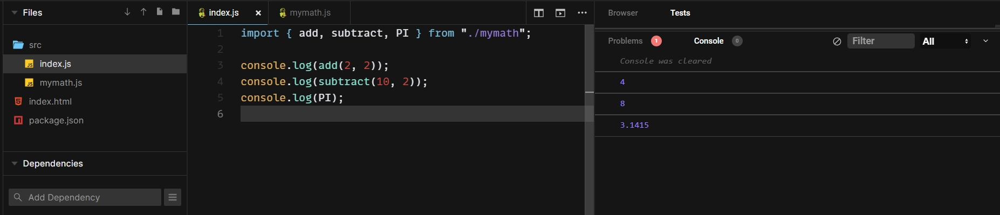
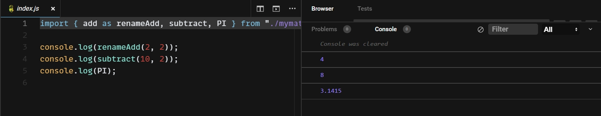
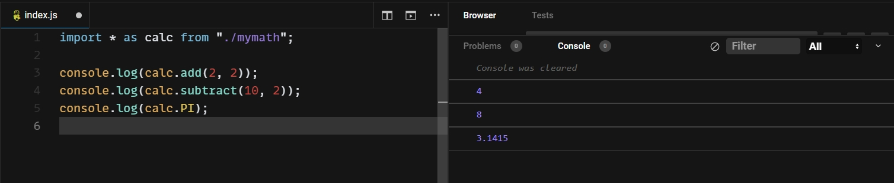
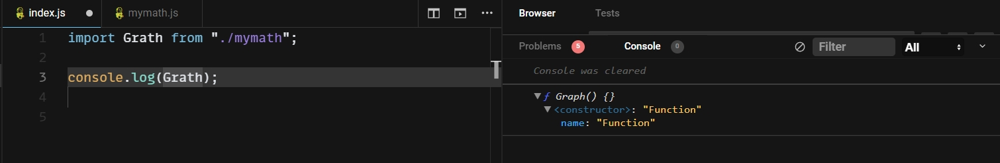
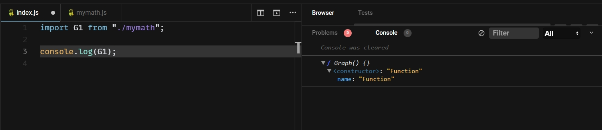
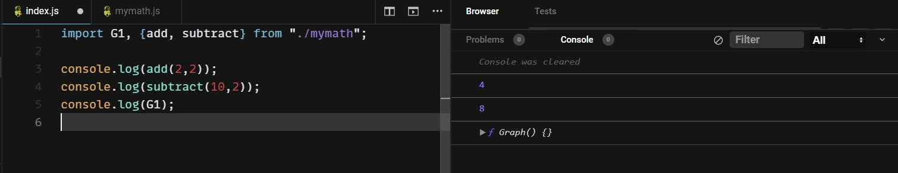
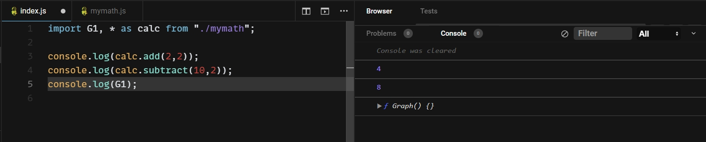

# Модули

В **ES2015** был представлен стандарт для модулей.

```js
function add(a, b) {
  return a + b;
}

function subtract(a, b) {
  return a - b;
}

function multyply(a, b) {
  return a * b;
}

function derived(a, b) {
  return a / b;
}

class Graph {
  addNode() {
    console.log("node add");
  }
}

const PI = 3.1415;

```

Давайте представим что наша программа состоит из нескольких десятков файлов. Файл **mymath.js** представляет собой файл с функциями переиспользуемых математических операций и класс который отвечает за графы, и потенциальные несколько констант.

## Именованые импорты

Для того что бы сделать этот файл модулем мы пишем **export** и в фигурных скобках перечисляю то что я хочу экспортировать.

```js
function add(a, b) {
  return a + b;
}

function subtract(a, b) {
  return a - b;
}

function multyply(a, b) {
  return a * b;
}

function derived(a, b) {
  return a / b;
}

class Graph {
  addNode() {
    console.log("node add");
  }
}

const PI = 3.1415;

export { add, subtract, multyply, derived };

```


C остальными сущностями **Graph** и **PI** мы не захотели делится с окружающим миром.

И теперь получаем эти функции в другом файле.



В **Webstorm** выдает ошибку.

```shell
import { add, subtract } from "./mymath";
^^^^^^
SyntaxError: Cannot use import statement outside a module

```

Кроме того что можно импортировать функции вы можете импортировать все что угодно.

```js
function add(a, b) {
  return a + b;
}

function subtract(a, b) {
  return a - b;
}

function multyply(a, b) {
  return a * b;
}

function derived(a, b) {
  return a / b;
}

class Graph {
  addNode() {
    console.log("node add");
  }
}

const PI = 3.1415;

export { add, subtract, multyply, derived, PI };

```

```js
import { add, subtract, PI } from "./mymath";

console.log(add(2, 2));
console.log(subtract(2, 2));
console.log(PI);

```



## Переименование

С каждой стороны и со стороны **import** и со стороны **export** эти сущности можно перименовывать. Для этого использую ключевое слова as и переименовываю.



И тоже самое со стороны **export**.


Предположим что вы хотите импортировать все что есть у файла **mymath.js**. Для этого мы можем использовать **\* as** и задаю имя.

```js
import * as calc from "./mymath";

console.log(calc.add(2, 2));
console.log(calc.subtract(10, 2));
console.log(calc.PI);

```



## Default export

Кроме экспорта с именами, файл может представить один **export default**

```js
function add(a, b) {
  return a + b;
}

function subtract(a, b) {
  return a - b;
}

function multyply(a, b) {
  return a * b;
}

function derived(a, b) {
  return a / b;
}

class Graph {
  addNode() {
    console.log("node add");
  }
}

const PI = 3.1415;

export default Graph;

```

```js
import Grath from "./mymath";

console.log(Grath);


```



Классы видны как функции в **JS**

Ну и конечно если со стороны импорта мы хотим его переименовать, нам не нужно писать **as**, мы просто задаем имя.

```js
import G1 from "./mymath";

console.log(G1);

```



## Default export и именовонные exports

Вы можете миксовать между собой дефолтные импорты и экспорты и именованные.

```js
function add(a, b) {
  return a + b;
}

function subtract(a, b) {
  return a - b;
}

function multyply(a, b) {
  return a * b;
}

function derived(a, b) {
  return a / b;
}

class Graph {
  addNode() {
    console.log("node add");
  }
}

const PI = 3.1415;

export { add, subtract, multyply, derived, PI };
export default Graph;

```

```js
import G1, {add, subtract} from "./mymath";

console.log(add(2,2));
console.log(subtract(10,2));
console.log(G1);

```



Если вы хотите получить импорт по умолчанию и все остальные импорты, так тоже можно сделать.

```js
import G1, * as calc from "./mymath";

console.log(calc.add(2,2));
console.log(calc.subtract(10,2));
console.log(G1);
 
```



 И все остальные **\* as calc** это значит что все остальные мы хотим импортировать как объект **calc**
 
Чаще всего ваши файлы будут экспортировать одну функции или один класс.

```js
export default class Graph {
  addNode() {
    console.log("node add");
  }
}
```

Таким образом я и объявляю класс и сразу же его экспортирую.

Дефолтных экспорта не может быть два.

Что бы подключить файл **css**

```js
import './main.css'
```

Точно так же я могу подключать и другие типы файлов. Но нужно помнить что это поведение и поддержка файлов, оно специфично для конкретного сборщика.


## Глобальные зависимости, библиотеки

Если у вас есть какая-нибудь библиотека которую вы установили к примеру с помощью **npm**. То синтаксис импорта будет немного отличаться.

```js
import joker from 'one-liner-joke'
```

Обратите внимаени что в то время как импортировать что-нибудь из файла я использую относительный путь к файлу **./dirname**.

Для библиотеки которая установлена как зависимость, я использую просто ее название.