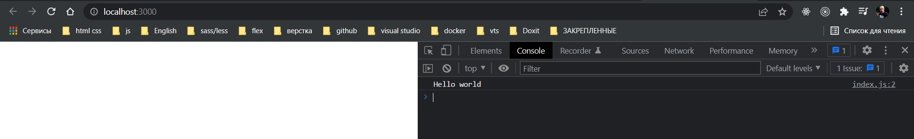

# 001_Создаем_пустой_проект

```shell
npx create-react-app todo

```

Удаляю все в папке src кроме index.js. Его просто полностью очищаю от кода.

И в папке public оставляю лишь такой вот 

```html
<!DOCTYPE html>
<html lang="en">
  <head>
    <meta charset="utf-8" />
    <meta name="viewport" content="width=device-width, initial-scale=1" />

    <title>React App</title>
  </head>
  <body>
    <div id="root"></div>

  </body>
</html>

```

```js
//src index.js
console.log("Hello world");

```



