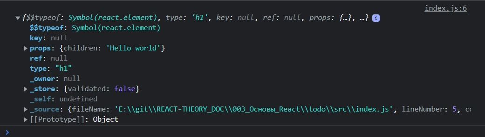
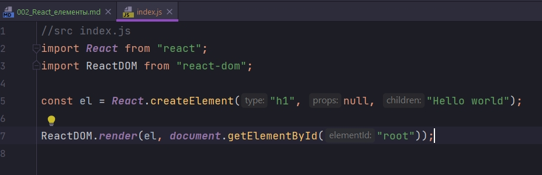
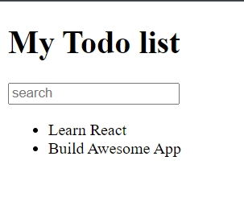

# 002_React_елементы

React елемент - Это самый маленький кирпичек на основании которого строятся приложения.

Первое что мы сделаем это подключим библиотеки react и react-dom.

```js
//src index.js
import React from "react";
import ReactDOM from "react-dom";

```

Теперь мы  можем создать React элемент.

```js
//src index.js
import React from "react";
import ReactDOM from "react-dom";

const el = <h1>Hello world</h1>;

ReactDOM.render(el, document.getElementById("root"));

```



В константе el содержится JSX кода. Конечно этот код не JS, по этому браузер не сможет использовать этот код. 

Но у нас есть инструмент который называется Babel который транспилирует этот JSX код в обычный JS. 

Этот код что мы написали можем использовать без JSX. На чистом JS.

```js
//src index.js
import React from "react";
import ReactDOM from "react-dom";

const el = React.createElement("h1", null, "Hello world");

ReactDOM.render(el, document.getElementById("root"));

```



И именно так обрабатывает код Babel. Т.е. каждый раз когда мы сохраняем файл. Наш сборщик проекта Webpack, он замечает что файл изменился. Webpack запускает babel который транспилирует JSX в обычный JS.

Если мы посмотрим на объект el, то увидим какой он легковестный

```js
//src index.js
import React from "react";
import ReactDOM from "react-dom";

const el = <h1>Hello world</h1>;
console.log(el);

ReactDOM.render(el, document.getElementById("root"));

```


Обычный браузерный объект h1 намного больше.


Эта техника, использовать легковестные объекты которые описывают элементы на странице, называется virtualDOM.


ReactDOM.render превращает react element  в настоящие объекты, которые можно отобразить на странице.

В JSX если element состоит из нескольких строк, то его стоит поместить в круглые скобки.

```js
//src index.js
import React from "react";
import ReactDOM from "react-dom";

const el = (
  <div>
    <h1>My Todo list</h1>
    <input type="text" placeholder="search" />
    <ul>
      <li>Learn React</li>
      <li>Build Awesome App</li>
    </ul>
  </div>
);

ReactDOM.render(el, document.getElementById("root"));

```




Таким образом мы сделали дерево элементов.

Еще, мы подключили библиотеку React, но мы ее нигде в коде не используем. React указывает Webpack и Babel какой JSX нужно транспилировать.


Элемент - это маленький легковестный объект, который проще всего создать использую JSX. Элементы - это часть концепции VirtualDOM.


ReactDOM - это библиотека которая преображает VirtualDOM в объекты которые попадают в DOM браузера.
