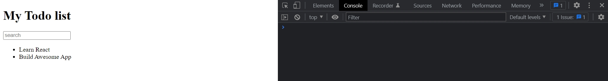

# 004_JSX

И так мы уже знаем что **JSX** похож на **html** и в **JSX** можно использовать как обычные **html** теги, так и имена **React** компонентов **<AppHeader />**.

Если **JSX** код занимает несколько строк, то его нужно взять вкруглые скобки, а для кода который занимает только одну строку круглые скобки не обязательны.

Блок **JSX** кода возвращает и создает **React элемент**. **JSX** код превращается в **React.createElement('h1', null, 'Hello world');** Второй аргумент это **props**.

По этому корнем **JSX** фрагмента должен быть один элемент. Т.е. один **Node.knot**. Другими словами должен быть родителский элемент.

## JS выражения в JSX

**JSX** умеет использовать в разметке **JS** выражения и их значения. И для того что бы их использовать достаточно обернуть в фигурные скобки. Рассмотрим **TodoList**

```js
//src index.js
import React from "react";
import ReactDOM from "react-dom";

const TodoList = () => {
  const arr = ["Learn React", "Build Awesome App"];
  return (
    <ul>
      {arr.map((element, index) => (
        <li key={index}>{element}</li>
      ))}
    </ul>
  );
};

const AppHeader = () => {
  return <h1>My Todo list</h1>;
};

const SearchPanel = () => {
  return <input type="text" placeholder="search" />;
};

const App = () => {
  return (
    <div>
      <AppHeader />
      <SearchPanel />
      <TodoList />
    </div>
  );
};

ReactDOM.render(<App />, document.getElementById("root"));

```



Можно использовать не только переменные но и результаты вызова функции.

```js
//src index.js
import React from "react";
import ReactDOM from "react-dom";

const TodoList = () => {
  const arr = ["Learn React", "Build Awesome App"];
  return (
    <ul>
      {arr.map((element, index) => (
        <li key={index}>{element}</li>
      ))}
    </ul>
  );
};

const AppHeader = () => {
  return <h1>My Todo list</h1>;
};

const SearchPanel = () => {
  return <input type="text" placeholder="search" />;
};

const App = () => {
  return (
    <div>
      <span>{new Date().toString()}</span>
      <AppHeader />
      <SearchPanel />
      <TodoList />
    </div>
  );
};

ReactDOM.render(<App />, document.getElementById("root"));

```


## Вставка React элементов

При помощи фигурных скобок мы можем вставлять одни **React** элементы в другие.

```js
//src index.js
import React from "react";
import ReactDOM from "react-dom";

const TodoList = () => {
  const arr = ["Learn React", "Build Awesome App"];
  return (
    <ul>
      {arr.map((element, index) => (
        <li key={index}>{element}</li>
      ))}
    </ul>
  );
};

const AppHeader = () => {
  return <h1>My Todo list</h1>;
};

const SearchPanel = () => {
  return <input type="text" placeholder="search" />;
};

const loginBox = <span>Log in please</span>;

const App = () => {
  return (
    <div>
      {loginBox}
      <AppHeader />
      <SearchPanel />
      <TodoList />
    </div>
  );
};

ReactDOM.render(<App />, document.getElementById("root"));

```


Кстати таким образом можно вставлять не только **React** элементы. 

## Вставка выражений

Еще одно полезное свойство. Если вот это выражение **loginBox** равно **null** или **undefined**, то для **React** это не будет ошибкой. Этот блок будет просто проигнорирован.

```js
//src index.js
import React from "react";
import ReactDOM from "react-dom";

const TodoList = () => {
  const arr = ["Learn React", "Build Awesome App"];
  return (
    <ul>
      {arr.map((element, index) => (
        <li key={index}>{element}</li>
      ))}
    </ul>
  );
};

const AppHeader = () => {
  return <h1>My Todo list</h1>;
};

const SearchPanel = () => {
  return <input type="text" placeholder="search" />;
};

const loginBox = null;

const App = () => {
  return (
    <div>
      {loginBox}
      <AppHeader />
      <SearchPanel />
      <TodoList />
    </div>
  );
};

ReactDOM.render(<App />, document.getElementById("root"));

```


И используя это свойство мы можем вставлять кусочки логики прямо в **JSX**. Давайте представим что у нас есть константа **isLoggedIn** котора говорит залогинен наш пользователь или нет. Если пользователь залогинен, то мы не будем ничего отображать, иначе пользователю нужно залогинеться.

```js
//src index.js
import React from "react";
import ReactDOM from "react-dom";

const TodoList = () => {
    const arr = ["Learn React", "Build Awesome App"];
    return (
        <ul>
            {arr.map((element, index) => (
                <li key={index}>{element}</li>
            ))}
        </ul>
    );
};

const AppHeader = () => {
    return <h1>My Todo list</h1>;
};

const SearchPanel = () => {
    return <input type="text" placeholder="search" />;
};

const isLoggedIn = false;
const loginBox = <span>Log in please</span>;
console.log("isLoggedIn:", isLoggedIn);

const App = () => {
    return (
        <div>
            {isLoggedIn ? null : loginBox}
            <AppHeader />
            <SearchPanel />
            <TodoList />
        </div>
    );
};

ReactDOM.render(<App />, document.getElementById("root"));

```


Залогинен

```js
//src index.js
import React from "react";
import ReactDOM from "react-dom";

const TodoList = () => {
  const arr = ["Learn React", "Build Awesome App"];
  return (
    <ul>
      {arr.map((element, index) => (
        <li key={index}>{element}</li>
      ))}
    </ul>
  );
};

const AppHeader = () => {
  return <h1>My Todo list</h1>;
};

const SearchPanel = () => {
  return <input type="text" placeholder="search" />;
};

const isLoggedIn = true;
const loginBox = <span>Log in please</span>;
console.log("isLoggedIn:", isLoggedIn);

const App = () => {
  return (
    <div>
      {isLoggedIn ? null : loginBox}
      <AppHeader />
      <SearchPanel />
      <TodoList />
    </div>
  );
};

ReactDOM.render(<App />, document.getElementById("root"));

```


C логикой в **JSX** нужно знать меру. Небольшая логика в роде такого тернарного оператора это абсолютно ОК. Но если начинают появляться соложные выражения, лючше эту логику перенести.

## Передача значений атрибутов

Фигурные скобки можно использовать для того что бы передавать значения атрибутов

К примеру в **html** элементе у нас есть атрибут **placeholder**. Если мы хотим по какой-то причине вынезсти значение этого атрибута в переменную или константу. То мы можем передать это значение испольуя такой же иснтаксис фигурных скобок.

```js
//src index.js
import React from "react";
import ReactDOM from "react-dom";

const TodoList = () => {
  const arr = ["Learn React", "Build Awesome App"];
  return (
    <ul>
      {arr.map((element, index) => (
        <li key={index}>{element}</li>
      ))}
    </ul>
  );
};

const AppHeader = () => {
  return <h1>My Todo list</h1>;
};

const SearchPanel = () => {
  const searchText = "Type here to search";
  return <input type="text" placeholder={searchText} />;
};

const isLoggedIn = true;
const loginBox = <span>Log in please</span>;
console.log("isLoggedIn:", isLoggedIn);

const App = () => {
  return (
    <div>
      {isLoggedIn ? null : loginBox}
      <AppHeader />
      <SearchPanel />
      <TodoList />
    </div>
  );
};

ReactDOM.render(<App />, document.getElementById("root"));

```

В фигурные скобки передаю индентификатор имени переменной **placeholder={searchText}**.


Атрибуты в React терминологии называются свойствами или **properties**. 

И для значений и свойств, не распостраняются такие же ограничения, как для значения **child** элементов. К примеру я не могу в элемент списка передать объект.


В качестве значения атрибута, мы можем передавать совершенно все что угодно. Для обычных **html** тегов это не имеет смысла, поскольку любой **html** тег так или иначе ожидает получить строку в качестве значения своего атрибута.


А вот передавать значения внутрь наших кастомных элементов иммет огромный смысл. Например мы могли бы передать в **TodoList** кастомный **property items**, и в качестве **items** передать массив тех элементов которые мы хотим отобразить.

```js
//src index.js
import React from "react";
import ReactDOM from "react-dom";

const TodoList = () => {
  const arr = ["Learn React", "Build Awesome App"];
  return (
    <ul>
      {arr.map((element, index) => (
        <li key={index}>{element}</li>
      ))}
    </ul>
  );
};

const AppHeader = () => {
  return <h1>My Todo list</h1>;
};

const SearchPanel = () => {
  const searchText = "Type here to search";
  return <input type="text" placeholder={searchText} />;
};

const isLoggedIn = true;
const loginBox = <span>Log in please</span>;
console.log("isLoggedIn:", isLoggedIn);

const App = () => {
  return (
    <div>
      {isLoggedIn ? null : loginBox}
      <AppHeader />
      <SearchPanel />
      <TodoList items={["Item 1", "Item 2"]} />
    </div>
  );
};

ReactDOM.render(<App />, document.getElementById("root"));

```

## Правила написания свойств

В **html** свойства можно писать как угодно, но в **JSX** правила более строгие. Названия атрибутов нужно писать **camelCase** т.е. начиная с маленькой буквы и каждое последующее слова слитно с большой буквы.

В **JSX** атрибут класса **css** нужно писать **className**.

Второй такой атрибут это **for**, он как правило ставится на **label** что бы указать к какому **html** элементу этот **label** относится. Так вот в **JSX** он называется **htmlFor**. Толко два исключения. Все остальные атрибуты называются точно так же только через **camelCase**.


# Передача объекта css свойств

```js
//src index.js
import React from "react";
import ReactDOM from "react-dom";

const TodoList = () => {
  const arr = ["Learn React", "Build Awesome App"];
  return (
    <ul>
      {arr.map((element, index) => (
        <li key={index}>{element}</li>
      ))}
    </ul>
  );
};

const AppHeader = () => {
  return <h1>My Todo list</h1>;
};

const SearchPanel = () => {
  const searchText = "Type here to search";
  const searchStyle = {
    fontSize: "30px",
  };
  return <input style={searchStyle} type="text" placeholder={searchText} />;
};

const isLoggedIn = true;
const loginBox = <span>Log in please</span>;
console.log("isLoggedIn:", isLoggedIn);

const App = () => {
  return (
    <div>
      {isLoggedIn ? null : loginBox}
      <AppHeader />
      <SearchPanel />
      <TodoList items={["Item 1", "Item 2"]} />
    </div>
  );
};

ReactDOM.render(<App />, document.getElementById("root"));

```


React получает значение из объекта **searchStyle**.


## Значения атрибутов по умолчанию

Если изначально не передать значение в атрибут, то по умолчанию оно **true**.

## Безопасность JSX

Давайте скажем что мы получаем значение с сервера. Злоумышленник поставил на сервер строку в которой есть **script**. Если вставвить этот **script** в **html** страницу, то он сработает.

Но еси мы используем эту строку в **JSX**, то строка безопасно отрисуется на нашеи интерфейсе.

```js
//src index.js
import React from "react";
import ReactDOM from "react-dom";

const TodoList = () => {
  const arr = ["Learn React", "Build Awesome App"];
  return (
    <ul>
      {arr.map((element, index) => (
        <li key={index}>{element}</li>
      ))}
    </ul>
  );
};

const AppHeader = () => {
  return <h1>My Todo list</h1>;
};

const SearchPanel = () => {
  const searchText = "Type here to search";
  const searchStyle = {
    fontSize: "30px",
  };
  return <input style={searchStyle} type="text" placeholder={searchText} />;
};

const isLoggedIn = true;
const loginBox = <span>Log in please</span>;
console.log("isLoggedIn:", isLoggedIn);

const App = () => {
  const value = '<script>alert("")</script>';
  return (
    <div>
      {value}
      {isLoggedIn ? null : loginBox}
      <AppHeader />
      <SearchPanel />
      <TodoList items={["Item 1", "Item 2"]} />
    </div>
  );
};

ReactDOM.render(<App />, document.getElementById("root"));

```


> JSX
> 
> Позволяет использовать выражения {foo.bar}
> 
> Аттрибуты называются camelCase`сом
> 
> class = className, for = htmlFor
> 
> В свойства можно передавать любое значение
> null, undefined, true и false в теле тегов игнорируются(не вызывая ошибок)


