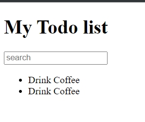

# 005_Структура_React_проекта_часть_1

Все компоненты которые мы написали пока что живут в одном файле. Такой подход конечно не масштабируется.

Вот такая структура очень хорош работает в крупных проектах. Один файл, один компонент. Это типичный паттерн организации кода для React приложений.

```js
// src/components/TodoList.js
import React from "react";

const TodoList = () => {
  const arr = ["Learn React", "Build Awesome App"];
  return (
    <ul>
      {arr.map((element, index) => (
        <li key={index}>{element}</li>
      ))}
    </ul>
  );
};

export default TodoList;

```

```js
// src/components/AppHeader.js
import React from "react";

const AppHeader = () => {
  return <h1>My Todo list</h1>;
};

export default AppHeader;

```

```js
// src/components/SearchPanel.js
import React from "react";

const SearchPanel = () => {
  return <input type="text" placeholder="search" />;
};

export default SearchPanel;

```

```js
//src index.js
import React from "react";
import ReactDOM from "react-dom";
import AppHeader from "./components/AppHeader";
import SearchPanel from "./components/SerchPanel";
import TodoList from "./components/TodoList";

const App = () => {
  return (
    <div>
      <AppHeader />
      <SearchPanel />
      <TodoList />
    </div>
  );
};

ReactDOM.render(<App />, document.getElementById("root"));

```

Так же можно разбить TodoList на два компонента.

```js
//src/components/TodoListItem.js
import React from "react";

const TodoListItem = () => {
  return <span>Drink Coffee</span>;
};

export default TodoListItem;

```

```js
// src/components/TodoList.js
import React from "react";
import TodoListItem from "./TodoListItem";

const TodoList = () => {
  return (
    <ul>
      <li>
        <TodoListItem />
      </li>
      <li>
        <TodoListItem />
      </li>
    </ul>
  );
};

export default TodoList;

```



> Структура React проекта
> 
> Один компонент - один файл
> 
> Помещаем все компоненты в папку components
> 
> Хорошие компоненты - независимые компоненты


