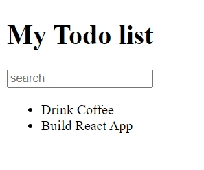
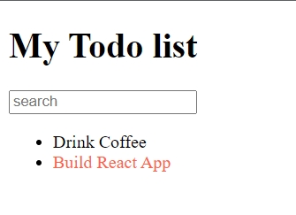

# 006_Props_свойства_компонентов

Мы будем использовать синтаксис деструктуризации и **spreed** оператор для объектов. 

Как и в обычные **html** элементы, в **React** компоненты можно передавать свойства, которые будут определять, как элемент будет выглядеть или что он будет отображать. 

В **TodoListItem** мы могли бы передать свойство **label**, которое бы говорило что будет отображать этот **TodoListItem**.

```js
// src/components/TodoList.js
import React from "react";
import TodoListItem from "./TodoListItem";

const TodoList = () => {
  return (
    <ul>
      <li>
        <TodoListItem label="Drink Coffee" />
      </li>
      <li>
        <TodoListItem label="Build React App" />
      </li>
    </ul>
  );
};

export default TodoList;

```

Теперь перейдем в **TodoListItem** и посмотрим как получить значение этого свойства.

Что бы получить значение из нашего тега **TodoListItem**, мы можем использовать объект **props**. Этот объект передается в каждую функцию компонента в качестве первого параметра.

```js
//src/components/TodoListItem.js
import React from "react";

const TodoListItem = (props) => {
  return <span>Drink Coffee</span>;
};

export default TodoListItem;

```

Конечно вы можете назвать его по своему, но типичное название для этого объекта **props**. Теперь выведу то что мы передали.

```js
//src/components/TodoListItem.js
import React from "react";

const TodoListItem = (props) => {
  return <span>{props.label}</span>;
};

export default TodoListItem;

```



Мы получили свойсво **label** из объекта **props**. А передали мы его в теге **TodoListItem**.

Этот код в компоненте **TodoListItem** можно сделать еще проще, если мы вспомним при синтаксис деструктуризации.

```js
//src/components/TodoListItem.js
import React from "react";

const TodoListItem = ({ label }) => {
  return <span>{label}</span>;
};

export default TodoListItem;

```

Соответственно внутри функции у нас появится переменная с названием **label** 


Давайте добавим еще одно свойство к нашему **TodoListItem** котороебудет менять внешний вид нашего компонента. К примеру если элемент списка будет отмечен как **important** т.е. как важный, то мы выделим текст цветом.

```js
// src/components/TodoList.js
import React from "react";
import TodoListItem from "./TodoListItem";

const TodoList = () => {
  return (
    <ul>
      <li>
        <TodoListItem label="Drink Coffee" />
      </li>
      <li>
        <TodoListItem label="Build React App" important />
      </li>
    </ul>
  );
};

export default TodoList;

```

Когда мы передаем совйство но не передаем для него значение, то значение по умолчанию будет **true**.

```js
//src/components/TodoListItem.js
import React from "react";

const TodoListItem = ({ label, important = false }) => {
  const style = {
    color: important ? "tomato" : "black",
  };

  return <span style={style}>{label}</span>;
};

export default TodoListItem;

```



> Props свойства компонентов 
> 
> Объект props передается в каждый компонент
> 
> const Comp = (props) => {<li>{props.name}</li>}
> 
> Можно передавать любые значения.
