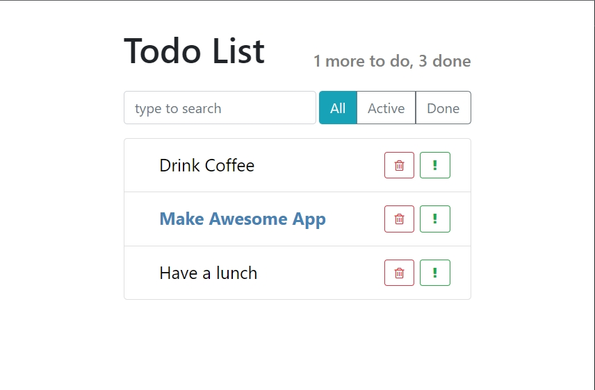

# 009_Импорт_css

Подключим Bootstrap. Подключим его через CDN <https://www.bootstrapcdn.com/>.


Перехожу на странице документации в Font Awesome

```html
<!DOCTYPE html>
<html lang="en">
  <head>
    <meta charset="utf-8" />
    <meta name="viewport" content="width=device-width, initial-scale=1" />
    <link rel="stylesheet" href="https://cdn.jsdelivr.net/npm/bootstrap@5.1.3/dist/css/bootstrap.min.css" integrity="sha384-1BmE4kWBq78iYhFldvKuhfTAU6auU8tT94WrHftjDbrCEXSU1oBoqyl2QvZ6jIW3" crossorigin="anonymous">
    <link rel="stylesheet" href="https://cdn.jsdelivr.net/npm/@fortawesome/fontawesome-free@5.15.4/css/fontawesome.min.css" integrity="sha384-jLKHWM3JRmfMU0A5x5AkjWkw/EYfGUAGagvnfryNV3F9VqM98XiIH7VBGVoxVSc7" crossorigin="anonymous">
    <title>React App</title>
  </head>
  <body>
    <div id="root"></div>

  </body>
</html>

```

```js
// src/components/TodoList.js
import React from "react";
import TodoListItem from "./TodoListItem";

const TodoList = ({ todos }) => {
  const elements = todos.map((item) => {
    const { id, ...itemProps } = item; // передаю все поля из объекта, кроме id, в itemProps
    return (
      <li key={id} className="list-group-item">
        <TodoListItem {...itemProps} />{" "}
        {/*С помощью spreed передаю все поля объекта в props как список*/}
      </li>
    );
  });

  return <ul className="list-group">{elements}</ul>;
};

export default TodoList;

```

Давайте напишем нашего собственного css.

```js
// src/components/TodoList.js
import React from "react";
import TodoListItem from "./TodoListItem";
import "./TodoList.css";

const TodoList = ({ todos }) => {
  const elements = todos.map((item) => {
    const { id, ...itemProps } = item; // передаю все поля из объекта, кроме id, в itemProps
    return (
      <li key={id} className="list-group-item">
        <TodoListItem {...itemProps} />{" "}
        {/*С помощью spreed передаю все поля объекта в props как список*/}
      </li>
    );
  });

  return <ul className="list-group todo-list">{elements}</ul>;
};

export default TodoList;

```

```css
/*src/components/TodoList.css*/
.todo-list .list-group-item{
    padding: .25rem .75rem;
}
```

Webpack умеет проходить по файлам и искать те самые модули которые мы используем. Webpack умеет работать не только с JS, но и с CSS. 

Webpack знает что если в вашем JS файле встречается вот такой вот import "./TodoList.css"; И вы импортируете не другой JS а css, то его нужно обработать по другому. Извлечь код из CSS файла и вставить его на страницу.

В React проектах типичный паттерн называть CSS файлы точно так же как называются файлы с компонентами.

Кастомные CSS селекторы по паттерну нужно называть так же как и название компонентов.

Кароче типо ставит видео на паузу и говорит что компоненты со стилями можете скачать....

Что я больше всего ненавижу это когда говорят что этот курс не об этом и потом показывают пол проекта переделанного. А версии библиотек уже хер найдешь!!!!

Кароче пример прокта в папке example_app.


