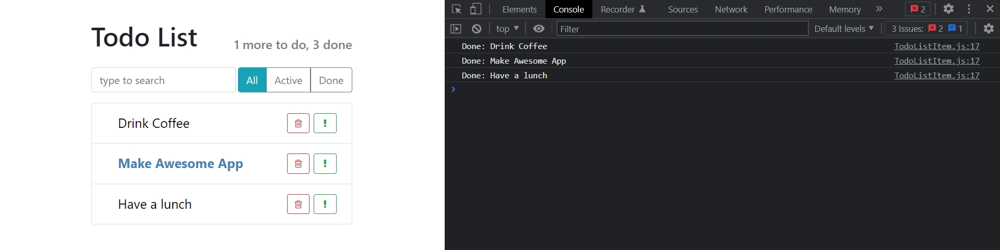

# 002_Обработка_событий

## Событие click

В этом видео мы посомтрим как отлавливать и получать это событие. А затем в отдельном видео мы посмотрим как можно сохранять внутреннее состояние компонента т.е. сохранять информацию о том выполнена наша задача или не выполнена и обновлять интерфейс соответственно.

Компонент с которым мы будем работать это **TodoListItem**. Зарегистрировать обработчик событий совсем не сложно. Достаточно добавить свойство **onClick** к нужному элементу и передать туда функцию.

```js
//src/components/TodoListItem.js
import React, { Component } from "react";
import "./TodoListItem.css";

export default class TodoListItem extends Component {
  render() {
    const { label, important = false } = this.props;
    const style = {
      color: important ? "steelblue" : "black",
      fontWeight: important ? "bold" : "normal",
    };
    return (
      <span className="todo-list-item">
        <span
          className="todo-list-item-label"
          style={style}
          onClick={() => console.log(`Done: ${label}`)}
        >
          {label}
        </span>

        <button
          type="button"
          className="btn btn-outline-success btn-sm float-right"
        >
          <i className="fa fa-exclamation" />
        </button>

        <button
          type="button"
          className="btn btn-outline-danger btn-sm float-right"
        >
          <i className="fa fa-trash-o" />
        </button>
      </span>
    );
  }
}

```



Все элементы отлавливают клики.

Писать код обработки в **JSX** это довольно не удобно. Намного удобнее будет создать отдельную функцию в классе и передать эту функию в **onClick**.

```js
//src/components/TodoListItem.js
import React, { Component } from "react";
import "./TodoListItem.css";

export default class TodoListItem extends Component {
  onLabelClick() {
    console.log(`Done: ${this.props.label}`);
  }

  render() {
    const { label, important = false } = this.props;
    const style = {
      color: important ? "steelblue" : "black",
      fontWeight: important ? "bold" : "normal",
    };
    return (
      <span className="todo-list-item">
        <span
          className="todo-list-item-label"
          style={style}
          onClick={this.onLabelClick}
        >
          {label}
        </span>

        <button
          type="button"
          className="btn btn-outline-success btn-sm float-right"
        >
          <i className="fa fa-exclamation" />
        </button>

        <button
          type="button"
          className="btn btn-outline-danger btn-sm float-right"
        >
          <i className="fa fa-trash-o" />
        </button>
      </span>
    );
  }
}

```

Обратите внимание на функцию **onLabelClick**. Я вытаскиваю **label** из **this.props.label**. Именно по этому, в компонентах классах, не передается **props** в функцию **render()**, поскольку **props** может быть нужен и в других функциях. И по этому **props** сохраняется в качестве свойства в классе.

Однако


Иду в **DevTools** во вкладку **Sources** ищу свой файл **TodoListItem** и на нужно строчке ставлю **breakPoint**.


Такое поведение будет проявлятся не только в **React**. Если вы будете писать свой код на чистом **JS** и передавать **eventListener** в **DOM**, то вы увидите что работать этот код будет точно так же.


Когда мы передаем функцию **this.onLabelClick** в **onClick**, эта функция **this.onLabelClick** не сохраняет связи с объектом в котором она была создана. Т.е. когда **this.onLabelClick** вызывается **this** пропадает.

В прошлый раз мы использовали функцию стрелки для возврата значения вызванной функии. Все дело в том что функция стрелки сохраняет лексический **this**. Т.е. значение в функции стрелке будет точно таким же как значение **this** в том месте где эта функция была объявлена. Соответственно в функции render **this** это правильный объект, и внутри функции стрелки он тоже был правильным. Но для обычных функций такое совойство не работает.


Первый способ исправления, и самый не красивый - это использовать функцию **bind** для того что бы намертво привязать **this** внутри **onLabelClick** к правильному объекту **this**.

```js
//src/components/TodoListItem.js
import React, { Component } from "react";
import "./TodoListItem.css";

export default class TodoListItem extends Component {
  onLabelClick() {
    console.log(`Done: ${this.props.label}`);
  }

  render() {
    const { label, important = false } = this.props;
    const style = {
      color: important ? "steelblue" : "black",
      fontWeight: important ? "bold" : "normal",
    };
    return (
      <span className="todo-list-item">
        <span
          className="todo-list-item-label"
          style={style}
          onClick={this.onLabelClick.bind(this)}
        >
          {label}
        </span>

        <button
          type="button"
          className="btn btn-outline-success btn-sm float-right"
        >
          <i className="fa fa-exclamation" />
        </button>

        <button
          type="button"
          className="btn btn-outline-danger btn-sm float-right"
        >
          <i className="fa fa-trash-o" />
        </button>
      </span>
    );
  }
}

```


В основном этот способ мне не нравится тем что каждый раз когда вы будете вызывать функцию **render** внутри функции **render** будет создаваться новая функция, которая будет оборачивать **onLabelClick** ведь именно так работает **bind**. Bind каждый раз создает новую функцию.


Есть более элегантный способ. Для этого добавим в наш класс **constructor**. 

И сразу выдает ошибку. Помните что если наш класс наследуется от какого нибудь другого класса, то мы обязательно должны вызывать метод **super()** с помощью которого я вызываю конструктор супер класса т.е. конструктор класса **Component**.

В конструкторе с помощью **this.onLabelClick** создаю функцию не на прототипе класса, а на самом объекте. И мы ее объявим как функцию стрелку так что бы **this** врутри этой функции сохранялся правильный.

Если вдруг вы не слишком хорошо помните чем отличается объект от своего прототипа и как функция может принадлежать объекту илипрототипу. Иди в раздел **ECMAScript 2019** и смотри раздел **011_Прототипы**.

```js
//src/components/TodoListItem.js
import React, { Component } from "react";
import "./TodoListItem.css";

export default class TodoListItem extends Component {
  constructor() {
    super();
    this.onLabelClick = () => {
      console.log(`Done: ${this.props.label}`);
    };
  }

  render() {
    const { label, important = false } = this.props;
    const style = {
      color: important ? "steelblue" : "black",
      fontWeight: important ? "bold" : "normal",
    };
    return (
      <span className="todo-list-item">
        <span
          className="todo-list-item-label"
          style={style}
          onClick={this.onLabelClick}
        >
          {label}
        </span>

        <button
          type="button"
          className="btn btn-outline-success btn-sm float-right"
        >
          <i className="fa fa-exclamation" />
        </button>

        <button
          type="button"
          className="btn btn-outline-danger btn-sm float-right"
        >
          <i className="fa fa-trash-o" />
        </button>
      </span>
    );
  }
}

```

И есть еще один способ. Который не является частью стандарта. Это свойство называется поля классов. Я могу написать стрелочную функцию прямо в теле класса. Без использования конструктора.

```js
//src/components/TodoListItem.js
import React, { Component } from "react";
import "./TodoListItem.css";

export default class TodoListItem extends Component {
  onLabelClick = () => {
    console.log(`Done: ${this.props.label}`);
  };

  render() {
    const { label, important = false } = this.props;
    const style = {
      color: important ? "steelblue" : "black",
      fontWeight: important ? "bold" : "normal",
    };
    return (
      <span className="todo-list-item">
        <span
          className="todo-list-item-label"
          style={style}
          onClick={this.onLabelClick}
        >
          {label}
        </span>

        <button
          type="button"
          className="btn btn-outline-success btn-sm float-right"
        >
          <i className="fa fa-exclamation" />
        </button>

        <button
          type="button"
          className="btn btn-outline-danger btn-sm float-right"
        >
          <i className="fa fa-trash-o" />
        </button>
      </span>
    );
  }
}

```

Работает. Имеено таким способом я буду добавлять **eventListener** на элементы в **React**.


Если вы хотите писать ваш код более консервативно создавайте методы в конструкторе и используйте функции стрелки для того что бы сохранить **this**.

> Обработка событий
> 
> Добавить свойство onClick(onBlur, onMouseOver и т.д.)
> 
> Передть функцию
> 
> Убедится что this сохраняет правильное значение внутри функции(типичная ошибка)

