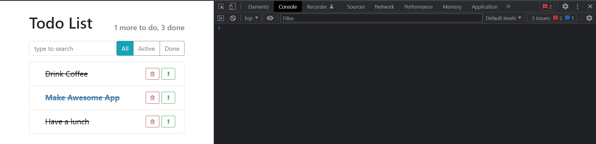
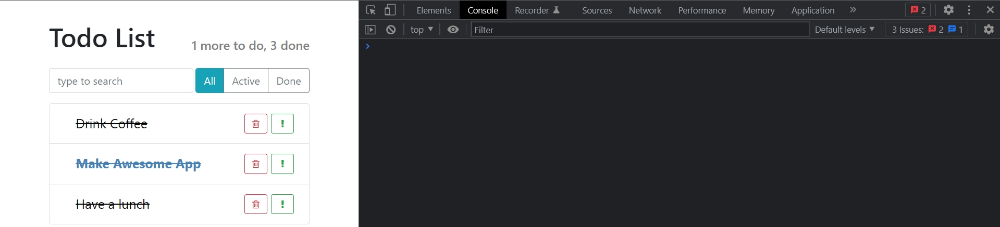
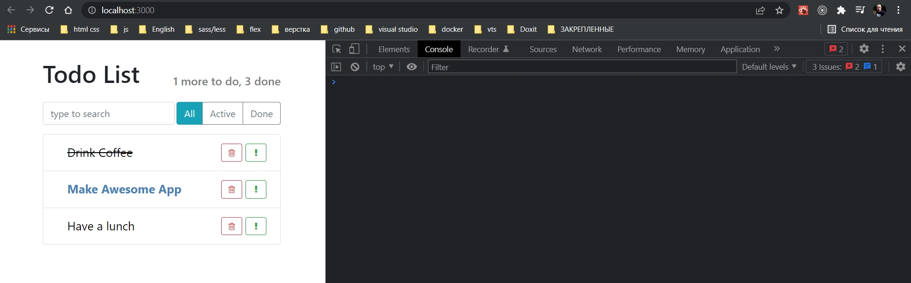

# 003_State

Основная причина использовать классы вмсто функций для создания компонентов это возможность хранить внутреннее состояние компонента.

Каким образом мы будем отмечать компонент отмеченным? Да очень просто. Если мы добавим к span еще один класс done, то наш css сделает всю работу за нас

```js
//src/components/TodoListItem.js
import React, { Component } from "react";
import "./TodoListItem.css";

export default class TodoListItem extends Component {
    constructor() {
        super();
        this.onLabelClick = () => {
            console.log(`Done: ${this.props.label}`);
        };
    }

    render() {
        const { label, important = false } = this.props;
        const style = {
            color: important ? "steelblue" : "black",
            fontWeight: important ? "bold" : "normal",
        };
        return (
            <span className="todo-list-item done">
                <span
                    className="todo-list-item-label"
                    style={style}
                    onClick={this.onLabelClick}
                >
                    {label}
                </span>

                <button
                    type="button"
                    className="btn btn-outline-success btn-sm float-right"
                >
                    <i className="fa fa-exclamation" />
                </button>

                <button
                    type="button"
                    className="btn btn-outline-danger btn-sm float-right"
                >
                    <i className="fa fa-trash-o" />
                </button>
            </span>
        );
    }
}

```



Осталось решить, как по клику пользователя добавлять этот класс к нашему span.


В React внутреннее состояние хранится в специальном поле которое называется **state**. 

Его можно инициализировать в конструкторе. **state** должен быть обязательно объектом в котором вы можете сохранить любую необходимую информацию для того что бы ваш компонент работал.

Для нас **state** будет совсем маленьким, там будет всего лишь одно свойство **done: false**.

Для того что бы достать это свойство из состояния я могу исползовать деструктуризацию **const {done} = this.state**.

Теперь мы можем использовать этот **done** для того что бы сформировать список классов которые мы присвоим к нашему **span**.

Выношу стили в переменную **classNames**.

```js
//src/components/TodoListItem.js
import React, { Component } from "react";
import "./TodoListItem.css";

export default class TodoListItem extends Component {
  constructor() {
    super();
    this.state = {
      done: false,
    };
  }

  render() {
    const { label, important = false } = this.props;
    const { done } = this.state;

    let classNames = "todo-list-item ";

    const style = {
      color: important ? "steelblue" : "black",
      fontWeight: important ? "bold" : "normal",
    };
    return (
      <span className={classNames}>
        <span
          className="todo-list-item-label"
          style={style}
          onClick={this.onLabelClick}
        >
          {label}
        </span>

        <button
          type="button"
          className="btn btn-outline-success btn-sm float-right"
        >
          <i className="fa fa-exclamation" />
        </button>

        <button
          type="button"
          className="btn btn-outline-danger btn-sm float-right"
        >
          <i className="fa fa-trash-o" />
        </button>
      </span>
    );
  }
}

```

Теперь в зависимости от того done этот **item** или не **done** мы к **classNames** можем добавить еще один класс **done**.

```js
//src/components/TodoListItem.js
import React, { Component } from "react";
import "./TodoListItem.css";

export default class TodoListItem extends Component {
    constructor() {
        super();
        this.state = {
            done: true,
        };
    }

    render() {
        const { label, important = false } = this.props;
        const { done } = this.state;

        let classNames = "todo-list-item ";
        if (done) {
            classNames += " done";
        }

        const style = {
            color: important ? "steelblue" : "black",
            fontWeight: important ? "bold" : "normal",
        };
        return (
            <span className={classNames}>
                <span
                    className="todo-list-item-label"
                    style={style}
                    onClick={this.onLabelClick}
                >
                    {label}
                </span>

                <button
                    type="button"
                    className="btn btn-outline-success btn-sm float-right"
                >
                    <i className="fa fa-exclamation" />
                </button>

                <button
                    type="button"
                    className="btn btn-outline-danger btn-sm float-right"
                >
                    <i className="fa fa-trash-o" />
                </button>
            </span>
        );
    }
}

```

И теперь если я в инициализации **state** заменю **false** на **true**.



Но мы хотели изменять этот класс только когда пользователь кликает мышкой на компоненте.


## Добавим установку состояния по клику.

В **React** есть одно очень важное правило!!!! После того как вы первый раз проинициализировали **state** его больше нельзя изменять напрямую. 

Его можно читать, так как мы делали в функции **render**.  **const { done } = this.state;**

Для того что бы изменять состояние мне нужно использовать специальную функцию **this.setState()**. И в эту функцию мы можем передать изменения которые мы хотим внести в **state**.

```js
//src/components/TodoListItem.js
import React, { Component } from "react";
import "./TodoListItem.css";

export default class TodoListItem extends Component {
  constructor() {
    super();
    this.state = {
      done: false,
    };
  }

  onLabelClick = () => {
    return this.setState({
      done: true,
    });
  };

  render() {
    const { label, important = false } = this.props;
    const { done } = this.state;

    let classNames = "todo-list-item ";
    if (done) {
      classNames += " done";
    }

    const style = {
      color: important ? "steelblue" : "black",
      fontWeight: important ? "bold" : "normal",
    };
    return (
      <span className={classNames}>
        <span
          className="todo-list-item-label"
          style={style}
          onClick={this.onLabelClick}
        >
          {label}
        </span>

        <button
          type="button"
          className="btn btn-outline-success btn-sm float-right"
        >
          <i className="fa fa-exclamation" />
        </button>

        <button
          type="button"
          className="btn btn-outline-danger btn-sm float-right"
        >
          <i className="fa fa-trash-o" />
        </button>
      </span>
    );
  }
}

```



**setState()** говорит React что состояние компонента изменилось. Вызови заново функцию render. И функция **render** возвращает новую структуру для нашего компонента.

React запускает свой **Reconciliation algorithm** и находит что у этих элементов изменился класс. И React обновляет только этот маленький параметр в DOM дереве. И после этого наш элемент на странице получае новый класс.


> State - состояние компонента
> 
> this.state инициализируется в конструкторе или в теле класса
> 
> После инициализации state нельзя изменить (только читать)
> 
> что бы обновить state - setState()