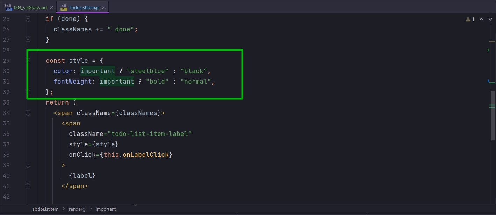
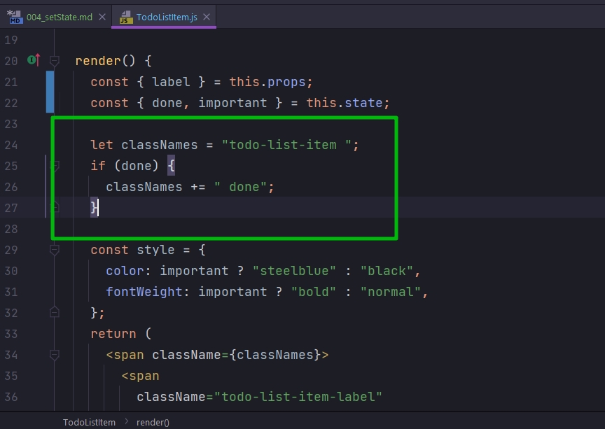
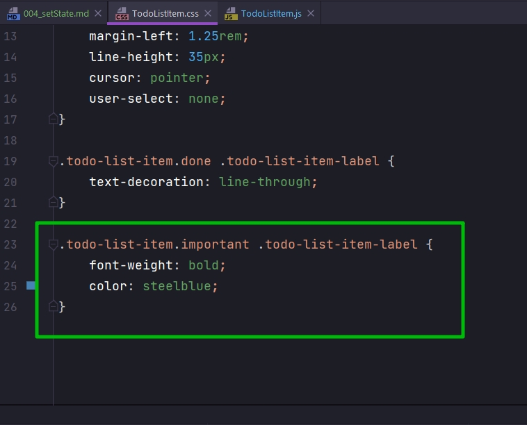
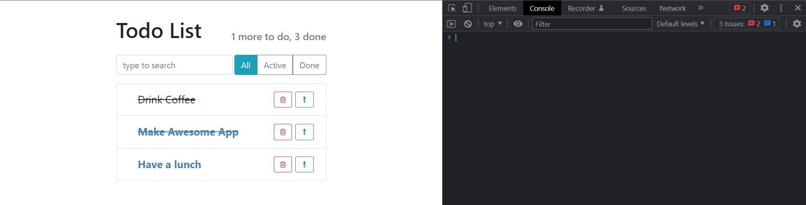

# 004_setState

Для того что бы немного лучше понять как работает функция **setState()** давайте добавим еще какой-нибудь элемент в наш объект.

Например при нажатии на кнопку пользователь мог устанавливать важность для нашего элемента.

В **state** добавлю еще один элемент **important: false**.

Далее убираю **important** из props поскольку он теперь будет в **state**.
И получаю **important** из **state**.

И теперь вот в этом блоке кода



Вместо того что бы эспользовать такую конструкцию, как на скрине, и формировать стиль прямо в элементе, мы сделаем наш код немножко чище. И точно так же как мы добавляли имя класса на **done**



Мы добавим **className** на **important**. В **css** я уже добавил правило что если наш **todo-list-item** отмечен как **important**, то **label** нужно отрисовать.



```css
/*src/components/TodoListItem.css*/

.todo-list-item {
    font-size: 1.25rem;
}

.todo-list-item button {
    width: 35px;
    margin: 3px;
}

.todo-list-item-label {
    margin-left: 1.25rem;
    line-height: 35px;
    cursor: pointer;
    user-select: none;
}

.todo-list-item.done .todo-list-item-label {
    text-decoration: line-through;
}

.todo-list-item.important .todo-list-item-label {
    font-weight: bold;
    color: steelblue;
}
```

Удаляю блок **style** и прописываю условие.

```js
//src/components/TodoListItem.js
import React, { Component } from "react";
import "./TodoListItem.css";

export default class TodoListItem extends Component {
  constructor() {
    super();
    this.state = {
      done: false,
      important: false,
    };
  }

  onLabelClick = () => {
    return this.setState({
      done: true,
    });
  };

  render() {
    const { label } = this.props;
    const { done, important } = this.state;

    let classNames = "todo-list-item ";
    if (done) {
      classNames += " done";
    }

    if (important) {
      classNames = " important";
    }
    return (
      <span className={classNames}>
        <span className="todo-list-item-label" onClick={this.onLabelClick}>
          {label}
        </span>

        <button
          type="button"
          className="btn btn-outline-success btn-sm float-right"
        >
          <i className="fa fa-exclamation" />
        </button>

        <button
          type="button"
          className="btn btn-outline-danger btn-sm float-right"
        >
          <i className="fa fa-trash-o" />
        </button>
      </span>
    );
  }
}

```

Теперь мы когда нажимаем на кнопку, мы должны вызывать **setState** и устанавливать **important** в **true**.

```js
//src/components/TodoListItem.js
import React, { Component } from "react";
import "./TodoListItem.css";

export default class TodoListItem extends Component {
  constructor() {
    super();
    this.state = {
      done: false,
      important: false,
    };
  }

  onLabelClick = () => {
    return this.setState({
      done: true,
    });
  };

  onMarkImportant = () => {
    return this.setState({
      important: true,
    });
  };

  render() {
    const { label } = this.props;
    const { done, important } = this.state;

    let classNames = "todo-list-item ";
    if (done) {
      classNames += " done";
    }

    if (important) {
      classNames += " important";
    }
    return (
      <span className={classNames}>
        <span className="todo-list-item-label" onClick={this.onLabelClick}>
          {label}
        </span>

        <button
          type="button"
          className="btn btn-outline-success btn-sm float-right"
          onClick={this.onMarkImportant}
        >
          <i className="fa fa-exclamation" />
        </button>

        <button
          type="button"
          className="btn btn-outline-danger btn-sm float-right"
        >
          <i className="fa fa-trash-o" />
        </button>
      </span>
    );
  }
}

```



Обратите внимание на то как мы использовали **setState**. Когда мы добавили новые элементы к текущему **state**, мы не обновляли предыдущие высовы **setState**.

**setState** принимает только ту часть **state** которая должна измениться. Т.е. когда мы меняем в функции **setState** значение **important**, нам не нужно передавать значение **done**. Этот новый объект, в функции **setState**, как бы наложится поверх объекта **state**. Это очень удобная особенность **React** которая защищает от ошибок и позволяет писать куда более чистый код.

Функция **setState** принимает не полный **state**, а только те значения которые нужно изменить. А **React** уже позаботится о том что бы объеденить текущие значения с новыми.

> Как работате setState()
> 
> В setState() нужно передавать только изменения в state