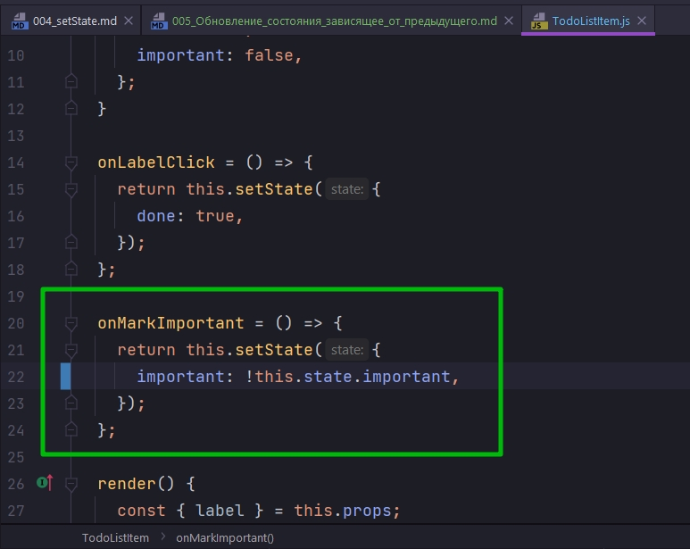
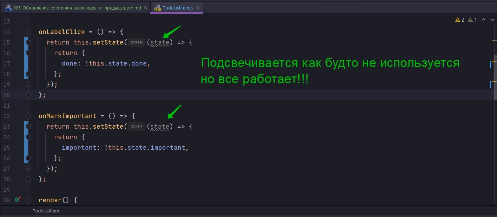
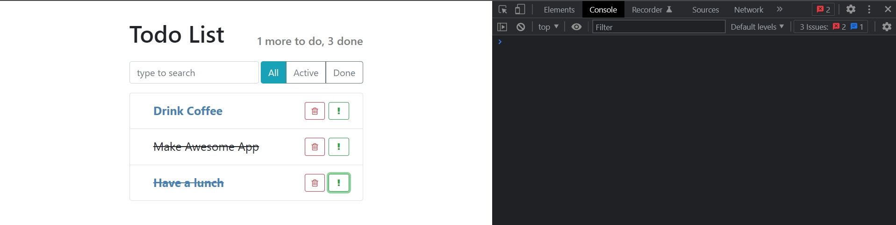
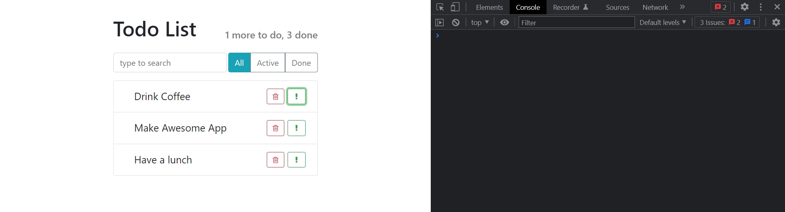
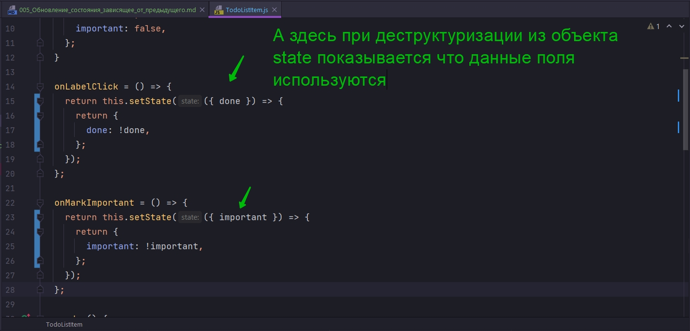

# 005_Обновление_состояния_зависящее_от_предыдущего

пререключение с **true** на **false** и в обратную сторону.

Скорее всего вам хочется написать инверсию.



```js
//src/components/TodoListItem.js
import React, { Component } from "react";
import "./TodoListItem.css";

export default class TodoListItem extends Component {
  constructor() {
    super();
    this.state = {
      done: false,
      important: false,
    };
  }

  onLabelClick = () => {
    return this.setState({
      done: true,
    });
  };

  onMarkImportant = () => {
    return this.setState({
      important: !this.state.important,
    });
  };

  render() {
    const { label } = this.props;
    const { done, important } = this.state;

    let classNames = "todo-list-item ";
    if (done) {
      classNames += " done";
    }

    if (important) {
      classNames += " important";
    }
    return (
      <span className={classNames}>
        <span className="todo-list-item-label" onClick={this.onLabelClick}>
          {label}
        </span>

        <button
          type="button"
          className="btn btn-outline-success btn-sm float-right"
          onClick={this.onMarkImportant}
        >
          <i className="fa fa-exclamation" />
        </button>

        <button
          type="button"
          className="btn btn-outline-danger btn-sm float-right"
        >
          <i className="fa fa-trash-o" />
        </button>
      </span>
    );
  }
}

```

Но этот код не верный!!! Все дело в том что функция **setState** иногда может работать асинхронно, не всегда, не каждый раз, но в некоторых случаях **setState** является асинхронной функцией. 

И по этому безопасней всего считать что тот **state** который вы устанавливаете, он устанавливается не моментально, а может быть установлен позже.

И таким образом когда пользователь кликает на кнопку и мы вызываем **onMarkImportant**, значение **this.state** еще может быть не обновленным. Возможно еще есть какой-нибудь кусочек **state** который не был обновлен. 

React делает это для оптимизации производительности. К примеру React может объеденять несколько вызовов setState и потом перерисовать элемент один раз. Или реализовывать другие очень интересные оптимизации. К примеру дать более высокий приоритет на перерисовку тем элементам которые сейчас видны на экране.


Что бы исправить это нам нужно вызвать **setState** немного иначе. Вместо того что бы передавать в функцию новое состояние, мы передадим в **setState** еще одну функцию, которая в свою очередь принимает наш текущий **state**. Когда мы передаем в **setState** функцию - это сигнал для реакта что этот код, этот **setState** нужно выполнить только тогда наш текущий **state** уже будет в его фнальном состоянии и его можно будет использовать для того что бы вычислить новый **state**.

Т.е. всегда для того что бы вычислить новый **state**, в зависимости от того какое текущее значение нашего **state**, нам нужно передавать в **setState** первым параметром функцию которая возвращает объект **state**.







```js
//src/components/TodoListItem.js
import React, { Component } from "react";
import "./TodoListItem.css";

export default class TodoListItem extends Component {
  constructor() {
    super();
    this.state = {
      done: false,
      important: false,
    };
  }

  onLabelClick = () => {
    return this.setState((state) => {
      return {
        done: !this.state.done,
      };
    });
  };

  onMarkImportant = () => {
    return this.setState((state) => {
      return {
        important: !this.state.important,
      };
    });
  };

  render() {
    const { label } = this.props;
    const { done, important } = this.state;

    let classNames = "todo-list-item ";
    if (done) {
      classNames += " done";
    }

    if (important) {
      classNames += " important";
    }
    return (
      <span className={classNames}>
        <span className="todo-list-item-label" onClick={this.onLabelClick}>
          {label}
        </span>

        <button
          type="button"
          className="btn btn-outline-success btn-sm float-right"
          onClick={this.onMarkImportant}
        >
          <i className="fa fa-exclamation" />
        </button>

        <button
          type="button"
          className="btn btn-outline-danger btn-sm float-right"
        >
          <i className="fa fa-trash-o" />
        </button>
      </span>
    );
  }
}

```

Этот аспект **React** может стать причиной ошибок, которые очень тяжело поймать, поскольку они будут проявляться не вседа. **setState** работает асинхронно. Код который напрямую устанавливает **state** чаще всего будет срабатывать корректно, но иногда он будет давать вам те самые ошибки которые очень-очень сложно отловить.

Глядя на предыдущий код я могу из **state** сразу деструктурировать интересужщее меня поле.



```js
//src/components/TodoListItem.js
import React, { Component } from "react";
import "./TodoListItem.css";

export default class TodoListItem extends Component {
  constructor() {
    super();
    this.state = {
      done: false,
      important: false,
    };
  }

  onLabelClick = () => {
    return this.setState(({ done }) => {
      return {
        done: !done,
      };
    });
  };

  onMarkImportant = () => {
    return this.setState(({ important }) => {
      return {
        important: !important,
      };
    });
  };

  render() {
    const { label } = this.props;
    const { done, important } = this.state;

    let classNames = "todo-list-item ";
    if (done) {
      classNames += " done";
    }

    if (important) {
      classNames += " important";
    }
    return (
      <span className={classNames}>
        <span className="todo-list-item-label" onClick={this.onLabelClick}>
          {label}
        </span>

        <button
          type="button"
          className="btn btn-outline-success btn-sm float-right"
          onClick={this.onMarkImportant}
        >
          <i className="fa fa-exclamation" />
        </button>

        <button
          type="button"
          className="btn btn-outline-danger btn-sm float-right"
        >
          <i className="fa fa-trash-o" />
        </button>
      </span>
    );
  }
}

```

Давайте повторим еще раз поскольку это один из самых-самых важных аспектов **React**!!! И в этом месте **React** разработчики которые только-только начинают писать код очень-очень часто допускают ошибки.


Если ваше новое состояние ни как не зависит от предыдущего состояния, вы можете использовать setState и передавать внутрь объект.

Если эе ваше состояние зависит от предыдущего. К примеру вы хотите изменить значение с true на **false** или c **false** на true, или вы хотите увеличить счетчик на еденичку, или сделать любое другое действие которое которое основано на текущем значении **state**, нам обязательно нужно использовать **setState()** которая первым параметром принимает функцию, которая будет вызвана тогда, когда **state** будет готов.

> Обновление состояния которое зависит от предыдущего
> 
> setState принимает функцию
> 
> аргументом callback принимает текущий state, можно сразу деструктурировать интересующее поле из state. Я так понимаю что я могу сразу деструктурировать нужное значение потому что callback идущий параметром функции setState, в свой парамтр принимает текущий state по умолчанию.
> 
> this.setState((state) =>{return {count: state.count + 1}})