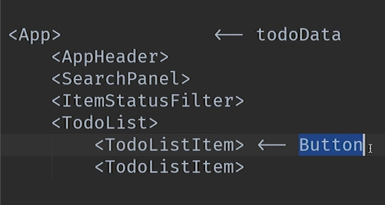
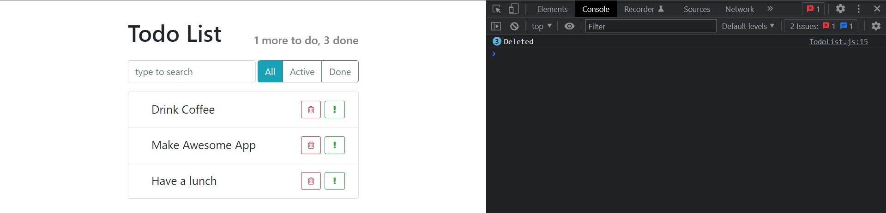
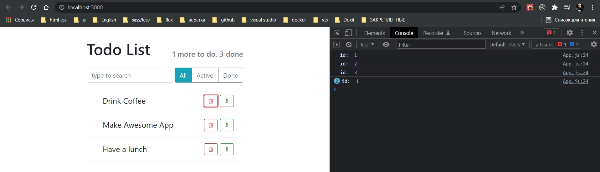

# 006_Собственные события

Следующим логичным шагом будет сделать так что бы мы могли удалять элементы из списка. Но с этой функциональностью не все так просто. 

Дело в том что в **React** компонент не может просто так взять и самоудалится. Для того что бы удалить элемент нам нужно удалить его из источника данных. А источник данных для наших **TodoListItem** находится в **App.js**. 


Как же нам реализовать удаление?

На самом верхнем уровне у нас находится компонент **App**  именно там находится наш массив данных.



И в самом конце иерархии компонентов у нас есть кнопка которая удаляет элементы.

Для того что бы избавится от этого компонента внизу иерархии нам нужно сделать так что бы данные вверху иерархии на уровне **App** обновились.

Другими словами нам нужно сделать так что бы компонент **App** каким-то образом узнавал что кнопка на компоненте **TodoListItem** была нажата.

И мы можем передать вверх по иерархии эти данные используя свою собственную систему событий.

Идея которую мы сейчас реализуем заключается в том что **TodoListItem** будет генерить событие, которое будет слушать **TodoList**, **TodoList** передаст это событие еще выше в элемент **App**. И элемент **App** в свою очередь обновит массив. После того как данные обновяться **TodoListItem** исчезнет так как соответствующего элемента в массиве не будет.

В **TodoList** на каждом генерируемом элементе списка, в теге **TodoListItem** создаю props т.е. кастомный event **onDeleted**.

```js
// src/components/TodoList.js
import React from "react";

import TodoListItem from "../TodoListItem/TodoListItem";
import "../TodoListItem/TodoListItem.css";

const TodoList = ({ todos }) => {
    const elements = todos.map((item) => {
        const { id, ...itemProps } = item;

        return (
            <li key={id} className="list-group-item ">
                <TodoListItem
                    {...itemProps}
                    onDeleted={() => console.log("Deleted")} // это props
                />
            </li>
        );
    });

    return <ul className="list-group  todo-list">{elements}</ul>;
};

export default TodoList;

```

В самом компоненте **TodoListItem** отлавливаю, деструктурирую из объекта **this.props** нужный мне пропс **onDeleted** и передаю его в событие **onClick** повешанное на кнопку.



Теперь наш **TodoListItem** говорит **TodoList** что пользователь решил меня удалить.


Теперь что мы делаем в **TodoList** ? мы не хотим просто выводить в консоль. Мы хотим передать это сообщение еще на один уровень выше, на уровень компонента **App**. Но в случае с **App** не не достаточно просто передать что один какой-то элемент из списка решил удалиться. Нам нужно передать какой именно это был элемент.


В компонента **App** на теге **Todolist** мне нужно зарегистрировать новый eventListener **onDeleted**. И этот слушатель будет получать **id** элемента который мы удаляем.

```js
import React from "react";

import AppHeader from "../AppHeader/AppHeader";
import SearchPanel from "../SearchPanel/SerchPanel";
import TodoList from "../TodoList/TodoList";
import ItemStatusFilter from "../ItemStatusFilter/ItemStatusFilter";
import "./App.css";

const App = () => {
    const todoData = [
        { label: "Drink Coffee", important: false, id: 1 },
        { label: "Make Awesome App", important: true, id: 2 },
        { label: "Have a lunch", important: false, id: 3 },
    ];

    return (
        <div className="todo-app">
            <AppHeader toDo={1} done={3} />
            <div className="top-panel d-flex">
                <SearchPanel />
                <ItemStatusFilter />
            </div>

            <TodoList todos={todoData} onDeleted={(id) => console.log("id: ", id)} />
        </div>
    );
};

export default App;

```

Теперь перейдем в **TodoList** и убедимся что мы действительно вызываем эту функцию.

В **props**. вызываю функцию **onDeleted** написанную в **App**  передаю **id**, который также попадает в **TodoListItem**. Запутанно

```js
// src/components/TodoList.js
import React from "react";

import TodoListItem from "../TodoListItem/TodoListItem";
import "../TodoListItem/TodoListItem.css";

const TodoList = ({ todos, onDeleted }) => {
  const elements = todos.map((item) => {
    const { id, ...itemProps } = item;

    return (
      <li key={id} className="list-group-item ">
        <TodoListItem
          {...itemProps}
          onDeleted={() => onDeleted(id)} // это props. вызываю функцию onDeleted написанную в App  передаю id, который также попадает в TodoListItem
        />
      </li>
    );
  });

  return <ul className="list-group  todo-list">{elements}</ul>;
};

export default TodoList;

```

id у нас как раз таки здесь уже есть потому что мы его используем в качестве ключа для наших элементов.



Следующим шагом будет удалить этот элемент из массива и обновить приложение. Но прямо сейчас сделать это мы не сможем, поскольку наш массив **todoDate** - это не часть состояния. Это не часть state компонента **App**. Наш компонент **App** пока что просто функция.

В первую очередь нужно сделать так что бы **todoDate** стал частью состояния этого компонента, ну а сам компонент стал классом.


Итог. Все что мы делаем это передаем функции в нашем компоненте. А затем когда происходит одно из событий **DOM**, мы вызываем эти функции. Т.е. мы передаем информацию по иерархии выше в компоненты о том что что-то произошло.

> Собственная система событий
> 
> Любой компонент может генерировать собственные события(onDone, onAdded)
> 
> Достаточно передать callback функцию, как property, а затем вызвать ее из компонента, когда наступило событие
> 
> Через события, данные поднимаются вверх по иерархии компонентов.