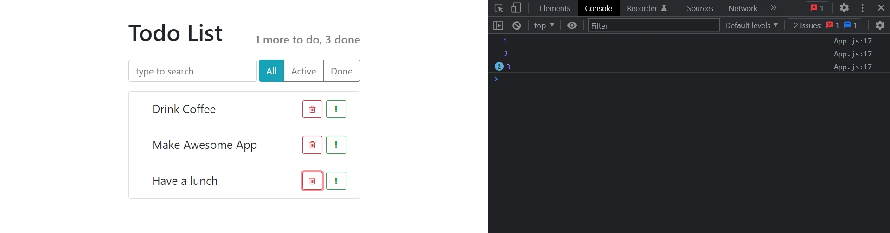
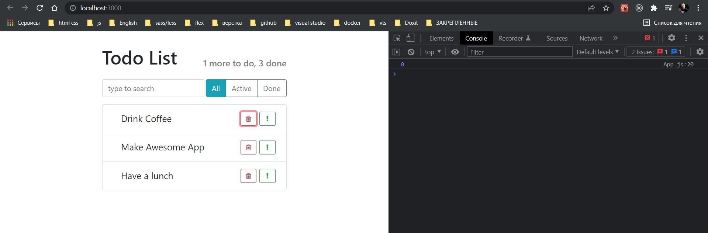
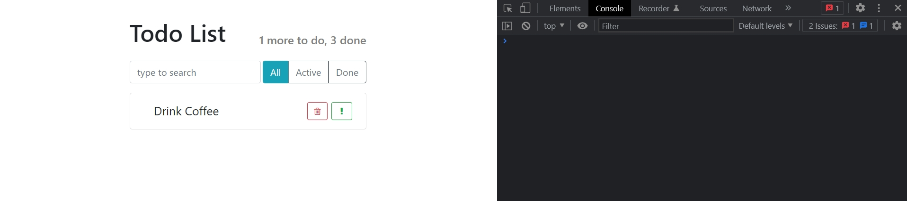

# 007_setState_Удаление_элемента

Продолжаю писать код удаления элемента!!

У нас есть элемент App, у которого есть данные, массив наших элементов которые мы используем для списка. 

Соответственно если мы обновим этот массив. Удалим нужный элемент, а затем приложение обновится, то наш компонент пропадет.

Единственная проблема что App сейчас является компонентом функцией. А как мы знаем у функциональных компонентов не может быть state.

Соответственно, даже если мы удалим элемент из этого массива, React ни как не узнает о том что остаток приложения нужно обновить.

Для того что бы React обновил приложение компонент App нужно сделать компонентом классом. А todoDate сделать частью state приложения. Тогда мы будем вызывать функцию setState которая в свою очередь даст React знать что приложение нужно обновить. 

Сначало рефакторю и делаю компонент класс.

```js
import React, { Component } from "react";
import AppHeader from "../AppHeader/AppHeader";
import SearchPanel from "../SearchPanel/SerchPanel";
import TodoList from "../TodoList/TodoList";
import ItemStatusFilter from "../ItemStatusFilter/ItemStatusFilter";
import "./App.css";

export default class App extends Component {
    state = {
        todoData: [
            { label: "Drink Coffee", important: false, id: 1 },
            { label: "Make Awesome App", important: true, id: 2 },
            { label: "Have a lunch", important: false, id: 3 },
        ],
    };
    render() {
        return (
            <div className="todo-app">
                <AppHeader toDo={1} done={3} />
                <div className="top-panel d-flex">
                    <SearchPanel />
                    <ItemStatusFilter />
                </div>

                <TodoList
                    todos={this.state.todoData}
                    onDeleted={(id) => console.log("id: ", id)}
                />
            </div>
        );
    }
}

```

Теперь пишу функцию deleteItem которую объявляю в теле класса. Поскольку мы будем передавать эту функцию как eventListener нам надо убедится что значение this в этой функции останется корректным.

```js
import React, { Component } from "react";
import AppHeader from "../AppHeader/AppHeader";
import SearchPanel from "../SearchPanel/SerchPanel";
import TodoList from "../TodoList/TodoList";
import ItemStatusFilter from "../ItemStatusFilter/ItemStatusFilter";
import "./App.css";

export default class App extends Component {
  state = {
    todoData: [
      { label: "Drink Coffee", important: false, id: 1 },
      { label: "Make Awesome App", important: true, id: 2 },
      { label: "Have a lunch", important: false, id: 3 },
    ],
  };
  deleteItem = (id) => {
    console.log(id);
  };
  render() {
    return (
      <div className="todo-app">
        <AppHeader toDo={1} done={3} />
        <div className="top-panel d-flex">
          <SearchPanel />
          <ItemStatusFilter />
        </div>

        <TodoList todos={this.state.todoData} onDeleted={this.deleteItem} />
      </div>
    );
  }
}

```



Тут черт ногу сломит. У меня возник вопрос откуда я получаю id в функции deleteItem. И думаю яже его из состояния не получал!!!

Все дело в том что этот id я прокидываю в пропс onDeleted в теге TodoList, в котором и хранится значение из дочернего элемента TodoList где я перебираю массив и получаю все элементы.

Сложновато для понимания когда значение прокидываешь из дочернего элемента в родительский.


Теперь можно перейти к самому удалению. И здесь у меня есть вопрос. Естественно нам нужно вызвать this.setState(). Но в какой форме мы будем вызывать setState() что мы передадим внутрь. Он спрашивает должны ли мы передать объект или функцию которая принимает объект state. Конечно функцию. Которая принимает старый state, а в теле функции создает новый state  накладывает его поверх старого.

В setState сравниваю id массива и id полученный из props.

```js
import React, { Component } from "react";
import AppHeader from "../AppHeader/AppHeader";
import SearchPanel from "../SearchPanel/SerchPanel";
import TodoList from "../TodoList/TodoList";
import ItemStatusFilter from "../ItemStatusFilter/ItemStatusFilter";
import "./App.css";

export default class App extends Component {
    state = {
        todoData: [
            { label: "Drink Coffee", important: false, id: 1 },
            { label: "Make Awesome App", important: true, id: 2 },
            { label: "Have a lunch", important: false, id: 3 },
        ],
    };
    deleteItem = (id) => {
        this.setState(({ todoData }) => {
            //сравниваю id в массиве и id полученное из props
            const idx = todoData.findIndex((element) => element.id === id);
            console.log(idx);
        });
    };
    render() {
        return (
            <div className="todo-app">
                <AppHeader toDo={1} done={3} />
                <div className="top-panel d-flex">
                    <SearchPanel />
                    <ItemStatusFilter />
                </div>

                <TodoList todos={this.state.todoData} onDeleted={this.deleteItem} />
            </div>
        );
    }
}

```



И я получаю index массива где поле id совпадает с id полученное из props.

Мы говы удалять элемент.

Для удаления элемента из массива использю splice. Он вытащит элемет из массива. Для этого указываю первым параметром наш индекс idx, а вторым параметром указываю количество этементов 1.

Если не помнишь как работает splice <https://learn.javascript.ru/array-methods>

И далее возвращаю новое состояние.

```js
import React, { Component } from "react";
import AppHeader from "../AppHeader/AppHeader";
import SearchPanel from "../SearchPanel/SerchPanel";
import TodoList from "../TodoList/TodoList";
import ItemStatusFilter from "../ItemStatusFilter/ItemStatusFilter";
import "./App.css";

export default class App extends Component {
  state = {
    todoData: [
      { label: "Drink Coffee", important: false, id: 1 },
      { label: "Make Awesome App", important: true, id: 2 },
      { label: "Have a lunch", important: false, id: 3 },
    ],
  };
  deleteItem = (id) => {
    this.setState(({ todoData }) => {
      //сравниваю id в массиве и id полученное из props
      const idx = todoData.findIndex((element) => element.id === id);
      todoData.splice(idx, 1);
      //Здесь проблема в том что я изменяю старый объект state
      return {
        todoData: todoData,
      };
    });
  };
  render() {
    return (
      <div className="todo-app">
        <AppHeader toDo={1} done={3} />
        <div className="top-panel d-flex">
          <SearchPanel />
          <ItemStatusFilter />
        </div>

        <TodoList todos={this.state.todoData} onDeleted={this.deleteItem} />
      </div>
    );
  }
}

```

Здесь проблема в том что я изменяю старый объект state. Самая грубая ошибка.

Если я удаляю элемент из массива, то он разбиватеся на две части. Первая часть до удаляемого элемента. Вторая часть после удаляемого элемента.

Как нам получить элементы перед элементом которые мы хотим удалить? Для того что бы получить эти элементы мы будем использовать метод slice. Этот метод не изменяет существующий массив и по этому нам можно его использовать.

slice принимает два аргумента, начало и конец сегмента который мы будем копировать. Начало сегмена у нас ноль, а конец сегмента это индекс который мы собираемся удалить.

//копирую первую часть массива
const before = todoData.slice(0, idx);

// копирую часть массива после удаляемого элемента
const after = todoData(idx + 1);

Поскольку сам index пропадает +1 означает до конца. Если мы не передаем второй аргумент жто будет обозначать что от удаляемого элемента и до конца.

```js
import React, { Component } from "react";
import AppHeader from "../AppHeader/AppHeader";
import SearchPanel from "../SearchPanel/SerchPanel";
import TodoList from "../TodoList/TodoList";
import ItemStatusFilter from "../ItemStatusFilter/ItemStatusFilter";
import "./App.css";

export default class App extends Component {
    state = {
        todoData: [
            { label: "Drink Coffee", important: false, id: 1 },
            { label: "Make Awesome App", important: true, id: 2 },
            { label: "Have a lunch", important: false, id: 3 },
        ],
    };
    deleteItem = (id) => {
        this.setState(({ todoData }) => {
            //сравниваю id в массиве и id полученное из props
            const idx = todoData.findIndex((element) => element.id === id);
            todoData.splice(idx, 1);
            // [a,b,c,d,e]
            // [a,b, ,d,e]
            //копирую первую часть массива
            const before = todoData.slice(0, idx);
            // копирую часть массива после удаляемого элемента
            const after = todoData.slice(idx + 1);
            const newArray = [...before, ...after];
            return {
                todoData: newArray,
            };
        });
    };
    render() {
        return (
            <div className="todo-app">
                <AppHeader toDo={1} done={3} />
                <div className="top-panel d-flex">
                    <SearchPanel />
                    <ItemStatusFilter />
                </div>

                <TodoList todos={this.state.todoData} onDeleted={this.deleteItem} />
            </div>
        );
    }
}

```



Но при обновлении страницы у нас подтягивается старое состояние.

На самом деле константы before и after нужны для того чтобы очень наглядно показать как это работает.

```js
import React, { Component } from "react";
import AppHeader from "../AppHeader/AppHeader";
import SearchPanel from "../SearchPanel/SerchPanel";
import TodoList from "../TodoList/TodoList";
import ItemStatusFilter from "../ItemStatusFilter/ItemStatusFilter";
import "./App.css";

export default class App extends Component {
    state = {
        todoData: [
            { label: "Drink Coffee", important: false, id: 1 },
            { label: "Make Awesome App", important: true, id: 2 },
            { label: "Have a lunch", important: false, id: 3 },
        ],
    };
    deleteItem = (id) => {
        this.setState(({ todoData }) => {
            //сравниваю id в массиве и id полученное из props
            const idx = todoData.findIndex((element) => element.id === id);
            // [a,b,c,d,e]
            // [a,b, ,d,e]
            //копирую первую часть массива
            // копирую часть массива после удаляемого элемента
            const newArray = [...todoData.slice(0, idx), ...todoData.slice(idx + 1)];
            return {
                todoData: newArray,
            };
        });
    };
    render() {
        return (
            <div className="todo-app">
                <AppHeader toDo={1} done={3} />
                <div className="top-panel d-flex">
                    <SearchPanel />
                    <ItemStatusFilter />
                </div>

                <TodoList todos={this.state.todoData} onDeleted={this.deleteItem} />
            </div>
        );
    }
}

```

И удаляю splice поскольку это зло меняет исходный массив. 

> setState() не должен изменять текущий state
> 
> Методы которые изменяют (mutate) массив использовать нельзя
> 
> slice не изменяет исходный массив
>  const newArray = [...todoData.slice(0, idx), ...todoData.slice(idx + 1)];
> 


