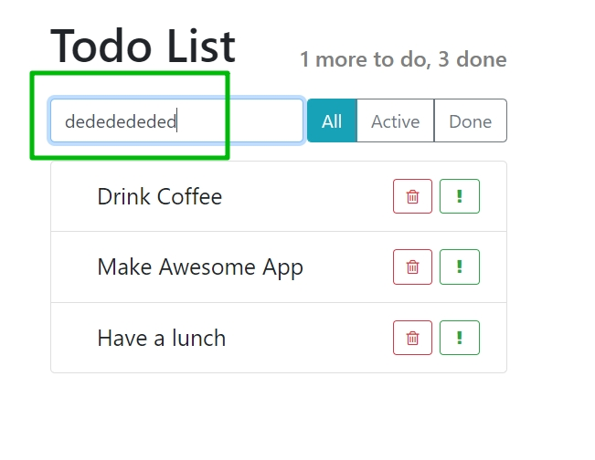

# 008_Добавление_элемента

Наши уроки которые мы посвятили удалению элемента из списка были довольно сложными.
Мы скомбинировали две разные техники.

1. Кастомные **event** которые мы используем для того что бы передать данные от элементов внизу иерархии к элементам вверху иерархии т.е. как бы поднять данные вверх. Мы передаем данные от **ListItem** вверх до самого **App**, для того что бы **App** мог обновить свой **state**.
2. Это то как обновлять **state** когда он немного более сложный. Не просто переменные, а к примеру массивы. И мы узнали что массивы нельзя изменять. Мы можем только создавать новые массивы. Для того что бы это сделать мы использовали вот такой подход.

```js
// [a,b,c,d,e]
      // [a,b, ,d,e]
      //копирую первую часть массива
      // копирую часть массива после удаляемого элемента
      const newArray = [...todoData.slice(0, idx), ...todoData.slice(idx + 1)];
```

Мы использовали данные до удаляемого элемента и данные после удаляемого элемента. После чего объеденяли эти данные и копировали в новый массив.


В этом уроке закрепим пройденное и сделаем такую же функциональность для добавления новых элементов в **Todo** список.

Пока что у меня нет формы снизу для добавления новых элементов в список. Как раз будет повод сделать этот самый компонент.

Мы пока не будем делать функционал который позволит пользователю вводит текст в форму поскольку мы пока не знаем как работать с формами



Но сделать кнопку при нажатии на которую мы будем добавлять новый элемент с любым вобще текстом это будет вполне полезно для того что бы закрепить метериал.

```js
import React, { Component } from "react";
import "./ItemAddForm.css";

export default class ItemAddForm extends Component {
    render() {
        return (
            <div className="item-add-form">
                <button className="btn btn-online-secondary">Add Item</button>
            </div>
        );
    }
}

```

```css
.item-add-form{
    margin-top: 10px;
}
```


Теперь мне нужно сделать так что бы при нажатии на кнопку, наш компонент App получал **event** и знал что мы хотим добавить новый **TodoItem** к списку. 

В компоненте **App** в атрибуте тега **ItemAddForm** создаю **event** т.е. **props** **onItemAdded**. и передаю туда функцицию **this.addItem**. Функция **addItem** будет принимать параметр **text**, пока что мы его передавать не будем. И саму функцию напишем позже.

```js
import React, { Component } from "react";
import AppHeader from "../AppHeader/AppHeader";
import SearchPanel from "../SearchPanel/SerchPanel";
import TodoList from "../TodoList/TodoList";
import ItemStatusFilter from "../ItemStatusFilter/ItemStatusFilter";
import ItemAddForm from "../ItemAddForm/ItemAddForm";
import "./App.css";
import { findAllByDisplayValue } from "@testing-library/react";

export default class App extends Component {
  state = {
    todoData: [
      { label: "Drink Coffee", important: false, id: 1 },
      { label: "Make Awesome App", important: true, id: 2 },
      { label: "Have a lunch", important: false, id: 3 },
    ],
  };

  //Функция удаления Item
  deleteItem = (id) => {
    this.setState(({ todoData }) => {
      //сравниваю id в массиве и id полученное из props
      const idx = todoData.findIndex((element) => element.id === id);
      // [a,b,c,d,e]
      // [a,b, ,d,e]
      //копирую первую часть массива
      // копирую часть массива после удаляемого элемента
      const newArray = [...todoData.slice(0, idx), ...todoData.slice(idx + 1)];
      return {
        todoData: newArray,
      };
    });
  };

  //Функция добавления Item
  addItem = (text) => {
    console.log("Added", text);
  };

  render() {
    return (
      <div className="todo-app">
        <AppHeader toDo={1} done={3} />
        <div className="top-panel d-flex">
          <SearchPanel />
          <ItemStatusFilter />
        </div>
        <TodoList todos={this.state.todoData} onDeleted={this.deleteItem} />
        <ItemAddForm onItemAdded={this.addItem} />
      </div>
    );
  }
}

```

Теперь возвращаюсь в **ItemAddForm** и сделаю что бы это событие действительно было. Нам нужно добавить **eventListener** на кнопку т.е. **onClick**.

```js
import React, { Component } from "react";
import "./ItemAddForm.css";

export default class ItemAddForm extends Component {
  render() {
    const { onItemAdded } = this.props;

    return (
      <div className="item-add-form">
        <button
          className="btn btn-online-secondary"
          onClick={() => onItemAdded("Hello world")}
        >
          Add Item
        </button>
      </div>
    );
  }
}

```


Когда мы дойдем до работы с формами у нас здесь будет нормальный текст  а не **Hello world**. Теперь наш компонент **App.js** знает что мы хотим добавить новый **Item**.


Все что нам осталось сделать это реализовать функцию **addItem**. И в этом случае ситуации немного интереснее. На самом деле она состоит из двух частей. Первое что мне нужно сделать это сформировать объект. Со всеми полями проблем нет, а вот **id** нужно сгенерировать. Для того что бы они были уникальными.


Для того что бы сгенерировать **id** подходов может быть масса. Начиная с того что вы могли написать случайный **id** т.е. получать его каждый раз рандомно, заканчивая тем что каждый раз вы можете генерить последвательные **id**, или вообще использовать сторонний модуль **uuid** который сгенерирует **id** для вас.


Мы будем генерировать **id** последовательно.


У класса я создам поле **maxId** и начну генерить **id** cо **100**

```js
import React, { Component } from "react";
import AppHeader from "../AppHeader/AppHeader";
import SearchPanel from "../SearchPanel/SerchPanel";
import TodoList from "../TodoList/TodoList";
import ItemStatusFilter from "../ItemStatusFilter/ItemStatusFilter";
import ItemAddForm from "../ItemAddForm/ItemAddForm";
import "./App.css";
import { findAllByDisplayValue } from "@testing-library/react";

export default class App extends Component {
  maxId = 100;

  state = {
    todoData: [
      { label: "Drink Coffee", important: false, id: 1 },
      { label: "Make Awesome App", important: true, id: 2 },
      { label: "Have a lunch", important: false, id: 3 },
    ],
  };

  //Функция удаления Item
  deleteItem = (id) => {
    this.setState(({ todoData }) => {
      //сравниваю id в массиве и id полученное из props
      const idx = todoData.findIndex((element) => element.id === id);
      // [a,b,c,d,e]
      // [a,b, ,d,e]
      //копирую первую часть массива
      // копирую часть массива после удаляемого элемента
      const newArray = [...todoData.slice(0, idx), ...todoData.slice(idx + 1)];
      return {
        todoData: newArray,
      };
    });
  };

  //Функция добавления Item
  addItem = (text) => {
    //generate id ?
    const newItem = {
      label: text,
      important: false,
      id: this.maxId++,
    };
    // add element in array
  };

  render() {
    return (
      <div className="todo-app">
        <AppHeader toDo={1} done={3} />
        <div className="top-panel d-flex">
          <SearchPanel />
          <ItemStatusFilter />
        </div>
        <TodoList todos={this.state.todoData} onDeleted={this.deleteItem} />
        <ItemAddForm onItemAdded={this.addItem} />
      </div>
    );
  }
}

```

Если сейчас посмотреть на функцию **addItem** то можно сказать, стой!!! Ты же изменяеть состояние поля класса. На самом деле **maxId** это не состяние класса, он не находится в объекте **state**, поскольку **maxId** ни как не влияет на **rendering**. Он не в **state**, он просто находится в самом классе. Эта операция для приложения абсолютно безобидная.


И вторая часть нашего пазла как добавить этот **Item** в массив?

Помните!! Мы не можем изменять предыдущий массив. Мы не можем изменять предыдущее состояние. Использую **setState**. В параметре деструктурирую **state**  вытаскиваю массив **todoData**. Новый элемент массива будет состоять из всех элементов старого массива плюс новый элемент.

```js
import React, { Component } from "react";
import AppHeader from "../AppHeader/AppHeader";
import SearchPanel from "../SearchPanel/SerchPanel";
import TodoList from "../TodoList/TodoList";
import ItemStatusFilter from "../ItemStatusFilter/ItemStatusFilter";
import ItemAddForm from "../ItemAddForm/ItemAddForm";
import "./App.css";
import { findAllByDisplayValue } from "@testing-library/react";

export default class App extends Component {
  maxId = 100;

  state = {
    todoData: [
      { label: "Drink Coffee", important: false, id: 1 },
      { label: "Make Awesome App", important: true, id: 2 },
      { label: "Have a lunch", important: false, id: 3 },
    ],
  };

  //Функция удаления Item
  deleteItem = (id) => {
    this.setState(({ todoData }) => {
      //сравниваю id в массиве и id полученное из props
      const idx = todoData.findIndex((element) => element.id === id);
      // [a,b,c,d,e]
      // [a,b, ,d,e]
      //копирую первую часть массива
      // копирую часть массива после удаляемого элемента
      const newArray = [...todoData.slice(0, idx), ...todoData.slice(idx + 1)];
      return {
        todoData: newArray,
      };
    });
  };

  //Функция добавления Item
  addItem = (text) => {
    //generate id ?
    const newItem = {
      label: text,
      important: false,
      id: this.maxId++,
    };
    // add element in array
    this.setState(({ todoData }) => {
      const newArr = [...todoData, newItem];
      return {
        todoData: newArr,
      };
    });
  };

  render() {
    return (
      <div className="todo-app">
        <AppHeader toDo={1} done={3} />
        <div className="top-panel d-flex">
          <SearchPanel />
          <ItemStatusFilter />
        </div>
        <TodoList todos={this.state.todoData} onDeleted={this.deleteItem} />
        <ItemAddForm onItemAdded={this.addItem} />
      </div>
    );
  }
}

```


> Добавление элементов
> 
> arr.push() - тоже изменение массива (нельзя выполнять на массивах из state)
> 
> Добавить элемент в конец массива
> const newArr = [...oldArr, newItem]
> 
> Добавить элемент в начало массива
> const newArr =[newItem, ...oldArr]

