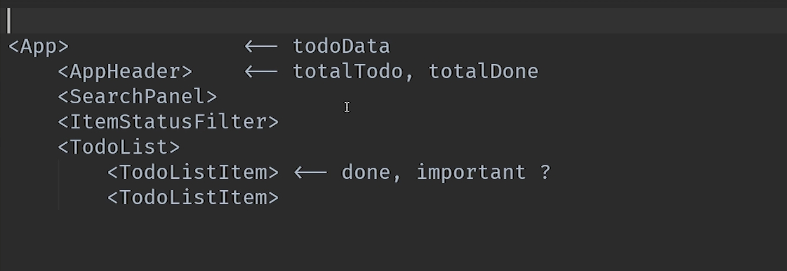
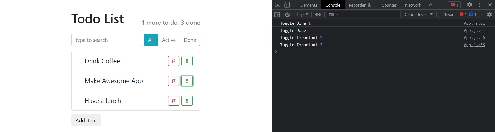

# 009_Данные_в_React_приложении

Реализуем виджет который показывате сколько еще элементов нам предстоит сделать, а сколько уже выполнено.

Давайте посмотрим на план для того что бы понять как именно мы будем решать эту работу.



Меня здесь интересует две вещи.

1. Где в иерархии находятся те компоненты которые мы редактируем 
2. И где находятся данные которые нужны этим компонентам

В первую очередь посмотрим на **AppHeader**. Для того что бы сработать этому компоненту или его **parent** родителю **App**, нужно знать о том какие именно элементы отмечены как **done**. А где у нас находится эта информация? Эта информация находится в **state** **TodoListItem**. Совершенно в другом компоненте. 

И возникает закономерный вопрос. А каким образом мысвяжем эти два компонента **AppHeader** и **TodoListItem**, которые находяться в разных частях иерархии приложения. Для того что бы данные из **TodoListItem**, каким-то образом попали в **AppHeader**?

И ответ тут очень простой. НИКАК!!!!

Мы даже не будем пытаться связывать независимые компоненты. Потому что независимые компоненты это хорошо.

Вместо этого давайте подумаем все ли хорошо с нашей моделью данных?

И здесь возникает набольшая проблема. Все данные храняться у компонента **App**. Все данные, кроме параметров **done** и **important** которые оказались у нас в **TodoListItem**.

В тот момент кода **todoListItem** был полностью независим и никакому другому компоненту эти данные были ненужны, это имело смысл. 

Но теперь, после того как мы написали еще немного кода, мы поняли что данные из **TodoListItem** нужны и другим комопонентам. 

И для того что бы наш **AppHeader** заработал, что бы мы могли реализовать красиво логику этого компонента, параметры done и **important**, нам нужно поднять на уровень **App**, что бы все данные, все свойства наших **item-ов** были в одном месте.

И тогда задача становится тривиальной. Если **App** будет знать состояние **done** каждого элемента, он сможет обновлять наш **AppHeader**, каждый раз когда состояние одного из элементов изменяется.

И так у нас есть план. Нам нужно пробросить наше кастомное событие, каждый раз когда пользователь отмечает один из элементов как done или **important**.

Начнем писать этот код начиная с **App**.

```js
import React, { Component } from "react";
import AppHeader from "../AppHeader/AppHeader";
import SearchPanel from "../SearchPanel/SerchPanel";
import TodoList from "../TodoList/TodoList";
import ItemStatusFilter from "../ItemStatusFilter/ItemStatusFilter";
import ItemAddForm from "../ItemAddForm/ItemAddForm";
import "./App.css";
import { findAllByDisplayValue } from "@testing-library/react";

export default class App extends Component {
  maxId = 100;

  state = {
    todoData: [
      { label: "Drink Coffee", important: false, id: 1 },
      { label: "Make Awesome App", important: true, id: 2 },
      { label: "Have a lunch", important: false, id: 3 },
    ],
  };

  //Функция удаления Item
  deleteItem = (id) => {
    this.setState(({ todoData }) => {
      //сравниваю id в массиве и id полученное из props
      const idx = todoData.findIndex((element) => element.id === id);
      // [a,b,c,d,e]
      // [a,b, ,d,e]
      //копирую первую часть массива
      // копирую часть массива после удаляемого элемента
      const newArray = [...todoData.slice(0, idx), ...todoData.slice(idx + 1)];
      return {
        todoData: newArray,
      };
    });
  };

  //Функция добавления Item
  addItem = (text) => {
    //generate id ?
    const newItem = {
      label: text,
      important: false,
      id: this.maxId++,
    };
    // add element in array
    this.setState(({ todoData }) => {
      const newArr = [...todoData, newItem];
      return {
        todoData: newArr,
      };
    });
  };

  //функция отметки важного дела
  onToggleImportant = (id) => {
    console.log("Toggle Important", id);
  };

  //функция отметки выполненного дела
  onToggleDone = (id) => {
    console.log("Toggle Done", id);
  };

  render() {
    return (
      <div className="todo-app">
        <AppHeader toDo={1} done={3} />
        <div className="top-panel d-flex">
          <SearchPanel />
          <ItemStatusFilter />
        </div>
        <TodoList
          todos={this.state.todoData}
          onDeleted={this.deleteItem}
          onToggleImportant={this.onToggleImportant}
          onToggleDone={this.onToggleDone}
        />
        <ItemAddForm onItemAdded={this.addItem} />
      </div>
    );
  }
}

```

Замечательно!!! Наш новый **TodoList** получил два новых **event**.

Теперь перехожу в **TodoList** и попробуем эти новые **event** использовать. Для начало деструктурирую их из props, И так же передаю их в **props** **TodoListItem** вызывая данные функции и передавая в их параметры **id** элемента.

```js
// src/components/TodoList.js
import React from "react";

import TodoListItem from "../TodoListItem/TodoListItem";
import "../TodoListItem/TodoListItem.css";

const TodoList = ({ todos, onDeleted, onToggleImportant, onToggleDone }) => {
  const elements = todos.map((item) => {
    const { id, ...itemProps } = item;

    return (
      <li key={id} className="list-group-item ">
        <TodoListItem
          {...itemProps}
          onDeleted={() => onDeleted(id)}
          onToggleImportant={() => onToggleImportant(id)}
          onToggleDone={() => onToggleDone(id)}
        />
      </li>
    );
  });

  return <ul className="list-group  todo-list">{elements}</ul>;
};

export default TodoList;

```

Теперь два новых **eventListener** прошли от **App** к **TodoList**. И последнее что мне нужно сделать это вызвать эти **event** в **TodoListItem**.

```js
//src/components/TodoListItem.js
import React, { Component } from "react";
import "./TodoListItem.css";

export default class TodoListItem extends Component {
  constructor() {
    super();
    this.state = {
      done: false,
      important: false,
    };
  }

  // onLabelClick = () => {
  //   return this.setState(({ done }) => {
  //     return {
  //       done: !done,
  //     };
  //   });
  // };
  //
  // onMarkImportant = () => {
  //   return this.setState(({ important }) => {
  //     return {
  //       important: !important,
  //     };
  //   });
  // };

  render() {
    const { label, onDeleted, onToggleDone, onToggleImportant } = this.props;
    const { done, important } = this.state;

    let classNames = "todo-list-item ";
    if (done) {
      classNames += " done";
    }

    if (important) {
      classNames += " important";
    }
    return (
      <span className={classNames}>
        <span className="todo-list-item-label" onClick={onToggleDone}>
          {label}
        </span>

        <button
          type="button"
          className="btn btn-outline-success btn-sm float-right"
          onClick={onToggleImportant}
        >
          <i className="fa fa-exclamation" />
        </button>

        <button
          type="button"
          className="btn btn-outline-danger btn-sm float-right"
          onClick={onDeleted}
        >
          <i className="fa fa-trash-o" />
        </button>
      </span>
    );
  }
}

```



Теперь уберу из компонента все лишнее. Убираю не нужные функции. Так же **done** и **important** еуперь я буду брать из **props**. А **state** теперь вообще не нужен. А раз **state** не нужен могу компонент опять отрефакторить в функциональный.

```js
//src/components/TodoListItem.js
import React from "react";
import "./TodoListItem.css";

const TodoListItem = (props) => {
  const { label, onDeleted, onToggleDone, onToggleImportant, important, done } =
    props;

  let classNames = "todo-list-item ";
  if (done) {
    classNames += " done";
  }

  if (important) {
    classNames += " important";
  }
  return (
    <span className={classNames}>
      <span className="todo-list-item-label" onClick={onToggleDone}>
        {label}
      </span>

      <button
        type="button"
        className="btn btn-outline-success btn-sm float-right"
        onClick={onToggleImportant}
      >
        <i className="fa fa-exclamation" />
      </button>

      <button
        type="button"
        className="btn btn-outline-danger btn-sm float-right"
        onClick={onDeleted}
      >
        <i className="fa fa-trash-o" />
      </button>
    </span>
  );
};

export default TodoListItem;

```

> Данные в React приложении
> 
> Центролизовать управление данными хорошая практика
> 
> Если данные нужно использовать в нескольких компонентах - их нужно хранить в родительском компоненте
> 
> Что бы поднять данные вверх по иерархии компонентов, используйте события.