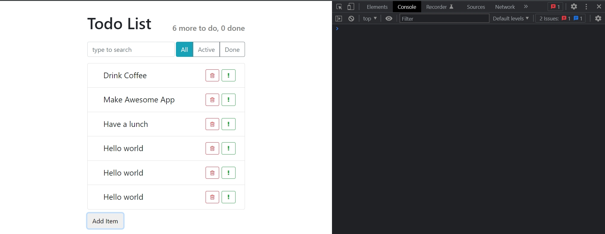

# 010_setState_редактирование_элементов

И так мы начали исправлять нашу ситуацию с данными и мы передали в App два события onToggleDone и onToggleImportant. Которые в свою очередь компонент App может использовать для того что бы обновить свой state а именно TodoData. 

State а именно TodoData передается из App в качестве props в todoList, а TodoList в качестве props передает конкретные элементы этого TodoData  каждому индивидуальному item-у. И именно таким способом TodoItem будет получать информацию о том что он стал важным или он стал выполненным.

Владельцем данных будет компонент App. 

В этом видео посмотрим как собственно сделать так что бы App обновлял свой state когда ему приходит информация о том что один из элементов стал done или important.


И так обновим App. В первую очередь у каждого свойства элемента списка появится свойство done.

Я заметил что у нас есть несколько мест где мы создаем элементы todo списка. Вот эти места, где мы инициализируем первые элементы.


И вот это место, там где мы добавляем новый элемент списка.


Сократим количество кода которое у нас дублируется. Создам функцию которая умеет создавать новый элемент для нашего todo списка. 

Функцию называю createTodoItem. Этой фунции ножно знать только текст, но я передам параметр как label. И возвращать данная функция будет все тоже самое, когда мы добавляли новый item к нашему массиву.

Кроме полей из функции addItem добавляю поле done:false.


Прекрасно!!! Теперь везде где я создаю новые элементы я могу использовать эту функцию. 

Удаляю все объекты из state.todoData и добавляю эту функцию.

```js
import React, { Component } from "react";
import AppHeader from "../AppHeader/AppHeader";
import SearchPanel from "../SearchPanel/SerchPanel";
import TodoList from "../TodoList/TodoList";
import ItemStatusFilter from "../ItemStatusFilter/ItemStatusFilter";
import ItemAddForm from "../ItemAddForm/ItemAddForm";
import "./App.css";

export default class App extends Component {
  maxId = 100;

  state = {
    todoData: [
      this.createTodoItem("Drink Coffee"),
      this.createTodoItem("Make Awesome App"),
      this.createTodoItem("Have a lunch"),
    ],
  };

  //Функция удаления Item
  deleteItem = (id) => {
    this.setState(({ todoData }) => {
      //сравниваю id в массиве и id полученное из props
      const idx = todoData.findIndex((element) => element.id === id);
      // [a,b,c,d,e]
      // [a,b, ,d,e]
      //копирую первую часть массива
      // копирую часть массива после удаляемого элемента
      const newArray = [...todoData.slice(0, idx), ...todoData.slice(idx + 1)];
      return {
        todoData: newArray,
      };
    });
  };

  //Функция создания item
  createTodoItem  (label)  {
    return {
      label: label,
      important: false,
      done: false,
      id: this.maxId++,
    };
  };

  //Функция добавления Item
  addItem = (text) => {
    //generate id ?
    const newItem = {
      label: text,
      important: false,
      id: this.maxId++,
    };
    // add element in array
    this.setState(({ todoData }) => {
      const newArr = [...todoData, newItem];
      return {
        todoData: newArr,
      };
    });
  };

  //функция отметки важного дела
  onToggleImportant = (id) => {
    console.log("Toggle Important", id);
  };

  //функция отметки выполненного дела
  onToggleDone = (id) => {
    console.log("Toggle Done", id);
  };

  render() {
    return (
      <div className="todo-app">
        <AppHeader toDo={1} done={3} />
        <div className="top-panel d-flex">
          <SearchPanel />
          <ItemStatusFilter />
        </div>
        <TodoList
          todos={this.state.todoData}
          onDeleted={this.deleteItem}
          onToggleImportant={this.onToggleImportant}
          onToggleDone={this.onToggleDone}
        />
        <ItemAddForm onItemAdded={this.addItem} />
      </div>
    );
  }
}

```

И второе место где мы хотели убрать дубликацию кода это функция addItem. В newItem это теперь будет не объект а вызов функции createTodoItem(text) с передачей нужного текста.

```js
import React, { Component } from "react";
import AppHeader from "../AppHeader/AppHeader";
import SearchPanel from "../SearchPanel/SerchPanel";
import TodoList from "../TodoList/TodoList";
import ItemStatusFilter from "../ItemStatusFilter/ItemStatusFilter";
import ItemAddForm from "../ItemAddForm/ItemAddForm";
import "./App.css";

export default class App extends Component {
  maxId = 100;

  state = {
    todoData: [
      this.createTodoItem("Drink Coffee"),
      this.createTodoItem("Make Awesome App"),
      this.createTodoItem("Have a lunch"),
    ],
  };

  //Функция удаления Item
  deleteItem = (id) => {
    this.setState(({ todoData }) => {
      //сравниваю id в массиве и id полученное из props
      const idx = todoData.findIndex((element) => element.id === id);
      // [a,b,c,d,e]
      // [a,b, ,d,e]
      //копирую первую часть массива
      // копирую часть массива после удаляемого элемента
      const newArray = [...todoData.slice(0, idx), ...todoData.slice(idx + 1)];
      return {
        todoData: newArray,
      };
    });
  };

  //Функция создания item
  createTodoItem(label) {
    return {
      label: label,
      important: false,
      done: false,
      id: this.maxId++,
    };
  }

  //Функция добавления Item
  addItem = (text) => {
    //generate id ?
    const newItem = this.createTodoItem(text);
    // add element in array
    this.setState(({ todoData }) => {
      const newArr = [...todoData, newItem];
      return {
        todoData: newArr,
      };
    });
  };

  //функция отметки важного дела
  onToggleImportant = (id) => {
    console.log("Toggle Important", id);
  };

  //функция отметки выполненного дела
  onToggleDone = (id) => {
    console.log("Toggle Done", id);
  };

  render() {
    return (
      <div className="todo-app">
        <AppHeader toDo={1} done={3} />
        <div className="top-panel d-flex">
          <SearchPanel />
          <ItemStatusFilter />
        </div>
        <TodoList
          todos={this.state.todoData}
          onDeleted={this.deleteItem}
          onToggleImportant={this.onToggleImportant}
          onToggleDone={this.onToggleDone}
        />
        <ItemAddForm onItemAdded={this.addItem} />
      </div>
    );
  }
}

```


Прекрасно. Остался один вопрос. Как нам реализовать onToggleImportant и onToggleDone.

И так наше золотое правило! мы не можем изменять старый state, по этому использую setState. setState принимает старый state  именно деструктурирую todoData. 

Тело функции разбиваю на две задачи.

1. нам нужно обновить объект который содержится в нужном месте в массиве.
2. Нам нужно сконструировать новый массив, поскольку мы не можем изменять существующий массив. А изменение объекта, который находится внутри существующего массива, тоже считается изменением текущего state.


```js
import React, { Component } from "react";
import AppHeader from "../AppHeader/AppHeader";
import SearchPanel from "../SearchPanel/SerchPanel";
import TodoList from "../TodoList/TodoList";
import ItemStatusFilter from "../ItemStatusFilter/ItemStatusFilter";
import ItemAddForm from "../ItemAddForm/ItemAddForm";
import "./App.css";

export default class App extends Component {
    maxId = 100;

    state = {
        todoData: [
            this.createTodoItem("Drink Coffee"),
            this.createTodoItem("Make Awesome App"),
            this.createTodoItem("Have a lunch"),
        ],
    };

    //Функция удаления Item
    deleteItem = (id) => {
        this.setState(({ todoData }) => {
            //сравниваю id в массиве и id полученное из props
            const idx = todoData.findIndex((element) => element.id === id);
            // [a,b,c,d,e]
            // [a,b, ,d,e]
            //копирую первую часть массива
            // копирую часть массива после удаляемого элемента
            const newArray = [...todoData.slice(0, idx), ...todoData.slice(idx + 1)];
            return {
                todoData: newArray,
            };
        });
    };

    //Функция создания item
    createTodoItem(label) {
        return {
            label: label,
            important: false,
            done: false,
            id: this.maxId++,
        };
    }

    //Функция добавления Item
    addItem = (text) => {
        //generate id ?
        const newItem = this.createTodoItem(text);
        // add element in array
        this.setState(({ todoData }) => {
            const newArr = [...todoData, newItem];
            return {
                todoData: newArr,
            };
        });
    };

    //функция отметки важного дела
    onToggleImportant = (id) => {
        console.log("Toggle Important", id);
    };

    //функция отметки выполненного дела
    onToggleDone = (id) => {
        this.setState(({ todoData }) => {
            //сравниваю id в массиве и id полученное из props
            const idx = todoData.findIndex((element) => element.id === id);
            // 1. update object
            //заношу старый item в отдельную переменную
            const oldItem = todoData[idx];

            //2. construct new array
        });
    };

    render() {
        return (
            <div className="todo-app">
                <AppHeader toDo={1} done={3} />
                <div className="top-panel d-flex">
                    <SearchPanel />
                    <ItemStatusFilter />
                </div>
                <TodoList
                    todos={this.state.todoData}
                    onDeleted={this.deleteItem}
                    onToggleImportant={this.onToggleImportant}
                    onToggleDone={this.onToggleDone}
                />
                <ItemAddForm onItemAdded={this.addItem} />
            </div>
        );
    }
}


```

Как нам поступить?

Первым делом мы получаем idx элемента. И после по индексу элемента заношу наш item в переменную


После чего создаю новый объект, со всеми свойствами старого объекта. Для этого использую Object Spreed оператор.


Теперь мы создали объект у которого все теже свойства что и у старого объекта. Но если вторым параметром, после деструктурированного объекта, я добавлю еще одно свойство, то это свойство перезапишет соответствующее свойство которое мы скопировали в ...oldItem. И это свойство done: !oldItem.done


```js
import React, { Component } from "react";
import AppHeader from "../AppHeader/AppHeader";
import SearchPanel from "../SearchPanel/SerchPanel";
import TodoList from "../TodoList/TodoList";
import ItemStatusFilter from "../ItemStatusFilter/ItemStatusFilter";
import ItemAddForm from "../ItemAddForm/ItemAddForm";
import "./App.css";

export default class App extends Component {
  maxId = 100;

  state = {
    todoData: [
      this.createTodoItem("Drink Coffee"),
      this.createTodoItem("Make Awesome App"),
      this.createTodoItem("Have a lunch"),
    ],
  };

  //Функция удаления Item
  deleteItem = (id) => {
    this.setState(({ todoData }) => {
      //сравниваю id в массиве и id полученное из props
      const idx = todoData.findIndex((element) => element.id === id);
      // [a,b,c,d,e]
      // [a,b, ,d,e]
      //копирую первую часть массива
      // копирую часть массива после удаляемого элемента
      const newArray = [...todoData.slice(0, idx), ...todoData.slice(idx + 1)];
      return {
        todoData: newArray,
      };
    });
  };

  //Функция создания item
  createTodoItem(label) {
    return {
      label: label,
      important: false,
      done: false,
      id: this.maxId++,
    };
  }

  //Функция добавления Item
  addItem = (text) => {
    //generate id ?
    const newItem = this.createTodoItem(text);
    // add element in array
    this.setState(({ todoData }) => {
      const newArr = [...todoData, newItem];
      return {
        todoData: newArr,
      };
    });
  };

  //функция отметки важного дела
  onToggleImportant = (id) => {
    console.log("Toggle Important", id);
  };

  //функция отметки выполненного дела
  onToggleDone = (id) => {
    this.setState(({ todoData }) => {
      //сравниваю id в массиве и id полученное из props
      const idx = todoData.findIndex((element) => element.id === id);
      // 1. update object
      //заношу старый item в отдельную переменную
      const oldItem = todoData[idx];
        //копирую старый объект в новый и меняю лишь одно значение done
      const newItem = { ...oldItem, done: !oldItem.done };

      //2. construct new array
    });
  };

  render() {
    return (
      <div className="todo-app">
        <AppHeader toDo={1} done={3} />
        <div className="top-panel d-flex">
          <SearchPanel />
          <ItemStatusFilter />
        </div>
        <TodoList
          todos={this.state.todoData}
          onDeleted={this.deleteItem}
          onToggleImportant={this.onToggleImportant}
          onToggleDone={this.onToggleDone}
        />
        <ItemAddForm onItemAdded={this.addItem} />
      </div>
    );
  }
}

```

И так теперь у меня есть новый элемент newItem. Который точно такой же как старый элемент oldItem, кроме значения done. Старый элемент oldItem при этом мы не изменяли. Мы просто взяли из него ключи и значения и скопировали в новый объект ...oldItem c помощью Object Spreed оператора.

Первая задача решена. Мы создали новый объект с обновленным свойством. 


Вторая задача это сконструировать новый массив. Давайте посмотрим как мы реализовали удаление 


Новый массив - это старый массив до нужного индекса, а потом старый массив с нужного индекса и до конца, пропуская нужный index. А что если мы с вами возьмем этот же код, который был с удалением нашего массива, и между старым индексом и новым индексом, на место удаленного элемента поставим наш новый item.  


Получается что мы создаем новый массив со всеми значениями которые были в старом массиве, до того элемента который мы хотим обновить. Затем мы вставляем новый элемент. Который точно такой же как старый, только с противоположным значением done. И затем мы вставляем все остальные жлементы из todoData которые идут после обновленного элемента.


```js
import React, { Component } from "react";
import AppHeader from "../AppHeader/AppHeader";
import SearchPanel from "../SearchPanel/SerchPanel";
import TodoList from "../TodoList/TodoList";
import ItemStatusFilter from "../ItemStatusFilter/ItemStatusFilter";
import ItemAddForm from "../ItemAddForm/ItemAddForm";
import "./App.css";

export default class App extends Component {
    maxId = 100;

    state = {
        todoData: [
            this.createTodoItem("Drink Coffee"),
            this.createTodoItem("Make Awesome App"),
            this.createTodoItem("Have a lunch"),
        ],
    };

    //Функция удаления Item
    deleteItem = (id) => {
        this.setState(({ todoData }) => {
            //сравниваю id в массиве и id полученное из props
            const idx = todoData.findIndex((element) => element.id === id);
            // [a,b,c,d,e]
            // [a,b, ,d,e]
            //копирую первую часть массива
            // копирую часть массива после удаляемого элемента
            const newArray = [...todoData.slice(0, idx), ...todoData.slice(idx + 1)];
            return {
                todoData: newArray,
            };
        });
    };

    //Функция создания item
    createTodoItem(label) {
        return {
            label: label,
            important: false,
            done: false,
            id: this.maxId++,
        };
    }

    //Функция добавления Item
    addItem = (text) => {
        //generate id ?
        const newItem = this.createTodoItem(text);
        // add element in array
        this.setState(({ todoData }) => {
            const newArr = [...todoData, newItem];
            return {
                todoData: newArr,
            };
        });
    };

    //функция отметки важного дела
    onToggleImportant = (id) => {
        console.log("Toggle Important", id);
    };

    //функция отметки выполненного дела
    onToggleDone = (id) => {
        this.setState(({ todoData }) => {
            //сравниваю id в массиве и id полученное из props
            const idx = todoData.findIndex((element) => element.id === id);
            // 1. update object
            //заношу старый item в отдельную переменную
            const oldItem = todoData[idx];
            //копирую старый объект в новый и меняю лишь одно значение done
            const newItem = { ...oldItem, done: !oldItem.done };

            //2. construct new array
            const newArray = [
                ...todoData.slice(0, idx),
                newItem,
                ...todoData.slice(idx + 1),
            ];
            return {
                todoData: newArray,
            };
        });
    };

    render() {
        return (
            <div className="todo-app">
                <AppHeader toDo={1} done={3} />
                <div className="top-panel d-flex">
                    <SearchPanel />
                    <ItemStatusFilter />
                </div>
                <TodoList
                    todos={this.state.todoData}
                    onDeleted={this.deleteItem}
                    onToggleImportant={this.onToggleImportant}
                    onToggleDone={this.onToggleDone}
                />
                <ItemAddForm onItemAdded={this.addItem} />
            </div>
        );
    }
}

```


Это один из самых сложных моментов React. Когда дело косается обновления состояния. Нам нужно обновить объект который является частью массива. Нам нужно скомбинировать как бы две техники. Нам нужно скомбинировать как бы ту часть которая удаляет элемент из массива. И вместо удаленного элемента, поставить новый объект, точно такой же как старый, но с одним свойством, которое изменило свое значение.


Теперь если мы посмотрим на структуру нашего приложения то TodoListItem больше не отвечает ни за какие данные. Все данные принадлежать компоненту App


И это очень классно!!! Поскольку мы точно знаем, что то значение, которое находится в state App - это окончательное и правильное значение. Больше нет ни одного места в приложении которое может содержать какое-то другое значение наших параметров. 

И теперь у App есть вся необходимая информация для того что бы посчитать, а сколько именно item у нас в состоянии done.


Теперь сделаем так, что бы тег AppHeader получал не числа которые я ввел, а реальные значения из массива.


Для этого создаю переменную в которую заношу результат фильтра. Отфильтрую todoDate из состояния с помощью метода filter. Мы найдем все элементы todoData которые удовлетворяют условию. Заметьте что filter создает новый массив. По этому мы не изменяем массив в состоянии. 

И после метода filter() я использую еще один метод length для того что бы получить длинну массива.


```js
import React, { Component } from "react";
import AppHeader from "../AppHeader/AppHeader";
import SearchPanel from "../SearchPanel/SerchPanel";
import TodoList from "../TodoList/TodoList";
import ItemStatusFilter from "../ItemStatusFilter/ItemStatusFilter";
import ItemAddForm from "../ItemAddForm/ItemAddForm";
import "./App.css";

export default class App extends Component {
  maxId = 100;

  state = {
    todoData: [
      this.createTodoItem("Drink Coffee"),
      this.createTodoItem("Make Awesome App"),
      this.createTodoItem("Have a lunch"),
    ],
  };

  //Функция удаления Item
  deleteItem = (id) => {
    this.setState(({ todoData }) => {
      //сравниваю id в массиве и id полученное из props
      const idx = todoData.findIndex((element) => element.id === id);
      // [a,b,c,d,e]
      // [a,b, ,d,e]
      //копирую первую часть массива
      // копирую часть массива после удаляемого элемента
      const newArray = [...todoData.slice(0, idx), ...todoData.slice(idx + 1)];
      return {
        todoData: newArray,
      };
    });
  };

  //Функция создания item
  createTodoItem(label) {
    return {
      label: label,
      important: false,
      done: false,
      id: this.maxId++,
    };
  }

  //Функция добавления Item
  addItem = (text) => {
    //generate id ?
    const newItem = this.createTodoItem(text);
    // add element in array
    this.setState(({ todoData }) => {
      const newArr = [...todoData, newItem];
      return {
        todoData: newArr,
      };
    });
  };

  //функция отметки важного дела
  onToggleImportant = (id) => {
    console.log("Toggle Important", id);
  };

  //функция отметки выполненного дела
  onToggleDone = (id) => {
    this.setState(({ todoData }) => {
      //сравниваю id в массиве и id полученное из props
      const idx = todoData.findIndex((element) => element.id === id);
      // 1. update object
      //заношу старый item в отдельную переменную
      const oldItem = todoData[idx];
      //копирую старый объект в новый и меняю лишь одно значение done
      const newItem = { ...oldItem, done: !oldItem.done };

      //2. construct new array
      const newArray = [
        ...todoData.slice(0, idx),
        newItem,
        ...todoData.slice(idx + 1),
      ];
      return {
        todoData: newArray,
      };
    });
  };

  render() {
    //Поиск отмеченных item
    const doneCount = this.state.todoData.filter((element) => {
      return element.done === true;
    }).length;

    return (
      <div className="todo-app">
        <AppHeader toDo={1} done={doneCount} />
        <div className="top-panel d-flex">
          <SearchPanel />
          <ItemStatusFilter />
        </div>
        <TodoList
          todos={this.state.todoData}
          onDeleted={this.deleteItem}
          onToggleImportant={this.onToggleImportant}
          onToggleDone={this.onToggleDone}
        />
        <ItemAddForm onItemAdded={this.addItem} />
      </div>
    );
  }
}

```


Ну и соответственно осталось посчитать количество элементов которые еще осталось сделать. Длинна всего массива из state минус количество выполненных элементов.




И прежде чем закончить почижу код. 

И теперь нужно реализовать похожий код для onToggleImportant. И то чего я не хочу делать это брать код из onToggleDone, копировать его как есть в onToggleImportant  и заменять там один единственный параметр.


По этому я предлагаю сделать отделтную функцию toggleProperty. Эта функция будет принимать на вход массив arr с которым мы будем работать. Вторым парамеетром id элемента который мы будем изменять и propName которую нам нужно изменить c true на false. И затем мы будем переиспользовать данную функцию в onToggleDone и onToggleImportant.


Теперь эту функцию мы можем вызвать из setState когда нам нужно будет изменить свойства.

В функциях onToggleImportant и onToggleDone в возвращаемом объекте TodoData присваиваю результат вызова функции toggleProperty.

```js
import React, { Component } from "react";
import AppHeader from "../AppHeader/AppHeader";
import SearchPanel from "../SearchPanel/SerchPanel";
import TodoList from "../TodoList/TodoList";
import ItemStatusFilter from "../ItemStatusFilter/ItemStatusFilter";
import ItemAddForm from "../ItemAddForm/ItemAddForm";
import "./App.css";

export default class App extends Component {
  maxId = 100;

  state = {
    todoData: [
      this.createTodoItem("Drink Coffee"),
      this.createTodoItem("Make Awesome App"),
      this.createTodoItem("Have a lunch"),
    ],
  };

  //Функция удаления Item
  deleteItem = (id) => {
    this.setState(({ todoData }) => {
      //сравниваю id в массиве и id полученное из props
      const idx = todoData.findIndex((element) => element.id === id);
      // [a,b,c,d,e]
      // [a,b, ,d,e]
      //копирую первую часть массива
      // копирую часть массива после удаляемого элемента
      const newArray = [...todoData.slice(0, idx), ...todoData.slice(idx + 1)];
      return {
        todoData: newArray,
      };
    });
  };

  //Функция создания item
  createTodoItem(label) {
    return {
      label: label,
      important: false,
      done: false,
      id: this.maxId++,
    };
  }

  //Функция добавления Item
  addItem = (text) => {
    //generate id ?
    const newItem = this.createTodoItem(text);
    // add element in array
    this.setState(({ todoData }) => {
      const newArr = [...todoData, newItem];
      return {
        todoData: newArr,
      };
    });
  };

  //выношу дублируемый код из onToggleImportant и onToggleDone
  toggleProperty(arr, id, propName) {
    //сравниваю id в массиве и id полученное из props
    const idx = arr.findIndex((element) => element.id === id);
    // 1. update object
    //заношу старый item в отдельную переменную
    const oldItem = arr[idx];
    //копирую старый объект в новый и меняю лишь одно значение done
    const newItem = { ...oldItem, [propName]: !oldItem[propName] };

    //2. construct new array
    return [...arr.slice(0, idx), newItem, ...arr.slice(idx + 1)];
  }

  //функция отметки важного дела
  onToggleImportant = (id) => {
    this.setState(({ todoData }) => {
      return {
        todoData: this.toggleProperty(todoData, id, "important"),
      };
    });
  };

  //функция отметки выполненного дела
  onToggleDone = (id) => {
    this.setState(({ todoData }) => {
      return {
        todoData: this.toggleProperty(todoData, id, "done"),
      };
    });
  };

  render() {
    const { todoData } = this.state;
    //Поиск отмеченных item
    const doneCount = todoData.filter((element) => {
      return element.done === true;
    }).length;

    //Поиск оставшихся не отмеченных item
    const todoCount = todoData.length - doneCount;

    return (
      <div className="todo-app">
        <AppHeader toDo={todoCount} done={doneCount} />
        <div className="top-panel d-flex">
          <SearchPanel />
          <ItemStatusFilter />
        </div>
        <TodoList
          todos={todoData}
          onDeleted={this.deleteItem}
          onToggleImportant={this.onToggleImportant}
          onToggleDone={this.onToggleDone}
        />
        <ItemAddForm onItemAdded={this.addItem} />
      </div>
    );
  }
}

```


Мы с вами разобрали как обновить элемент внутри массива, когда нам нужно сменить свойства объекта. И это самый сложный case обновления state.

Т.е. Если у вас в state есть массив, и внутри этого массива находяться объекты, и вам нужно сменить свойства одного объекта, нужно быть очень осторожным что бы не изменить ни один элемент старого state. 

Мы разобрали самый сложный кусочек материала во всем курсе

> setState() - изменить элемент
> 
> oldObj нельзя изменять
> oldObj = oldArr[idx]
> 
> ...но можно скопировать в новый объект
> newObj = {...oldObj, prop:newValue}
> 
> newArr = [...oldArr.slice( 0, idx), newObj, oldArr.slice(idx + 1)]


