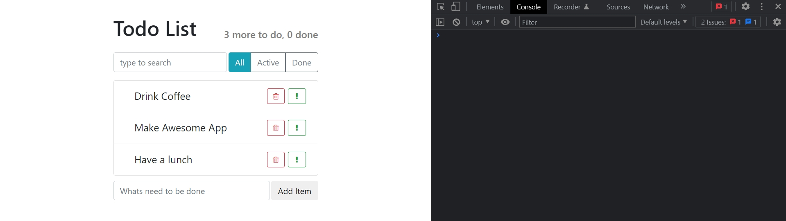
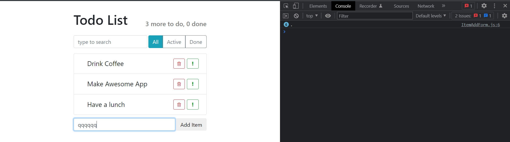
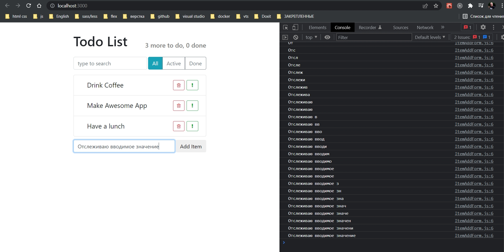
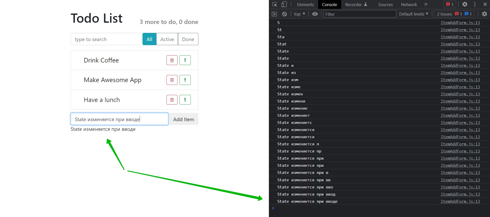
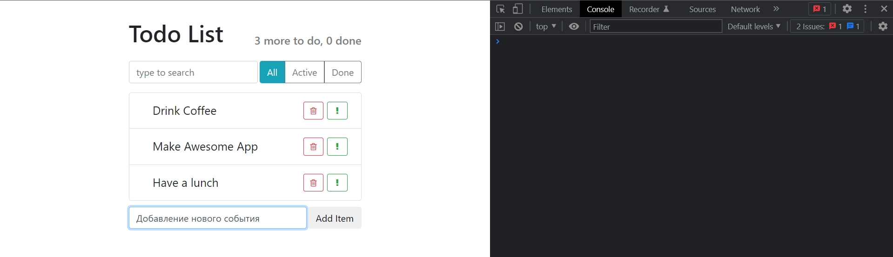
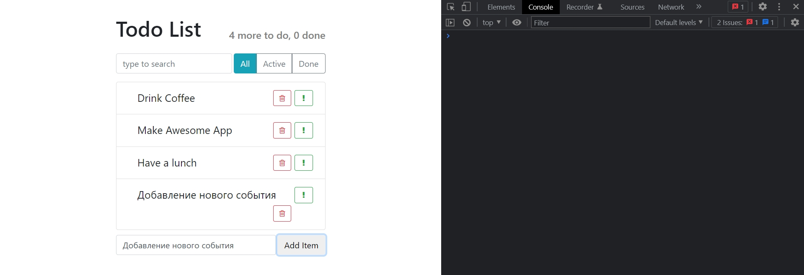

# 011_Работа_с_формами

Пришло время добавить форму для добавления нового item.

Редактирую ItemAddForm. В форме буду использовать eventListener onChange.

```js
import React, { Component } from "react";
import "./ItemAddForm.css";

export default class ItemAddForm extends Component {
  render() {
    const { onItemAdded } = this.props;

    return (
      <form className="item-add-form d-flex">
        <input
          type="text"
          className="form-control"
          onChange={this.onLabelChange}
          placeholder="Whats need to be done"
        />
        <button
          className="btn btn-online-secondary"
          onClick={() => onItemAdded("Hello world")}
        >
          Add Item
        </button>
      </form>
    );
  }
}

```

```css
.item-add-form{
    margin-top: 10px;
}

.item-add-form input{
    margin-right: 3px;
}
```



Оставшийся вопрос. Как сделать так что бы когда мы вводили эти самые значения, наш React компонент узнавал, какое самое свежее значение в этой форме. И именно для этого мы добавили eventListener onChange. Давайте теперь добавим функцию onLabelChange. Эта функция будет вызываться каждый раз когда наш input изменяется. К примеру как пользователь напечатал несколько символов.




Теперь. Как достать значение которое есть в input?

Очень просто. Каждый eventListener т.е. каждая функция которая используется как eventListener на вход принимает специальный объект, который называется event. Этот объект содержит в себе информацию о том какое имеенно событие наступило, и детали этого самого события.

К примеру для события onMouseMove - этот event будет содержать информацию о том какие координаты мыши.

А для события onChange, из объекта event мы легко сможем вытащить, для начало через свойство target, тот самый input который изменяется, а затем через свойство value мы можем получить его текущее значение.

```js
import React, { Component } from "react";
import "./ItemAddForm.css";

export default class ItemAddForm extends Component {
  onLabelChange = (event) => {
    console.log(event.target.value);
  };

  render() {
    const { onItemAdded } = this.props;

    return (
      <form className="item-add-form d-flex">
        <input
          type="text"
          className="form-control"
          onChange={this.onLabelChange}
          placeholder="Whats need to be done"
        />
        <button
          className="btn btn-online-secondary"
          onClick={() => onItemAdded("Hello world")}
        >
          Add Item
        </button>
      </form>
    );
  }
}

```



Как видите для каждой буквы которой я ввожу вызывается onLabelChange и выражение event.target.value содержит в себе текущее значение поля ввода.


Теперь сохраним это значение в state. Делаю label пустой строкой по умолчанию.

В onLabelChange вызываю setState, и поскольку наш state не зависит от предыдущего state, мы можем просто передать туда объект, а не функцию.


```js
import React, { Component } from "react";
import "./ItemAddForm.css";

export default class ItemAddForm extends Component {
  state = {
    label: "",
  };

  onLabelChange = (event) => {
    this.setState({
      label: event.target.value,
    });
  };

  render() {
    const { onItemAdded } = this.props;

    return (
      <form className="item-add-form d-flex">
        <input
          type="text"
          className="form-control"
          onChange={this.onLabelChange}
          placeholder="Whats need to be done"
        />
        <button
          className="btn btn-online-secondary"
          onClick={() => onItemAdded("Hello world")}
        >
          Add Item
        </button>
      </form>
    );
  }
}

```

Теперь наш state обновляется.

Теперь мы можем делать интересные трюки. Теперь мы можем вывести значение этого label прямо на форме и показывать его в тот же момент когда мы печатаем.

Но я выведу под формой.

```js
import React, { Component } from "react";
import "./ItemAddForm.css";

export default class ItemAddForm extends Component {
  state = {
    label: "",
  };

  onLabelChange = (event) => {
    this.setState({
      label: event.target.value,
    });
    console.log(event.target.value);
  };

  render() {
    const { onItemAdded } = this.props;

    return (
      <>
        <form className="item-add-form d-flex">
          <input
            type="text"
            className="form-control"
            onChange={this.onLabelChange}
            placeholder="Whats need to be done"
          />
          <button
            className="btn btn-online-secondary"
            onClick={() => onItemAdded("Hello world")}
          >
            Add Item
          </button>
        </form>
        <p>{this.state.label}</p>
      </>
    );
  }
}

```




## Submit form

Теперь мне нужно передать значение стейта label в тот момент когда пользователь submit-ит эту форму. Т.е. либо он нажимает на кнопку Add Item, либо нажимает Enter в форме.

Для того что бы правильно обработать отправку формы, нам нужет event onSubmit. 

Как вы знаете форму можно отправить несколькими способами. Можно мышкой кликнуть на кнопку. Можно нажать Enter пока вы находитесь в поле ввода.

Многие начинающие разработчики совершают эту ошибку. Они добавляют событие onClick на саму кнопку.

Мы так сделали в тот момент когда у нас небыло формы.

Обрабатывать результаты формы нужно в событии onSubmit. Передаю туда функцию. Функцию я назову submit. Функция submit так же принимает объект event.

В событие onClick на кнопке, мы передавали props из App onItemAdded в котором содержится функция addItem.

Переношу вызов функции onItemAdded в submit. И в вызов onItemAdded передаю объект с измененным полем label.

```js
import React, { Component } from "react";
import "./ItemAddForm.css";

export default class ItemAddForm extends Component {
  state = {
    label: "",
  };

  //Обработка события ввода input, меняю state
  onLabelChange = (event) => {
    this.setState({
      label: event.target.value,
    });
  };

  //Обработка отправки формы
  submit = () => {
    this.props.onItemAdded(this.state.label);
  };

  render() {
    return (
      <>
        <form className="item-add-form d-flex" onSubmit={this.submit}>
          <input
            type="text"
            className="form-control"
            onChange={this.onLabelChange}
            placeholder="Whats need to be done"
          />
          <button className="btn btn-online-secondary">Add Item</button>
        </form>
      </>
    );
  }
}

```

Теперь пользователь может добавить свой собственный Item, но он на секунду появляется и исчезает.

Все дело в том что страница перезагружается.

Дело в том что изначально формы в браузерах был созданы что бы отправить данные на сервер и перерисовать новую страницу. Т.е. фактически отправка формы отправляет наш браузер на другую страницу. И это совершенно не то чего мы хотим в Single Page Application.  

Для того что бы отменить перезагрузку страницы мы можем использовать объект event который содержится в нашем eventListener onSubmit.

У объекта event есть специальный метод который называется preventDefault. Этот метод как бы говорит браузеру. Когда этот event будет обрабатываться, действие по умолчанию выполнять не нужно.

Для формы default это именно отправка данных на сервер и перезагрузка страницы.

```js
import React, { Component } from "react";
import "./ItemAddForm.css";

export default class ItemAddForm extends Component {
  state = {
    label: "",
  };

  //Обработка события ввода input, меняю state
  onLabelChange = (event) => {
    this.setState({
      label: event.target.value,
    });
  };

  //Обработка отправки формы
  submit = (event) => {
    event.preventDefault(); // отмена перезагрузки страницы
    this.props.onItemAdded(this.state.label);
  };

  render() {
    return (
      <>
        <form className="item-add-form d-flex" onSubmit={this.submit}>
          <input
            type="text"
            className="form-control"
            onChange={this.onLabelChange}
            placeholder="Whats need to be done"
          />
          <button className="btn btn-online-secondary">Add Item</button>
        </form>
      </>
    );
  }
}

```





В краце. Для того что бы получать текущее значение input мы используем значение onChange. И каждый раз когда это самое значение input меняется, мы вызываем нашу собственную функцию, onLabelChange, и использую объект event мы достаем из него текущее значение поля event.target.value.


Затем на форму нам нужно добавить event onSubmit для того что бы отловить тот момент когда пользователь submit-ит отправляет форму. 

Для того что бы отменить перезагрузку страницы мы говорим event.preventDefault().

> Работа с формами
> 
> Используем onChange() что бы получить текущее значение
> 
> onsubmit() событие отправки формы
> 
> event.preventDefault() - что бы страница не перезагружалась.


