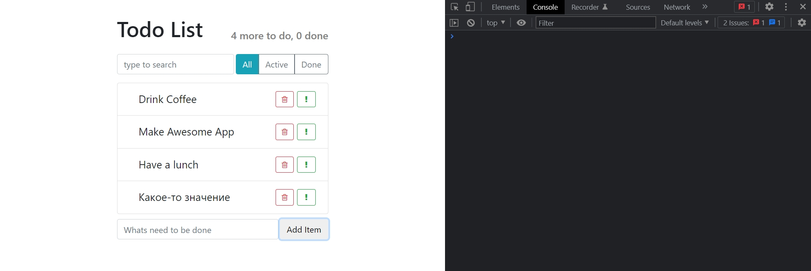

# 012_конторолируемые_компоненты

Давайте еще немного улучшим нашу форму добавления записи. И сделаем так что бы поле очищалось после того как польователь создаст новый элемент.

В нашем код связь между html элементом, а именно input и компонентом, она односторонняя.

Что я имею ввиду? 

html элемент передает нашему компоненту event который вызывается тогда когда элемент input изменяется.

После этого мы в onLabelChange устанавливаем значение в state, но в действительности в этой модели источник истины это именно input. 

В нашем компоненте сейчас как бы два состояния. 

1. Состояние это собственно в state
2. Второе состояние это именно то что сейчас записано в html на странице в value этого компонента.

Т.е. если кто-нибудь изменит state нашего компонента, то элемент об этом ни как не узнает.

Сейчас у нас нет внутренней связи которая бы вела от нашего внутреннего state компонента к элементу на странице. Такой html элемент называется НЕ КОНТРОЛИРУЕМЫМ!!! Потому что мы его не котролируем.

Мы можем исправить эту ситуацию и сделать элемент контролируемым. Достаточно сказать что элемент input будет получать свое значение value из state.

```js
import React, { Component } from "react";
import "./ItemAddForm.css";

export default class ItemAddForm extends Component {
  state = {
    label: "",
  };

  //Обработка события ввода input, меняю state
  onLabelChange = (event) => {
    this.setState({
      label: event.target.value,
    });
  };

  //Обработка отправки формы
  submit = (event) => {
    event.preventDefault(); // отмена перезагрузки страницы
    this.props.onItemAdded(this.state.label);
  };

  render() {
    return (
      <>
        <form className="item-add-form d-flex" onSubmit={this.submit}>
          <input
            type="text"
            className="form-control"
            onChange={this.onLabelChange}
            placeholder="Whats need to be done"
            value={this.state.label} // делаю компонент контролируемым
          />
          <button className="btn btn-online-secondary">Add Item</button>
        </form>
      </>
    );
  }
}

```

Теперь если мы немного модифицируем код onSubmit. И после того как мы вызвали onItemAdded. Мы вызовем еще и setState()  в которую передаю новый объект состояния, а точнее новое поле объекта состояния, то которое я хочу изменить. А имеено label делаю пустой строкой.

```js
import React, { Component } from "react";
import "./ItemAddForm.css";

export default class ItemAddForm extends Component {
  state = {
    label: "",
  };

  //Обработка события ввода input, меняю state
  onLabelChange = (event) => {
    this.setState({
      label: event.target.value,
    });
  };

  //Обработка отправки формы
  submit = (event) => {
    event.preventDefault(); // отмена перезагрузки страницы
    this.props.onItemAdded(this.state.label);
    this.setState({
      label: "",
    });
  };

  render() {
    return (
      <>
        <form className="item-add-form d-flex" onSubmit={this.submit}>
          <input
            type="text"
            className="form-control"
            onChange={this.onLabelChange}
            placeholder="Whats need to be done"
            value={this.state.label} // делаю компонент контролируемым
          />
          <button className="btn btn-online-secondary">Add Item</button>
        </form>
      </>
    );
  }
}

```




 В форме onSubmit мы вызываем setState, setState меняет состояние. React понимает что нужно обновить элементы, вызывает функцию render, render в input устанавливает новый value. React это замечает и обновляет value у элемента input. И вот это обновление value, когда React программно его устанавливает this.state.label, оно не приводит к событию. onChange не вызывается во второй раз. И таким способом мы получаем контроль над нашим элементом. ТАКИЕ ЭЛЕМЕНТЫ НАЗЫВАЮТСЯ КОНТРОЛИРУЕМЫМИ. Потому что React контролирует этот React элемент.
 
Мы можем делать и более интересные приемы когда наш input становится контролируемым. К примеру мы можем сделать так что бы в input всегда печатались только большие буквы.

```js
import React, { Component } from "react";
import "./ItemAddForm.css";

export default class ItemAddForm extends Component {
  state = {
    label: "",
  };

  //Обработка события ввода input, меняю state
  onLabelChange = (event) => {
    this.setState({
      label: event.target.value.toUpperCase(),
    });
  };

  //Обработка отправки формы
  submit = (event) => {
    event.preventDefault(); // отмена перезагрузки страницы
    this.props.onItemAdded(this.state.label);
    this.setState({
      label: "",
    });
  };

  render() {
    return (
      <>
        <form className="item-add-form d-flex" onSubmit={this.submit}>
          <input
            type="text"
            className="form-control"
            onChange={this.onLabelChange}
            placeholder="Whats need to be done"
            value={this.state.label} // делаю компонент контролируемым
          />
          <button className="btn btn-online-secondary">Add Item</button>
        </form>
      </>
    );
  }
}

```


Точно так же мы можем запретить печатать какие-нибудь символы. Или сделать форматирование для номеров телефона и кредитных карт.

В React большинство компонентов которые работают с формами, которые работают с input-ами, постороены именно по модели контролируемых элементов.

ПОВТОР. Для того что бы сделать элемент контролируемым, нам нужно сделать так что бы значение элемента value устанавливалось из состояния компонента.

> Контролируемые компоненты
> 
> onChange() обновляет state, а state обновляет value элемента
> 
> state - единственный источник значений
> 
> легко обновлять value, можно обновлять не только в ответ на ввод пользователя

