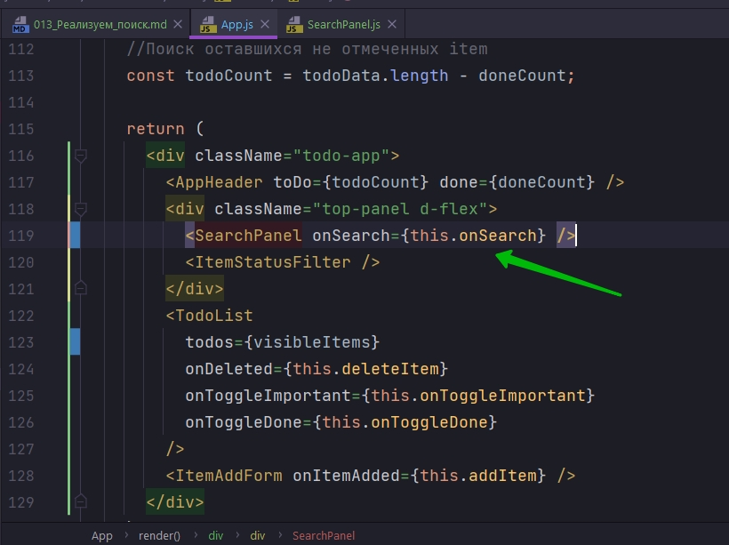

# 013_Реализуем_поиск

Давайте посмотрим из одно возможных решений.

Наша идея заключается в том, что конда пользователь начнет писать название какого-нибудь компонента, то наш список будет отфильтровываться и показывать только те элементы которые соответствуют нашему поиску.

И реализовывать этот функционал я начну с компонента App.

В первую очередь я хочу убедится что я умею фильтровать элементы. А затем я позабочусь что бы получить текст из поля поиска в мой компонент App.

И так первое что мне нужно сделать - это добавить еще один элемент в state и назову его term который будет пустой строкой.


Теперь напишем функцию которая будет фильтровать наши элементы. 

В нашей функции render мы теперь не можем выводить все элементы массива todoData. Нам нужно создать отдельный массив в котором будут только видимые, на текущий момент элементы.

Деструктурирую term из state. А затем  создаю переменную visibleItems в значение которой помещаю объект this на котором вызываю функцию search(), которую чуть позже реализую, первым параметром который принимает массив todoData, а вторым term. 


Теперь реализую функцию search. Функция search первым параметром будет принимать массив элементов items и тот текст который мы пытаемся найти term.


Как найти все эти элементы которые содержат весь этот текст? 

Нам нужно взять items  и вызвать на нем filter() и отфильтровать те элементы которые удовлетворяют условию.


При фильтрации мы получаем элементы item. И мы возвращаем true если item.label.indexOf(term),  indexOf вернет ноль или больше если строка содержится. И минус -1 если строки нет. Соответственно больше минус одного даст нам все те элементы у которых label это видимый текст на экране, содержит строку term.

И еше одно условие. Если term.length === 0 это пустая строка, то мы просто вернем все items. Это означает что если поле поиска пустое, то мы вообще не хотим ничего искать.

```js
import React, { Component } from "react";
import AppHeader from "../AppHeader/AppHeader";
import SearchPanel from "../SearchPanel/SerchPanel";
import TodoList from "../TodoList/TodoList";
import ItemStatusFilter from "../ItemStatusFilter/ItemStatusFilter";
import ItemAddForm from "../ItemAddForm/ItemAddForm";
import "./App.css";

export default class App extends Component {
    maxId = 100;

    state = {
        todoData: [
            this.createTodoItem("Drink Coffee"),
            this.createTodoItem("Make Awesome App"),
            this.createTodoItem("Have a lunch"),
        ],
        term: "",
    };

    //Функция удаления Item
    deleteItem = (id) => {
        this.setState(({ todoData }) => {
            //сравниваю id в массиве и id полученное из props
            const idx = todoData.findIndex((element) => element.id === id);
            // [a,b,c,d,e]
            // [a,b, ,d,e]
            //копирую первую часть массива
            // копирую часть массива после удаляемого элемента
            const newArray = [...todoData.slice(0, idx), ...todoData.slice(idx + 1)];
            return {
                todoData: newArray,
            };
        });
    };

    //Функция создания item
    createTodoItem(label) {
        return {
            label: label,
            important: false,
            done: false,
            id: this.maxId++,
        };
    }

    //Функция добавления Item
    addItem = (text) => {
        //generate id ?
        const newItem = this.createTodoItem(text);
        // add element in array
        this.setState(({ todoData }) => {
            const newArr = [...todoData, newItem];
            return {
                todoData: newArr,
            };
        });
    };

    //выношу дублируемый код из onToggleImportant и onToggleDone
    toggleProperty(arr, id, propName) {
        //сравниваю id в массиве и id полученное из props
        const idx = arr.findIndex((element) => element.id === id);
        // 1. update object
        //заношу старый item в отдельную переменную
        const oldItem = arr[idx];
        //копирую старый объект в новый и меняю лишь одно значение done
        const newItem = { ...oldItem, [propName]: !oldItem[propName] };

        //2. construct new array
        return [...arr.slice(0, idx), newItem, ...arr.slice(idx + 1)];
    }

    //функция отметки важного дела
    onToggleImportant = (id) => {
        this.setState(({ todoData }) => {
            return {
                todoData: this.toggleProperty(todoData, id, "important"),
            };
        });
    };

    //функция отметки выполненного дела
    onToggleDone = (id) => {
        this.setState(({ todoData }) => {
            return {
                todoData: this.toggleProperty(todoData, id, "done"),
            };
        });
    };

    //Поиск элементов
    search(items, term) {
        return items.filter((item) => {
            if (term.length === 0) {
                return item;
            }
            return item.label.indexOf(term) > -1;
        });
    }

    render() {
        const { todoData, term } = this.state;
        //Поиск элементов
        const visibleItems = this.search(todoData, term);

        //Поиск отмеченных item
        const doneCount = todoData.filter((element) => {
            return element.done === true;
        }).length;

        //Поиск оставшихся не отмеченных item
        const todoCount = todoData.length - doneCount;

        return (
            <div className="todo-app">
                <AppHeader toDo={todoCount} done={doneCount} />
                <div className="top-panel d-flex">
                    <SearchPanel />
                    <ItemStatusFilter />
                </div>
                <TodoList
                    todos={todoData}
                    onDeleted={this.deleteItem}
                    onToggleImportant={this.onToggleImportant}
                    onToggleDone={this.onToggleDone}
                />
                <ItemAddForm onItemAdded={this.addItem} />
            </div>
        );
    }
}

```

Теперь вернемся в функцию render. И вместо того что бы просто передавать весь массив элементов в TodoList, мы передадим туда только те элементы которые сейчас видимы.


И для того что бы это протестировать, в state в term введу term:'fe'.

```js
import React, { Component } from "react";
import AppHeader from "../AppHeader/AppHeader";
import SearchPanel from "../SearchPanel/SerchPanel";
import TodoList from "../TodoList/TodoList";
import ItemStatusFilter from "../ItemStatusFilter/ItemStatusFilter";
import ItemAddForm from "../ItemAddForm/ItemAddForm";
import "./App.css";

export default class App extends Component {
  maxId = 100;

  state = {
    todoData: [
      this.createTodoItem("Drink Coffee"),
      this.createTodoItem("Make Awesome App"),
      this.createTodoItem("Have a lunch"),
    ],
    term: "fe",
  };

  //Функция удаления Item
  deleteItem = (id) => {
    this.setState(({ todoData }) => {
      //сравниваю id в массиве и id полученное из props
      const idx = todoData.findIndex((element) => element.id === id);
      // [a,b,c,d,e]
      // [a,b, ,d,e]
      //копирую первую часть массива
      // копирую часть массива после удаляемого элемента
      const newArray = [...todoData.slice(0, idx), ...todoData.slice(idx + 1)];
      return {
        todoData: newArray,
      };
    });
  };

  //Функция создания item
  createTodoItem(label) {
    return {
      label: label,
      important: false,
      done: false,
      id: this.maxId++,
    };
  }

  //Функция добавления Item
  addItem = (text) => {
    //generate id ?
    const newItem = this.createTodoItem(text);
    // add element in array
    this.setState(({ todoData }) => {
      const newArr = [...todoData, newItem];
      return {
        todoData: newArr,
      };
    });
  };

  //выношу дублируемый код из onToggleImportant и onToggleDone
  toggleProperty(arr, id, propName) {
    //сравниваю id в массиве и id полученное из props
    const idx = arr.findIndex((element) => element.id === id);
    // 1. update object
    //заношу старый item в отдельную переменную
    const oldItem = arr[idx];
    //копирую старый объект в новый и меняю лишь одно значение done
    const newItem = { ...oldItem, [propName]: !oldItem[propName] };

    //2. construct new array
    return [...arr.slice(0, idx), newItem, ...arr.slice(idx + 1)];
  }

  //функция отметки важного дела
  onToggleImportant = (id) => {
    this.setState(({ todoData }) => {
      return {
        todoData: this.toggleProperty(todoData, id, "important"),
      };
    });
  };

  //функция отметки выполненного дела
  onToggleDone = (id) => {
    this.setState(({ todoData }) => {
      return {
        todoData: this.toggleProperty(todoData, id, "done"),
      };
    });
  };

  //Поиск элементов
  search(items, term) {
    return items.filter((item) => {
      if (term.length === 0) {
        return item;
      }
      return item.label.indexOf(term) > -1;
    });
  }

  render() {
    const { todoData, term } = this.state;
    //Поиск элементов
    const visibleItems = this.search(todoData, term);

    //Поиск отмеченных item
    const doneCount = todoData.filter((element) => {
      return element.done === true;
    }).length;

    //Поиск оставшихся не отмеченных item
    const todoCount = todoData.length - doneCount;

    return (
      <div className="todo-app">
        <AppHeader toDo={todoCount} done={doneCount} />
        <div className="top-panel d-flex">
          <SearchPanel />
          <ItemStatusFilter />
        </div>
        <TodoList
          todos={visibleItems}
          onDeleted={this.deleteItem}
          onToggleImportant={this.onToggleImportant}
          onToggleDone={this.onToggleDone}
        />
        <ItemAddForm onItemAdded={this.addItem} />
      </div>
    );
  }
}

```


А теперь если мы сделаем так, что бы значение из поля поиска переходило в App, и App обновлял свой state, то наш поиск заработает.


Захожу в компонент SearchPanel. И первое что мы сделаем это отрефакторим наш компонент так что бы он перестал быть компонентом функцией, и стал компонентом классом. Нам это нужно для того что бы сделать input контролируемым. Мы будем передавать в него значение из state. 

```js
// src/components/SearchPanel.js
import React, { Component } from "react";
import "./SearchPanel.css";

export default class SearchPanel extends Component {
  render() {
    return (
      <input
        type="text"
        className="form-control search-input"
        placeholder="type to search"
      />
    );
  }
}

```

Теперь создадим state. И в state будет одно значение term.

Делаю компонент контролируемым.

```js
// src/components/SearchPanel.js
import React, { Component } from "react";
import "./SearchPanel.css";

export default class SearchPanel extends Component {
  state = {
    term: "",
  };
  render() {
    return (
      <input
        type="text"
        className="form-control search-input"
        placeholder="type to search"
        value={this.state.term}
      />
    );
  }
}

```

И теперь что бы этот компонент был интерактивным и передавал в App каждое нажатие кнопки, мы добавим один eventListener который назовем onChange и передадим функцию this.onSearch.

Не забываем что мы должны сделать onSearch функцией стрелкой, поскольку мы передаем эту функцию как eventListener, значит нам нужно заботится о значении this. А он должен быть конкретно привязан к onChange, к лексическому его окружения, а не выходить на уровень выше как в случае с обычными функциями. Т.е. по факту произойдет выход из функции render.

В функции onSearch мы должны получить,  первым параметром наш объект event, иначе мы не сможем узнать какое же текущее значение нашего input.


```js
// src/components/SearchPanel.js
import React, { Component } from "react";
import "./SearchPanel.css";

export default class SearchPanel extends Component {
  state = {
    term: "",
  };

  onSearch = (event) => {
    const term = event.target.value;
    this.setState({
      term: term,
    });
    //вызываю eventListener который передает App
    this.props.onSearch(term);
  };

  render() {
    return (
      <input
        type="text"
        className="form-control search-input"
        placeholder="type to search"
        value={this.state.term}
        onChange={this.onSearch}
      />
    );
  }
}

```

Прекрасно!!! Теперь на каждоенажатие кнопки я буду вызывать onSearch.


Теперь возвражаюсь в App и добавляю этот eventListener. Т.е. в SearchPanel передаю props onSearch



И пишу эту функцию


```js
import React, { Component } from "react";
import AppHeader from "../AppHeader/AppHeader";
import SearchPanel from "../SearchPanel/SearchPanel";
import TodoList from "../TodoList/TodoList";
import ItemStatusFilter from "../ItemStatusFilter/ItemStatusFilter";
import ItemAddForm from "../ItemAddForm/ItemAddForm";
import "./App.css";

export default class App extends Component {
  maxId = 100;

  state = {
    todoData: [
      this.createTodoItem("Drink Coffee"),
      this.createTodoItem("Make Awesome App"),
      this.createTodoItem("Have a lunch"),
    ],
    term: "",
  };

  //Функция удаления Item
  deleteItem = (id) => {
    this.setState(({ todoData }) => {
      //сравниваю id в массиве и id полученное из props
      const idx = todoData.findIndex((element) => element.id === id);
      // [a,b,c,d,e]
      // [a,b, ,d,e]
      //копирую первую часть массива
      // копирую часть массива после удаляемого элемента
      const newArray = [...todoData.slice(0, idx), ...todoData.slice(idx + 1)];
      return {
        todoData: newArray,
      };
    });
  };

  //Функция создания item
  createTodoItem(label) {
    return {
      label: label,
      important: false,
      done: false,
      id: this.maxId++,
    };
  }

  //Функция добавления Item
  addItem = (text) => {
    //generate id ?
    const newItem = this.createTodoItem(text);
    // add element in array
    this.setState(({ todoData }) => {
      const newArr = [...todoData, newItem];
      return {
        todoData: newArr,
      };
    });
  };

  //выношу дублируемый код из onToggleImportant и onToggleDone
  toggleProperty(arr, id, propName) {
    //сравниваю id в массиве и id полученное из props
    const idx = arr.findIndex((element) => element.id === id);
    // 1. update object
    //заношу старый item в отдельную переменную
    const oldItem = arr[idx];
    //копирую старый объект в новый и меняю лишь одно значение done
    const newItem = { ...oldItem, [propName]: !oldItem[propName] };

    //2. construct new array
    return [...arr.slice(0, idx), newItem, ...arr.slice(idx + 1)];
  }

  //функция отметки важного дела
  onToggleImportant = (id) => {
    this.setState(({ todoData }) => {
      return {
        todoData: this.toggleProperty(todoData, id, "important"),
      };
    });
  };

  //функция отметки выполненного дела
  onToggleDone = (id) => {
    this.setState(({ todoData }) => {
      return {
        todoData: this.toggleProperty(todoData, id, "done"),
      };
    });
  };

  //Поиск элементов
  search(items, term) {
    return items.filter((item) => {
      if (term.length === 0) {
        return item;
      }
      return item.label.indexOf(term) > -1;
    });
  }

  //Поиск того что вводит пользоватеь в input
  onSearch = (term) => {
    this.setState({ term: term });
  };

  render() {
    const { todoData, term } = this.state;
    //Поиск элементов
    const visibleItems = this.search(todoData, term);

    //Поиск отмеченных item
    const doneCount = todoData.filter((element) => {
      return element.done === true;
    }).length;

    //Поиск оставшихся не отмеченных item
    const todoCount = todoData.length - doneCount;

    return (
      <div className="todo-app">
        <AppHeader toDo={todoCount} done={doneCount} />
        <div className="top-panel d-flex">
          <SearchPanel onSearch={this.onSearch} />
          <ItemStatusFilter />
        </div>
        <TodoList
          todos={visibleItems}
          onDeleted={this.deleteItem}
          onToggleImportant={this.onToggleImportant}
          onToggleDone={this.onToggleDone}
        />
        <ItemAddForm onItemAdded={this.addItem} />
      </div>
    );
  }
}

```


Но здесь тоже есть нюанс. Поиск учитывает регистр. Мы можем трансформировать и label и term что бы они были записаны маленькими буквами.


```js
import React, { Component } from "react";
import AppHeader from "../AppHeader/AppHeader";
import SearchPanel from "../SearchPanel/SearchPanel";
import TodoList from "../TodoList/TodoList";
import ItemStatusFilter from "../ItemStatusFilter/ItemStatusFilter";
import ItemAddForm from "../ItemAddForm/ItemAddForm";
import "./App.css";

export default class App extends Component {
  maxId = 100;

  state = {
    todoData: [
      this.createTodoItem("Drink Coffee"),
      this.createTodoItem("Make Awesome App"),
      this.createTodoItem("Have a lunch"),
    ],
    term: "",
  };

  //Функция удаления Item
  deleteItem = (id) => {
    this.setState(({ todoData }) => {
      //сравниваю id в массиве и id полученное из props
      const idx = todoData.findIndex((element) => element.id === id);
      // [a,b,c,d,e]
      // [a,b, ,d,e]
      //копирую первую часть массива
      // копирую часть массива после удаляемого элемента
      const newArray = [...todoData.slice(0, idx), ...todoData.slice(idx + 1)];
      return {
        todoData: newArray,
      };
    });
  };

  //Функция создания item
  createTodoItem(label) {
    return {
      label: label,
      important: false,
      done: false,
      id: this.maxId++,
    };
  }

  //Функция добавления Item
  addItem = (text) => {
    //generate id ?
    const newItem = this.createTodoItem(text);
    // add element in array
    this.setState(({ todoData }) => {
      const newArr = [...todoData, newItem];
      return {
        todoData: newArr,
      };
    });
  };

  //выношу дублируемый код из onToggleImportant и onToggleDone
  toggleProperty(arr, id, propName) {
    //сравниваю id в массиве и id полученное из props
    const idx = arr.findIndex((element) => element.id === id);
    // 1. update object
    //заношу старый item в отдельную переменную
    const oldItem = arr[idx];
    //копирую старый объект в новый и меняю лишь одно значение done
    const newItem = { ...oldItem, [propName]: !oldItem[propName] };

    //2. construct new array
    return [...arr.slice(0, idx), newItem, ...arr.slice(idx + 1)];
  }

  //функция отметки важного дела
  onToggleImportant = (id) => {
    this.setState(({ todoData }) => {
      return {
        todoData: this.toggleProperty(todoData, id, "important"),
      };
    });
  };

  //функция отметки выполненного дела
  onToggleDone = (id) => {
    this.setState(({ todoData }) => {
      return {
        todoData: this.toggleProperty(todoData, id, "done"),
      };
    });
  };

  //Поиск элементов
  search(items, term) {
    return items.filter((item) => {
      if (term.length === 0) {
        return item;
      }
      return item.label.toLowerCase().indexOf(term.toLowerCase()) > -1;
    });
  }

  //Поиск того что вводит пользоватеь в input
  onSearch = (term) => {
    this.setState({ term: term });
  };

  render() {
    const { todoData, term } = this.state;
    //Поиск элементов
    const visibleItems = this.search(todoData, term);

    //Поиск отмеченных item
    const doneCount = todoData.filter((element) => {
      return element.done === true;
    }).length;

    //Поиск оставшихся не отмеченных item
    const todoCount = todoData.length - doneCount;

    return (
      <div className="todo-app">
        <AppHeader toDo={todoCount} done={doneCount} />
        <div className="top-panel d-flex">
          <SearchPanel onSearch={this.onSearch} />
          <ItemStatusFilter />
        </div>
        <TodoList
          todos={visibleItems}
          onDeleted={this.deleteItem}
          onToggleImportant={this.onToggleImportant}
          onToggleDone={this.onToggleDone}
        />
        <ItemAddForm onItemAdded={this.addItem} />
      </div>
    );
  }
}

```


Таким образом мы реализовали два аспекта.

1. Мы научились фильтровать наш список по значению term из state нашего компонента.
2. Второй аспект это то что мы получаем это состояние и обновляем его когда пользователь печатает какие-нибудь значения.


> Реализуем поиск
> 
> Компонент App получил новый элемент state, в котором мы храним текст для поиска.
> 
> Перед тем как отображать элементы в render() мы отфильтровываем нужные.
> 
> Компонент SearchPanel генерирует событие onSearch на каждое нажатие клавиши(что бы App обновлял список)


