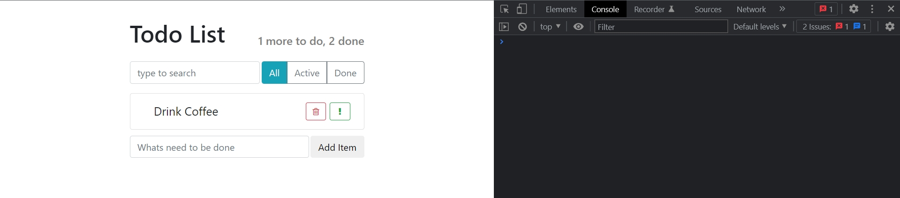
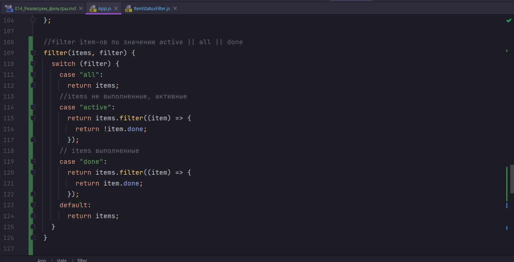

# 014_Реализуем_фильтры

А теперь реализуем фильтр элементов который позволит выбрать какие именно элементы отображать, все, активные, выполненные.


И я снова начну реализовывать этот функционал с компонента App. Добавлю свойство filter в state. И значение его может быть одно из трех active, all, done


И для того что бы проверить что фильтер работает установим его по умолчанию в active.

Теперь точно так же как мы создали функцию search, которая реализует поиск, мы создадим функцию filter, которая будет работать похожим образом. Первым параметром она принимает все items, вторым сам filter.

У нас должно быть три разных фильтра, по этому давайте реализуем switch. В зависимости от того каково значение filter, мы будем возвращать разные отфильтрованные масивы.


```js
import React, { Component } from "react";
import AppHeader from "../AppHeader/AppHeader";
import SearchPanel from "../SearchPanel/SearchPanel";
import TodoList from "../TodoList/TodoList";
import ItemStatusFilter from "../ItemStatusFilter/ItemStatusFilter";
import ItemAddForm from "../ItemAddForm/ItemAddForm";
import "./App.css";

export default class App extends Component {
  maxId = 100;

  state = {
    todoData: [
      this.createTodoItem("Drink Coffee"),
      this.createTodoItem("Make Awesome App"),
      this.createTodoItem("Have a lunch"),
    ],
    term: "",
    filter: "active", // active || all || done
  };

  //Функция удаления Item
  deleteItem = (id) => {
    this.setState(({ todoData }) => {
      //сравниваю id в массиве и id полученное из props
      const idx = todoData.findIndex((element) => element.id === id);
      // [a,b,c,d,e]
      // [a,b, ,d,e]
      //копирую первую часть массива
      // копирую часть массива после удаляемого элемента
      const newArray = [...todoData.slice(0, idx), ...todoData.slice(idx + 1)];
      return {
        todoData: newArray,
      };
    });
  };

  //Функция создания item
  createTodoItem(label) {
    return {
      label: label,
      important: false,
      done: false,
      id: this.maxId++,
    };
  }

  //Функция добавления Item
  addItem = (text) => {
    //generate id ?
    const newItem = this.createTodoItem(text);
    // add element in array
    this.setState(({ todoData }) => {
      const newArr = [...todoData, newItem];
      return {
        todoData: newArr,
      };
    });
  };

  //выношу дублируемый код из onToggleImportant и onToggleDone
  toggleProperty(arr, id, propName) {
    //сравниваю id в массиве и id полученное из props
    const idx = arr.findIndex((element) => element.id === id);
    // 1. update object
    //заношу старый item в отдельную переменную
    const oldItem = arr[idx];
    //копирую старый объект в новый и меняю лишь одно значение done
    const newItem = { ...oldItem, [propName]: !oldItem[propName] };

    //2. construct new array
    return [...arr.slice(0, idx), newItem, ...arr.slice(idx + 1)];
  }

  //функция отметки важного дела
  onToggleImportant = (id) => {
    this.setState(({ todoData }) => {
      return {
        todoData: this.toggleProperty(todoData, id, "important"),
      };
    });
  };

  //функция отметки выполненного дела
  onToggleDone = (id) => {
    this.setState(({ todoData }) => {
      return {
        todoData: this.toggleProperty(todoData, id, "done"),
      };
    });
  };

  //Поиск элементов
  search(items, term) {
    return items.filter((item) => {
      if (term.length === 0) {
        return item;
      }
      return item.label.toLowerCase().indexOf(term.toLowerCase()) > -1;
    });
  }

  //Поиск того что вводит пользоватеь в input
  onSearch = (term) => {
    this.setState({ term: term });
  };

  //filter item-ов по значению active || all || done
  filter(items, filter) {
    switch (filter) {
      case "all":
        return items;
      //items не выполненные, активные
      case "active":
        return items.filter((item) => {
          return !item.done;
        });
      // items выполненные
      case "done":
        return items.filter((item) => {
          return item.done;
        });
      default:
        return items;
    }
  }

  render() {
    const { todoData, term } = this.state;
    //Поиск элементов
    const visibleItems = this.search(todoData, term);

    //Поиск отмеченных item
    const doneCount = todoData.filter((element) => {
      return element.done === true;
    }).length;

    //Поиск оставшихся не отмеченных item
    const todoCount = todoData.length - doneCount;

    return (
      <div className="todo-app">
        <AppHeader toDo={todoCount} done={doneCount} />
        <div className="top-panel d-flex">
          <SearchPanel onSearch={this.onSearch} />
          <ItemStatusFilter />
        </div>
        <TodoList
          todos={visibleItems}
          onDeleted={this.deleteItem}
          onToggleImportant={this.onToggleImportant}
          onToggleDone={this.onToggleDone}
        />
        <ItemAddForm onItemAdded={this.addItem} />
      </div>
    );
  }
}

```

И теперь я могу добавить вызов функции filter к выражению visibleItems. Т.е. в этом выражении мы уже умеем искать по нашим item-ам this.search(). А затем после того как мы произвели поиск мы еще результат отфильтруем.


Теперь смотрим на state. Пока что все элементы у нас active. Но если я отмечу хоть один элемент как выполненный, то он должен пропасть из списка. Потому что по значению в state мне должны показываться активные items. Приозойдет фильтрация и выведутся активные items, но не выполненные.





Меняю state на done выполненные.


И ничего не выводится так как вызывается функция render при изменении state.filter.

## Передача значений из кнопок

Следующий шаг это реализовать кнопки All, Active, Done, которые будут передавать значения из кнопок.

Перехожу в компонент ItemStatusFilter.

```js
import React, { Component } from "react";
import "./ItemStatusFilter.css";

export default class ItemStatusFilter extends Component {
  render() {
    return (
      <div className="btn-group">
        <button type="button" className="btn btn-info">
          All
        </button>
        <button type="button" className="btn btn-outline-secondary">
          Active
        </button>
        <button type="button" className="btn btn-outline-secondary">
          Done
        </button>
      </div>
    );
  }
}

```

Во-первых давайте вынесем название кнопок и название соответствующих фильтров в отдельный массив. Так нам с кнопками будет работать удобнее. 

Если мы этого не сделаем нам придется написать довольно много блоков if else и проверять для каждой отдельной кнопки является ли она активной или нет. И кроме того для каждой отдельной кнопки добавлять eventListener который будет срабатывать когда мы нажимаем на эту кнопку.


Создаю массив buttons. И это будет массив из трех кнопок, трех объектов. У каждой кнопки будет name - это название фильтра и label - это то как выглядит кнопка на экране.


Теперь в функции render мы сможем реализовать небольшой кусочек кода, котрый пройдется по этому массиву buttons и для каждого элемента отрисует кнопку.

```js
import React, { Component } from "react";
import "./ItemStatusFilter.css";

export default class ItemStatusFilter extends Component {
  buttons = [
    { name: "all", label: "All" },
    { name: "active", label: "Active" },
    { name: "done", label: "Done" },
  ];

  render() {
    const buttons = this.buttons.map(({ name, label }) => {
      return (
        <button type="button" className="btn btn-info" key={name}>
          {label}
        </button>
      );
    });
    return <div className="btn-group">{buttons}</div>;
  }
}

```

И теперь все наши кнопки отрисовались как активные.


Для того что бы выбрать одну активную кнопку, мы будем использовать свойства. Т.е. мы будем расчитывать что компонент сверху иерархии, в нашем случае App, будет передавать нам текущее правильное значение фильтра.


В компоненте App, в тег ItemsStatusFilter мы передаем props filter={filter}, filter поскольку я его уже достал из state.

```js
import React, { Component } from "react";
import AppHeader from "../AppHeader/AppHeader";
import SearchPanel from "../SearchPanel/SearchPanel";
import TodoList from "../TodoList/TodoList";
import ItemStatusFilter from "../ItemStatusFilter/ItemStatusFilter";
import ItemAddForm from "../ItemAddForm/ItemAddForm";
import "./App.css";

export default class App extends Component {
  maxId = 100;

  state = {
    todoData: [
      this.createTodoItem("Drink Coffee"),
      this.createTodoItem("Make Awesome App"),
      this.createTodoItem("Have a lunch"),
    ],
    term: "",
    filter: "active", // active || all || done
  };

  //Функция удаления Item
  deleteItem = (id) => {
    this.setState(({ todoData }) => {
      //сравниваю id в массиве и id полученное из props
      const idx = todoData.findIndex((element) => element.id === id);
      // [a,b,c,d,e]
      // [a,b, ,d,e]
      //копирую первую часть массива
      // копирую часть массива после удаляемого элемента
      const newArray = [...todoData.slice(0, idx), ...todoData.slice(idx + 1)];
      return {
        todoData: newArray,
      };
    });
  };

  //Функция создания item
  createTodoItem(label) {
    return {
      label: label,
      important: false,
      done: false,
      id: this.maxId++,
    };
  }

  //Функция добавления Item
  addItem = (text) => {
    //generate id ?
    const newItem = this.createTodoItem(text);
    // add element in array
    this.setState(({ todoData }) => {
      const newArr = [...todoData, newItem];
      return {
        todoData: newArr,
      };
    });
  };

  //выношу дублируемый код из onToggleImportant и onToggleDone
  toggleProperty(arr, id, propName) {
    //сравниваю id в массиве и id полученное из props
    const idx = arr.findIndex((element) => element.id === id);
    // 1. update object
    //заношу старый item в отдельную переменную
    const oldItem = arr[idx];
    //копирую старый объект в новый и меняю лишь одно значение done
    const newItem = { ...oldItem, [propName]: !oldItem[propName] };

    //2. construct new array
    return [...arr.slice(0, idx), newItem, ...arr.slice(idx + 1)];
  }

  //функция отметки важного дела
  onToggleImportant = (id) => {
    this.setState(({ todoData }) => {
      return {
        todoData: this.toggleProperty(todoData, id, "important"),
      };
    });
  };

  //функция отметки выполненного дела
  onToggleDone = (id) => {
    this.setState(({ todoData }) => {
      return {
        todoData: this.toggleProperty(todoData, id, "done"),
      };
    });
  };

  //Поиск элементов
  search(items, term) {
    return items.filter((item) => {
      if (term.length === 0) {
        return item;
      }
      return item.label.toLowerCase().indexOf(term.toLowerCase()) > -1;
    });
  }

  //Поиск того что вводит пользоватеь в input
  onSearch = (term) => {
    this.setState({ term: term });
  };

  //filter item-ов по значению active || all || done
  filter(items, filter) {
    switch (filter) {
      case "all":
        return items;
      //items не выполненные, активные
      case "active":
        return items.filter((item) => {
          return !item.done;
        });
      // items выполненные
      case "done":
        return items.filter((item) => {
          return item.done;
        });
      default:
        return items;
    }
  }

  render() {
    const { todoData, term, filter } = this.state;
    //Поиск элементов
    const visibleItems = this.filter(this.search(todoData, term), filter);

    //Поиск отмеченных item
    const doneCount = todoData.filter((element) => {
      return element.done === true;
    }).length;

    //Поиск оставшихся не отмеченных item
    const todoCount = todoData.length - doneCount;

    return (
      <div className="todo-app">
        <AppHeader toDo={todoCount} done={doneCount} />
        <div className="top-panel d-flex">
          <SearchPanel onSearch={this.onSearch} />
          <ItemStatusFilter filter={filter} />
        </div>
        <TodoList
          todos={visibleItems}
          onDeleted={this.deleteItem}
          onToggleImportant={this.onToggleImportant}
          onToggleDone={this.onToggleDone}
        />
        <ItemAddForm onItemAdded={this.addItem} />
      </div>
    );
  }
}

```

Теперь наш компонент ItemStatusFilter получает информацию о том какой filter должен быть по умолчанию активен.


## Определение активной кнопки.

В компоненте ItemStatusFilter из пропсов достаю filter. Далее создаю переменную isActive в которой говорю что кнопка будет активной если filter === name имени кнопки.

Теперь осталось определить класс для кнопки. Создаю переменную classActive и в зависимости он условия что кнопка isActive присваиваю нужный класс.

```js
import React, { Component } from "react";
import "./ItemStatusFilter.css";

export default class ItemStatusFilter extends Component {
  buttons = [
    { name: "all", label: "All" },
    { name: "active", label: "Active" },
    { name: "done", label: "Done" },
  ];

  render() {
    const { filter } = this.props;
    const buttons = this.buttons.map(({ name, label }) => {
      const isActive = filter === name;
      const classActive = isActive ? "btn-info" : "btn-outline-secondary";
      return (
        <button type="button" className={`btn ${classActive}`} key={name}>
          {label}
        </button>
      );
    });
    return <div className="btn-group">{buttons}</div>;
  }
}

```


Проверка


## Добавление слушателя на кнопки.

Последнее что осталось сделать это повешать слушатель на кнопки и каждый раз сообщать компоненту App что произошел клик на кнопку.

В компонента App на ItemStatusFilter прописываю пропс onFilterChange и передаю туда функцию которая будет называться точно также.


```js
import React, { Component } from "react";
import AppHeader from "../AppHeader/AppHeader";
import SearchPanel from "../SearchPanel/SearchPanel";
import TodoList from "../TodoList/TodoList";
import ItemStatusFilter from "../ItemStatusFilter/ItemStatusFilter";
import ItemAddForm from "../ItemAddForm/ItemAddForm";
import "./App.css";

export default class App extends Component {
  maxId = 100;

  state = {
    todoData: [
      this.createTodoItem("Drink Coffee"),
      this.createTodoItem("Make Awesome App"),
      this.createTodoItem("Have a lunch"),
    ],
    term: "",
    filter: "", // active || all || done
  };

  //Функция удаления Item
  deleteItem = (id) => {
    this.setState(({ todoData }) => {
      //сравниваю id в массиве и id полученное из props
      const idx = todoData.findIndex((element) => element.id === id);
      // [a,b,c,d,e]
      // [a,b, ,d,e]
      //копирую первую часть массива
      // копирую часть массива после удаляемого элемента
      const newArray = [...todoData.slice(0, idx), ...todoData.slice(idx + 1)];
      return {
        todoData: newArray,
      };
    });
  };

  //Функция создания item
  createTodoItem(label) {
    return {
      label: label,
      important: false,
      done: false,
      id: this.maxId++,
    };
  }

  //Функция добавления Item
  addItem = (text) => {
    //generate id ?
    const newItem = this.createTodoItem(text);
    // add element in array
    this.setState(({ todoData }) => {
      const newArr = [...todoData, newItem];
      return {
        todoData: newArr,
      };
    });
  };

  //выношу дублируемый код из onToggleImportant и onToggleDone
  toggleProperty(arr, id, propName) {
    //сравниваю id в массиве и id полученное из props
    const idx = arr.findIndex((element) => element.id === id);
    // 1. update object
    //заношу старый item в отдельную переменную
    const oldItem = arr[idx];
    //копирую старый объект в новый и меняю лишь одно значение done
    const newItem = { ...oldItem, [propName]: !oldItem[propName] };

    //2. construct new array
    return [...arr.slice(0, idx), newItem, ...arr.slice(idx + 1)];
  }

  //функция отметки важного дела
  onToggleImportant = (id) => {
    this.setState(({ todoData }) => {
      return {
        todoData: this.toggleProperty(todoData, id, "important"),
      };
    });
  };

  //функция отметки выполненного дела
  onToggleDone = (id) => {
    this.setState(({ todoData }) => {
      return {
        todoData: this.toggleProperty(todoData, id, "done"),
      };
    });
  };

  //Поиск элементов
  search(items, term) {
    return items.filter((item) => {
      if (term.length === 0) {
        return item;
      }
      return item.label.toLowerCase().indexOf(term.toLowerCase()) > -1;
    });
  }

  //Поиск того что вводит пользоватеь в input
  onSearch = (term) => {
    this.setState({ term: term });
  };

  //filter item-ов по значению active || all || done
  filter(items, filter) {
    switch (filter) {
      case "all":
        return items;
      //items не выполненные, активные
      case "active":
        return items.filter((item) => {
          return !item.done;
        });
      // items выполненные
      case "done":
        return items.filter((item) => {
          return item.done;
        });
      default:
        return items;
    }
  }

  //Меняю значение filter: all || active || done
  onFilterChange = (filter) => {
    return this.setState({
      filter: filter,
    });
  };

  render() {
    const { todoData, term, filter } = this.state;
    //Поиск элементов
    const visibleItems = this.filter(this.search(todoData, term), filter);

    //Поиск отмеченных item
    const doneCount = todoData.filter((element) => {
      return element.done === true;
    }).length;

    //Поиск оставшихся не отмеченных item
    const todoCount = todoData.length - doneCount;

    return (
      <div className="todo-app">
        <AppHeader toDo={todoCount} done={doneCount} />
        <div className="top-panel d-flex">
          <SearchPanel onSearch={this.onSearch} />
          <ItemStatusFilter
            filter={filter}
            onFilterChange={this.onFilterChange}
          />
        </div>
        <TodoList
          todos={visibleItems}
          onDeleted={this.deleteItem}
          onToggleImportant={this.onToggleImportant}
          onToggleDone={this.onToggleDone}
        />
        <ItemAddForm onItemAdded={this.addItem} />
      </div>
    );
  }
}

```

Здесь все очень просто. Как только меняется filter мы обновляем его в состоянии, обновленное состояние возвращается назад в ItemStatusFilter, передается в качестве пропс filter, и компонент обновляет свою активную кнопку.

Теперь ItemStatusFilter должен реально отдавать этот event. вызываю на кнопке onClick callback в которой возвращает результат вызова функции onFilterChange(name) в котороу мы передаем значение имени книпки. Данная функция поднимает имя кнопки в App и меняет значение в состоянии filter.

```js
import React, { Component } from "react";
import "./ItemStatusFilter.css";

export default class ItemStatusFilter extends Component {
  buttons = [
    { name: "all", label: "All" },
    { name: "active", label: "Active" },
    { name: "done", label: "Done" },
  ];

  render() {
    const { filter, onFilterChange } = this.props;
    const buttons = this.buttons.map(({ name, label }) => {
      const isActive = filter === name;
      const classActive = isActive ? "btn-info" : "btn-outline-secondary";
      return (
        <button
          type="button"
          className={`btn ${classActive}`}
          key={name}
          onClick={() => onFilterChange(name)}
        >
          {label}
        </button>
      );
    });
    return <div className="btn-group">{buttons}</div>;
  }
}

```

И так заметил одну особенность


Значит все таки начальное состояние активной кнопки ставлю all.


Проверяю все ли работает.


Итог. Первое что мы сделали это то что бы App мог фильтровать элементы. Для этого мы создали функцию filter. Она принимает массив элементов items и текущий filter



filter может быть all, active, done. Мы использовали items.filter() для того что бы выбрать только те item которые соответствуют фильтру.


Затем мы установили еще один параметр для state, этот параметр filter


Этот параметр будет обновляться в результате события с нашего компонента который содержит три кнопочки. И eventListener в нашем случае называется onFilterChange


Именно onFilterChange обновляет состояниенашего компонента.


В компоненте ItemStatusFilter все довольно просто.

Для удобства кода мы вынесли список кнопок, их название и название соответствующих фильтров  в отдельный массив.


Затем мы проходимся по этому массиву и для каждого элемента создаем индивидуальную кнопку. Для каждой кнопки мы определяем активна она сейчас или нет. И если она активна мы устанавливаем правильный css класс.

И в конце мы возвращаем каждую кнопку в массив кнопок.


> Реализуем поиск
> 
> Фильтры работают на 90% так же, как поиск
> 
> В компоненте ItemStatusFilter мы вынесли описание кнопок в отдельный массив, что бы не дублировать if для каждой кнопки
> 
> Текущая активная кнопка передается как свойство. Это продолжение идеи контролируемых компонентов.

