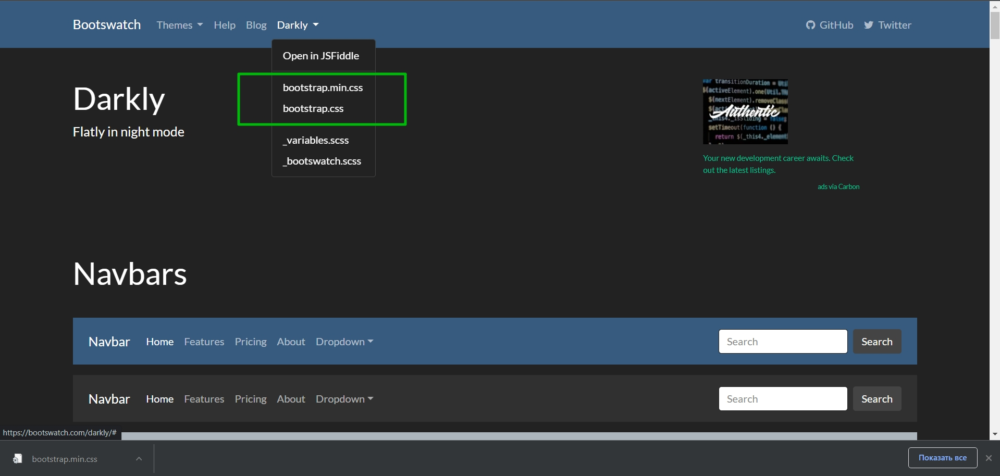
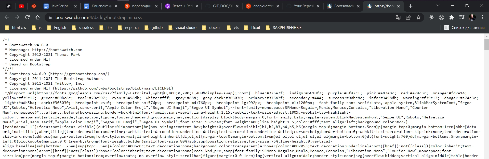

# 002_Создаем_пустой_проект

Есть сайт <https://bootswatch.com>

Здесь есть нескольк бесплатных тем которые заменяют стандартный css bootstrap  и использовать немного отличающийся стиль для вашего приложения.

Мы будем использовать тему которая называется Darkly



Мы можем скачать этот файл и использовать в нашем проекте. Либо мы можем  вызвать его с сайта. Я у себя CDN аболютно нигде не вижу. Так что постараюсь переписать.

Адрес: <https://bootswatch.com/4/darkly/bootstrap.min.css>

Не знаю это версия которая используется bootstrap или которую нужно использовать. По видео у него 4.1.3 , а у меня 4.6.0



```html
<!DOCTYPE html>
<html lang="en">
  <head>
    <meta charset="utf-8" />
    <meta name="viewport" content="width=device-width, initial-scale=1" />
    <title>StarDB</title>
    <link rel="stylesheet" href="https://bootswatch.com/4/darkly/bootstrap.min.css">

  </head>
  <body>
    <div id="root"></div>

  </body>
</html>

```

И оставляю только один index.js

```js
import React from "react";
import ReactDOM from "react-dom";

ReactDOM.render(document.getElementById("root"));

```
