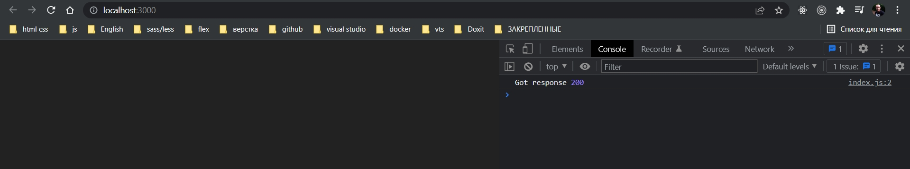
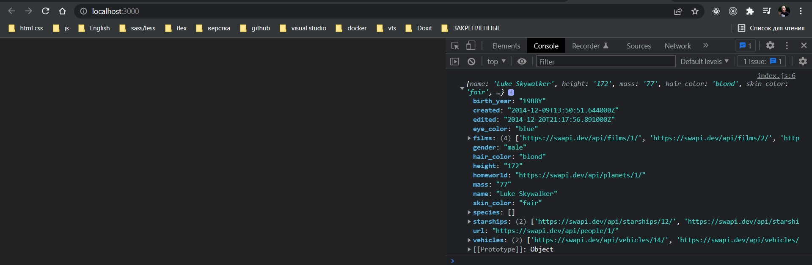

# 004_Как_работает_Fetch_API

Получать данные с сервере при помощи fetch совсем не сложно.

```js
fetch("https://swapi.dev/api/people/1/");

```

Первым параметром в функцию fetch передаю адрес в котором содержится индек персонажа.

Функция fetch возвращает promise. И когда тот свмый промис выполнится мы получим объект response

```js
fetch("https://swapi.dev/api/people/1/").then((response) => {
  console.log("Got response", response.status);
});

```



Первая важная особенность FETCH API это то что объект response не обязательно содержит весь ответ сервера. Т.е. то что вы получили response это означает что сервер уже ответил, он дал вам какой-нибудь код ответа. Но тело ответа, body тело или объект JSON все еще может быть недоступен.

Для того что бы достать тело ответа у объекта response есть несколько методов. Каждый метод возвращает еще один promise который выполняется уже тогда когда результат будет доступен.

Для того что бы получить JSON из ответа мы должны взвать у объекта response метод json()  и соответственно вернуть его результат.

```js
fetch("https://swapi.dev/api/people/1/")
  .then((response) => {
    return response.json();
  })
  .then((body) => {
    console.log(body);
  });

```



Сперва может показаться что этот API сложнее чем он может быть, немножко сложнее чем xmlHttpRequest. 

Сначало мы получаем результат запроса. И лишь потом из результата достаем тело ответа. 

Но такое разделение позволяет блее гибко работать со сценариями когда результат доступен не сразу. 

А написать функцию обертку которая скроет эти детали от основного кода будет совсем не сложно.


Работать с промисами намного удобнее когда вы используете синтаксис async await.

```js
const getResource = async (url) => {
  const response = await fetch(url); //получаю ответ с сервера
  const body = await response.json(); // получаю тело запроса
  return body;
};

getResource("https://swapi.dev/api/people/1/").then((body) => {
  console.log(body);
});

```

В теле функции getResource мы говорим что для начало получаем ответ сервера. С помощью ключевого слова await мы ждем пока результат promise не будет доступен. fetch возвращает promise, ключевое слово await говорит что мы будем ждать пока результат этого promise не станет доступным. И как только результат будет доступен, мы запишем результат в переменную response.

Теперь когда у нас есть переменная response мы можем точно таким же способом достать тело из этого результата, тело ответа. Точно так же response.json() возвращает promise, а await будет ждать пока результат promise не будет доступен. И затем результат будет записан в переменную body.

> Как работает FETCH
> 
> Что бы получить данные с сервера, нужно выполнить два вызова(каждый вернет Promise)
> 
> response = await fetch(url)
> body = await response.json()
> 
> Кроме .json() есть други функции для других типов ответа: arrayBuffer(), blob(), test(), formData().
